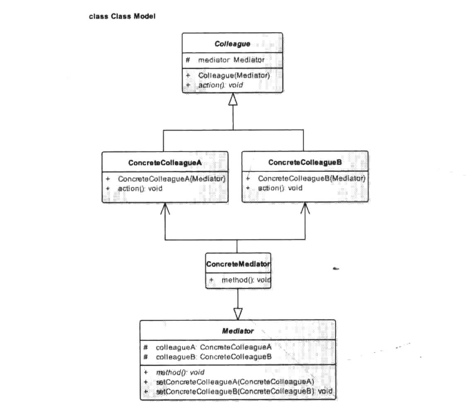

# 中介者模式


## 一、概念


### 1、介绍

中介者模式(Mediator Pattern)也称为调解者模式或调停者模式，Mediator本身就有调停者和调解者的意思。在日常生活中调停者或调解者这个角色我们见得比较多的是“和事佬”，也就是说调解两个有争端的人的角色，举个不恰当的例子，比如爸妈吵架，孩子或者双方父母则会出面劝架或阻止争吵，这里孩子或双方父母则是充当的是调解者的模式。而对于中介呢？大家平时听得最多的莫过于房产中介了，在房地产飞速发展的今天，各种房产中介公司如雨后春笋般冒出来，房产中介承担的责任很简单，就是在买房者与卖房者之间建立一座桥梁沟通两者，比如小民现在手里有套房子需要出售，于是他找房产中介并告诉房产中介房子的期望售价和房子的相关信息，然后房产中介则将这些信息收集汇总有时还会美化一番，然后把广告挂在橱窗里等待买房者，如果有人有意向购买这套房子，比如这里以小辉为例，房产中介就会告诉小辉关于这套房产的相关信息，如房龄、售价等，有时还会带小辉去房子里实际参观一番，最终小辉将自己的意愿告诉房产中介再由房产中
介去与小民进行沟通。也就是说在整个房产协商的过程中，小民和小辉买卖双方是很少直接接触的，大多数情况下都是通过房产中介来传达信息，可能只有在最终进行房产交接时小民和小辉才会正式见面。这就是我们现实生活中常见的调解者与中介者，但是，这里我们要说的中介者模式比起上述的两个例子来要复杂得多，上面我们所述的例子中，中介者或调解者所要协调的也就两类对象，而我们的中介者模式中需要协调的是多类对象。这里还是举一个小例子来说明，本书的阅读者大多都是T从业者，说得更准确些都是做Ap即的，一般来说，一个做App的公司可以分为几大模块：运维、产品、开发、设计还有测试，每当一个新App开始制作或者新版本需要制作之前，公司会开一个研讨会，运维负责市场了解用户使用倾向，研发的会说用户反映界面不好看要求修改界面…这样大家你一句我一句的讨论一半天也没有啥实质性的结果，主要原因在于大家都站在自己的立场考虑问题，这样的团队研讨会即使再开下去也没什么意义，这时候如果有一个人不属于运维、产品、开发、设计任一方的人站出来说，大家把各自的意见都跟我说，由我来权衡并做出最终的决定，不管决定如何你们都照做。因为这个人不代表任何一方，于是大家都全票表示肯定，这么一来一个方案很快就会定下来，而这个作出最终决定的人我们就称之为中介者，这里的中介者与我们的中介者模式一样面对的是多类对象，这里其实大家可以看到中介者模式的一些特性，每一个中介者都会知道所有的同事，比如上面我们所说的运维、产品、开发、设计还有测试，但是这些同事呢可以互不相识，而中介者不属于同事的任何一方，也不偏祖任何一方，这么一说相信大家对中介者模式会有一个非常清晰的了解。


### 2、定义

中介者模式包装了一系列对象相互作用的方式，使得这些对象不必相互明显作用。从而使它们可以松散偶合。当某些对象之间的作用发生改变时，不会立即影响其他的一些对象之间的作用。保证这些作用可以彼此独立的变化。中介者模式将多对多的相互作用转化为一对多的相互作用。中介者模式将对象的行为和协作抽象化，把对象在小尺度的行为上与其他对象的相互作用分开处理。


### 3、使用场景

当对象之间的交互操作很多且每个对象的行为操作都依赖彼此时，为防止在修改一个对象的行为时，同时涉及修改很多其他对象的行为，可采用中介者模式，来解决紧耦合问题。该模式将对象之间的多对多关系变成一对多关系，中介者对象将系统从网状结构变成以调停者为中心的星形结构，达到降低系统的复杂性，提高可扩展性的作用。


### 3、UML类图




- Mediator：抽象中介者角色，定义了同事对象到中介者对象的接口，一般以抽象类的方式实现。
- ConcreteMediator：具体中介者窘色，继承于抽象中介者，实现了父类定义的方法，它从具体的同事对象接收消息，向具体同事对象发出命令。
- Colleague：抽象同事类角色，定义了中介者对象的接口，它只知道中介者而不知道其他的同事对象。
- ConcreteColleagueA/B：具体同事类角色，继承于抽象同事类，每个具体同事类都知道本身在小范围内的行为，而不知道它在大范围内的目的。

根据类图可以得出如下一个中介者模式的通用模式代码。

Mediator：

```java
package cn.pangchun.scaffold.design_patterns.mediator;

/**
 * 抽象的中介者
 *
 * @author pangchun
 * @since 2023/10/16
 */
public abstract class Mediator {

    /**
     * 引用具体的同事
     */
    protected ConcreteColleagueA colleagueA;
    protected ConcreteColleagueB colleagueB;

    /**
     * 抽象中介方法，子类实现
     */
    public abstract void method();
}
```

ConcreteMediator：

```java
package cn.pangchun.scaffold.design_patterns.mediator;

/**
 * 具体中介者
 * 
 * @author pangchun
 * @since 2023/10/16
 */
public class ConcreteMediator extends Mediator {
    @Override
    public void method() {
        colleagueA.action();

        colleagueB.action();
    }
}
```

Colleague：

```java
package cn.pangchun.scaffold.design_patterns.mediator;

import lombok.AllArgsConstructor;
import lombok.Data;

/**
 * 抽象同事
 * 
 * @author pangchun
 * @since 2023/10/16
 */
@Data
@AllArgsConstructor
public abstract class Colleague {

    protected Mediator mediator;

    /**
     * 同事角色的具体行为，由子类实现
     */
    public abstract void action();
}
```

ConcreteColleagueA/B：

```java
package cn.pangchun.scaffold.design_patterns.mediator;

/**
 * 具体同事A
 * 
 * @author pangchun
 * @since 2023/10/16
 */
public class ConcreteColleagueA extends Colleague {

    public ConcreteColleagueA(Mediator mediator) {
        super(mediator);
    }

    @Override
    public void action() {
        System.out.println("ConcreteColleagueA 将信息交给中介者处理");
    }
}
```

```java
package cn.pangchun.scaffold.design_patterns.mediator;

/**
 * 具体同事B
 * 
 * @author pangchun
 * @since 2023/10/16
 */
public class ConcreteColleagueB extends Colleague {

    public ConcreteColleagueB(Mediator mediator) {
        super(mediator);
    }

    @Override
    public void action() {
        System.out.println("ConcreteColleagueB 将信息交给中介者处理");
    }
}
```


## 二、示例


### 1、示例

中介者模式的例子很多，其实我们每天都在使用的电脑就是一个中介者模式应用的例子，以电脑主机为例，我们都知道电脑主机部分构成主要分为几块：CPU、内存、显卡、IO设备，一般来说一台电脑有了前两块既可以运行启动了，当然，如果你要连接显示器显示画面，那么还需要加上显卡，如果你需要存储数据什么的，那还需要加上O设备，但是，在本节中这些部分都不是重要的，因为它们分隔开来也就是一个普通的零部件而已，我们需要一样东西将这些零部件都整合起来
变成一个完整的整体，这个东西就是主板，在这里主板就起到了中介者的作用，连接CPU、内存、显卡和O设备等，任何两个模块之间的通信都会经过主板去协调，这里以读取光盘为例，来看看主板是如何充当这个中介者角色的。首先还是定义一个抽象的中介者。

```java
package cn.pangchun.scaffold.design_patterns.mediator;

/**
 * 抽象的中介者
 *
 * @author pangchun
 * @since 2023/10/16
 */
public abstract class Mediator {

    /**
     * 同事对象改变时通知中介者的方法
     * 在同事对象改变时由中介者对象去通知其他同事对象
      * @param c 同事对象
     */
    public abstract void changed(Colleague c);
}
```

抽象中介者中只是定义了一个抽象接口方法，具体的同事类通过该方法来通知中介者自身的状态改变。而具体的中介者这里就是指主板，由它负责联系各个具体同事类，也就是CPU、内存、显卡、IO设备等。

```java
package cn.pangchun.scaffold.design_patterns.mediator;

import lombok.Data;
import lombok.EqualsAndHashCode;
import lombok.experimental.Accessors;

/**
 * 主板中介者
 * 
 * @author pangchun
 * @since 2023/10/16
 */
@Data
@Accessors(chain = true)
@EqualsAndHashCode(callSuper = true)
public class MainBoard extends Mediator {

    /**
     * 引用其他同事对象
     */
    private CdDevice cdDevice;
    private Cpu cpu;
    private GraphicsCard graphicsCard;
    private SoundCard soundCard;

    @Override
    public void changed(Colleague c) {
        // 如果是光驱读取了数据
        if (c == cdDevice) {
            handleCd((CdDevice) c);
        } else if (c == cpu) {
            handleCpu((Cpu) c);
        }
    }

    /**
     * 处理cd设备读取数据后与其他设备的交互
     * @param cdDevice 光驱设备
     */
    public void handleCd(CdDevice cdDevice) {
        cpu.decodeData(cdDevice.read());
    }

    /**
     * 处理cpu读取数据后与其他设备的交互
     * @param cpu cpu
     */
    public void handleCpu(Cpu cpu) {
        soundCard.soundPlay(cpu.getDataSound());
        graphicsCard.videoPlay(cpu.getDataVideo());
    }
}
```

抽象同事类里只有一个抽象中介者的引用，我们在构造方法中为其赋值。

```java
package cn.pangchun.scaffold.design_patterns.mediator;

import lombok.Data;

/**
 * 抽象同事
 * 
 * @author pangchun
 * @since 2023/10/16
 */
@Data
public abstract class Colleague {

    protected Mediator mediator;

    public Colleague(Mediator mediator) {
        this.mediator = mediator;
    }
}
```

接下来就是各个具体的零部件了，首先是CPU,其负责从主板传递来音、视频数据的解码。

```java
package cn.pangchun.scaffold.design_patterns.mediator;

import lombok.Getter;

/**
 * 具体同事CPU：负责从主板传递来音视频的数据解码
 * 
 * @author pangchun
 * @since 2023/10/16
 */
@Getter
public class Cpu extends Colleague {

    /**
     * 视频和音频数据
     */
    private String dataVideo, dataSound;

    public Cpu(Mediator mediator) {
        super(mediator);
    }

    /**
     * 解码音视频数据
     * @param data 音视频数据
     */
    public void decodeData(String data) {
        // 分割音视频数据
        final String[] tmp = data.split(",");

        // 解析音视频数据
        this.dataVideo = tmp[0];
        this.dataSound = tmp[1];

        // 告诉中介者自身状态改变
        mediator.changed(this);
    }
}
```

而CD设备则负责读取光盘的数据并将数据提供给主板。

```java
package cn.pangchun.scaffold.design_patterns.mediator;

/**
 * 具体同事CD设备：负责读取光盘的数据并传递给主板
 * 
 * @author pangchun
 * @since 2023/10/16
 */
public class CdDevice extends Colleague {

    /**
     * 视频数据
     */
    private String data;

    public CdDevice(Mediator mediator) {
        super(mediator);
    }

    /**
     * 读取视频数据
     * @return 视频数据
     */
    public String read() {
        return data;
    }

    /**
     * 加载视频数据
     */
    public void load() {
        // 实际情况是视频和音频数据都在一个数据流中
        data = "视频数据,音频数据";

        // 通知中介者，也就是主板数据改变
        mediator.changed(this);
    }
}
```

显卡和声卡分别用来播放视频和音频，其逻辑相对来说简单。

```java
package cn.pangchun.scaffold.design_patterns.mediator;

/**
 * 具体同事显卡：用来播放视频
 * 
 * @author pangchun
 * @since 2023/10/16
 */
public class GraphicsCard extends Colleague {

    public GraphicsCard(Mediator mediator) {
        super(mediator);
    }

    /**
     * 播放视频
     * @param data 视频数据
     */
    public void videoPlay(String data) {
        System.out.println("视频：" + data);
    }
}
```

```java
package cn.pangchun.scaffold.design_patterns.mediator;

/**
 * 具体同事声卡：用来播放音频
 * 
 * @author pangchun
 * @since 2023/10/16
 */
public class SoundCard extends Colleague {

    public SoundCard(Mediator mediator) {
        super(mediator);
    }

    /**
     * 播放音频
     * @param data 视频音频
     */
    public void soundPlay(String data) {
        System.out.println("音频：" + data);
    }
}
```

最后，我们通过一个客户类来模拟电脑播放电影的效果。

```java
/**
 * 中介者模式 - 主板
 */
@Test
public void testMediator() {
    // 构造主板对象
    final MainBoard mainBoard = new MainBoard();

    // 分别构造各个零件
    final CdDevice cdDevice = new CdDevice(mainBoard);
    final Cpu cpu = new Cpu(mainBoard);
    final GraphicsCard graphicsCard = new GraphicsCard(mainBoard);
    final SoundCard soundCard = new SoundCard(mainBoard);

    // 将各个零部件安装到主板
    mainBoard.setCdDevice(cdDevice)
            .setCpu(cpu)
            .setGraphicsCard(graphicsCard)
            .setSoundCard(soundCard);

    // 完成后就可以开始放片了
    cdDevice.load();
}
```

输出结果：

```bash
音频：音频数据
视频：视频数据
```

从上述程序演示读者可以明白，中介者模式就是用来协调多个对象之间的交互的，就像上面示例中的主板，如果没有主板这个中介者，那么电脑里的每一个零部件都要与其他零部件建立关联，比如CPU要与内存交互、CPU要与显卡交互、CPU还要与IO设备交互等，这么一来就会构成一个错综复杂的网状图，而中介者模式的出现则是将这一个错综复杂的网状图变成一个结构清晰的星形图，其中心就是中介者。


