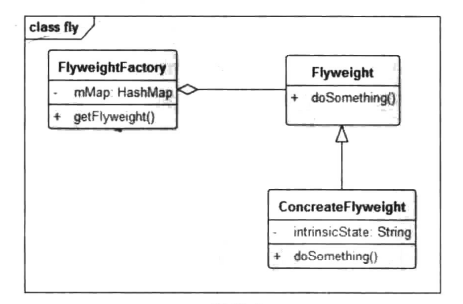
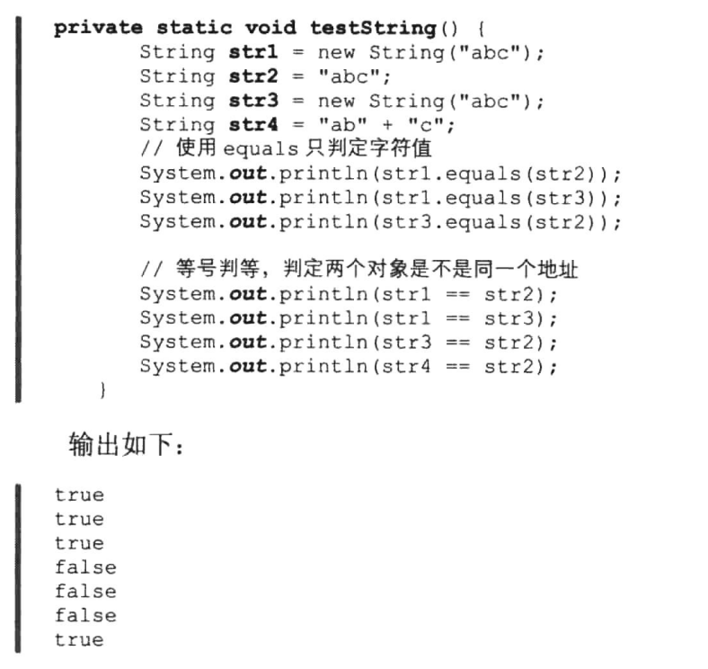

# 享元模式


## 一、概念


### 1、介绍

享元模式是对象池的一种实现，它的英文名称叫做Flyweight,.代表轻量级的意思。享元模式用来尽可能减少内存使用量，它适合用于可能存在大量重复对象的场景，来缓存可共享的对象，达到对象共享、避免创建过多对象的效果，这样一来就可以提升性能、避免内存移除等。

享元对象中的部分状态是可以共享，可以共享的状态成为内部状态，内部状态不会随着环境变化：不可共享的状态则称之为外部状态，它们会随着环境的改变而改变。在享元模式中会建立一个对象容器，在经典的享元模式中该容器为一个Map,它的键是享元对象的内部状态，它的值就是亨元对象本身。客户端程序通过这个内部状态从享元工厂中获取享元对象，如果有缓存则使用缓存对象，否则创建一个享元对象并且存入容器中，这样一来就避免了创建过多对象的问题。


### 2、定义

使用共享对象可有效地支持大量细粒度地对象。


### 3、使用场景

1. 系统中存在大量的相似对象。
2. 细粒度的对象都具备较接近的外部状态，而且内部状态与环境无关，也就是说对象没有特定身份。
3. 需要缓冲池的场景。


### 4、UML类图



角色介绍：

1. Flyweight：享元对象抽象基类或者接口；
2. ConcreteFlyweight：具体的享元对象；
3. FlyweightFactory：享元工厂，负责管理享元对象池和创建享元对象。


## 二、示例


### 1、示例

过年回家买火车票是一件很困难的事，无数人用刷票插件软件在向服务端发出请求，对于每一个请求服务器都必须做出应答。在用户设置好出发地和目的地之后，每次请求都返回一个查询的车票结果。为了便于理解，我们假设每次返回的只有一躺列车的车票。那么当数以万计的人不间断在请求数据时，如果每次都重新创建一个查询的车票结果，那么必然会造成大量重复对象的创建、销毁，使得GC任务繁重、内存占用率高居不下。而这类问题通过享元模式就能够得到很好地改善，从城市A到城市B的车辆是有限的，车上的铺位也就是硬卧、硬卧、坐票3种。我们将这些可以公用的对象缓存起来，在用户查询时优先使用缓存，如果没有缓存则重新创建。这样就将成千上万的对象变为了可选择的有限数量。

首先我们创建一个Ticket接口，该接口定义展示车票信息的函数，具体代码如下。

```java
package cn.pangchun.scaffold.design_patterns.flyweight;

/**
 * 车票接口：展示车票信息
 * 
 * @author pangchun
 * @since 2023/10/25
 */
public interface Ticket {

    /**
     * 展示车票信息
     * @param bunk 铺位，分为上铺、下铺、坐票
     */
    void showTicketInfo(String bunk);
}
```

它的一个具体的实现类是TrainTicket类，具体代码如下。

```java
package cn.pangchun.scaffold.design_patterns.flyweight;

import java.util.Random;

/**
 * 具体的火车票
 *
 * @author pangchun
 * @since 2023/10/25
 */
public class TrainTicket implements Ticket {

    private String from; // 起始地
    private String to; // 目的地
    private String bunk; // 铺位
    private int price; // 铺位

    public TrainTicket(String from, String to) {
        this.from = from;
        this.to = to;
    }

    @Override
    public void showTicketInfo(String bunk) {
        price = new Random().nextInt(300);
        System.out.println("购买从 " + from + " 到 " + to + " 的 " + bunk + " 火车票 " + ", 价格: " + price);
    }
}
```

数据库中表示火车票的信息有出发地、目的地、铺位、价格等字段，在购票用户每次查询时如果没有用某种缓存模式，那么返回车票数据的接口实现如下。

```java
package cn.pangchun.scaffold.design_patterns.flyweight;

/**
 * 车票工厂
 * 
 * @author pangchun
 * @since 2023/10/25
 */
public class TicketFactory {

    public static Ticket getTicket(String from, String to) {
        return new TrainTicket(from, to);
    }
}
```

在TicketFactory的getTicket函数中每次会new一个TrainTicket对象，也就是说如果在短时间内有10000万用户求购北京到青岛的车票，那么北京到青岛的车票对象就会被创建10000次，当数据返回之后这些对象变得无用了又会被虚拟机回收。此时就会造成大量的重复对象存在内存中，GC对这些对象的回收也会非常消耗资源。如果用户的请求量很大可能导致系统变得极其缓慢，甚至可能导致OOM。

正如上文所说，享元模式通过消息池的形式有效地减少了重复对象的存在。它通过内部状态标识某个种类的对象，外部程序根据这个不会变化的内部状态从消息池中取出对象。使得同一类对象可以被复用，避免大量重复对象。

使用享元模式很简单，只需要简单地改造一下TicketFactory,具体代码如下。

```java
package cn.pangchun.scaffold.design_patterns.flyweight;

import java.util.Map;
import java.util.concurrent.ConcurrentHashMap;

/**
 * 车票工厂
 * 
 * @author pangchun
 * @since 2023/10/25
 */
public class TicketFactory {

    public static Map<String ,Ticket> ticketMap = new ConcurrentHashMap<>();

    public static Ticket getTicket(String from, String to) {
        String key = from + "-" + to;
        if (ticketMap.containsKey(key)) {
            System.out.println("使用缓存 ====> " + key);
            return ticketMap.get(key);
        } else {
            System.out.println("创建对象 ====> " + key);
            final TrainTicket ticket = new TrainTicket(from, to);
            ticketMap.put(key, ticket);
            return ticket;
        }
    }
}
```

我们在TicketFactory添加了一个map容器，并且以出发地+“.”+目的地为键、以车票对象作为值存储车票对象。这个mp的键就是我们说的内部状态，在这里就是出发地、横杠、目的地拼接起来的字符串，如果没有缓存则创建一个对象，并且将这个对象缓存到map中，下次再有这类请求时则直接从缓存中获取。这样即使有10000个请求北京到青岛的车票信息，那么出发地是北京、目的地是青岛的车票对象只有一个。这样就从这个对象从10000减到了1个，避免了大量的内存占用及频繁的GC操作。简单实现代码如下。

```java
/**
 * 享元模式 - 火车票
 */
@Test
public void testFlyweight() {
    final Ticket ticket01 = TicketFactory.getTicket("北京", "青岛");
    ticket01.showTicketInfo("上铺");
    final Ticket ticket02 = TicketFactory.getTicket("北京", "青岛");
    ticket02.showTicketInfo("下铺");
    final Ticket ticket03 = TicketFactory.getTicket("北京", "青岛");
    ticket03.showTicketInfo("坐票");
}
```

结果输出：

```bash
创建对象 ====> 北京-青岛
购买从 北京 到 青岛 的 上铺 火车票 , 价格: 233
使用缓存 ====> 北京-青岛
购买从 北京 到 青岛 的 下铺 火车票 , 价格: 141
使用缓存 ====> 北京-青岛
购买从 北京 到 青岛 的 坐票 火车票 , 价格: 265
```

从输出结果可以看到，只有第一次查询车票时创建了一次对象，后续的查询都使用的是消息池中的对象。这其实就是相当于一个对象缓存，避免了对象的重复创建与回收。在这个例子中，内部状态就是出发地和目的地，内部状态不会发生变化：外部状态就是铺位和价格，价格会随着铺位的变化而变化。

在JDK中String也是类似消息池，我们知道在Java中String是存在于常量池中。也就是说一个String被定义之后它就被缓存到了常量池中，当其他地方要使用同样的字符串时，则直接使用的是缓存，而不会重复创建。例如下面这段代码。



在前3个通过equals函数判定中，由于它们的字符值都相等，因此3个判等都为rue,因此，String的equals只根据字符值进行判断。而在后4个判断中则使用的是两个等号判断，两个等号判断代表的意思是判定这两个对象是否相等，也就是两个对象指向的内存地址是否相等。由于s1和str3都是通过new构建的，而str2则是通过字面值赋值的，因此这3个判定都为false,因为它们并不是同一个对象。而st2和str4都是通过字面值赋值的，也就是直接通过双引号设置的字符串值，因此，最后一个通过“=”判定的值为tue,也就是说str2和str4是同一个字符串对象。因为sr4使用了缓存在常量池中的sr2对象。这就是享元模式在我们开发中的一个重要案例。
