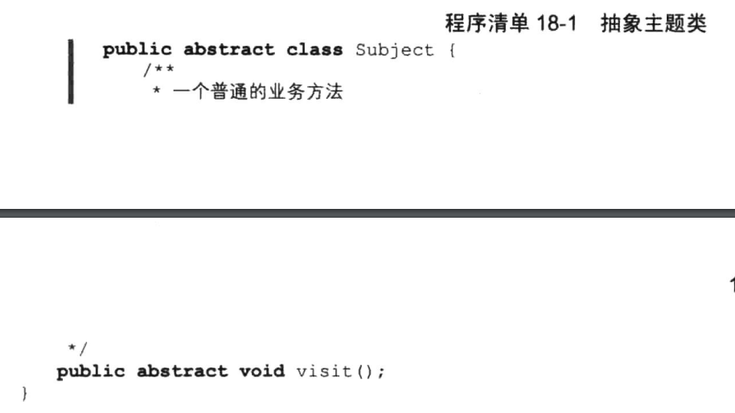

# 代理模式


## 一、概念


### 1、介绍

代理模式(Proxy Pattern)也称为委托模式，是本书结构型设计模式所讲的第一个模式，其重要性不言而喻，相信在学过本章的内容后会发现不少设计模式中都有代理模式的影子。那么何谓代理呢？其实代理在我们日常生活中也并不少见，对于程序员来说最常接触的莫过于代理上网了，连上代理服务器地址，就可以轻松畅游全世界的网络；还有每天吃饭时赶进度是常事，叫公司的同事帮忙买饭也是一种代理：如果你碰到辞职老板不给你发工资，那么你还得请个律师帮你打官司，这也是一种代理。总而言之，也许你并不留意，但是代理的确是无处不在，现实生活中如此，我们的Cod世界里也是如此！既然如此，我们来深究一下代理模式到底有多普遍。首先还是来看一个它的定义。


### 2、定义

为其他对象提供一种代理以控制对这个对象的访问。


### 3、使用场景

当无法或不想直接访问某个对象或访问某个对象存在困难时可以通过一个代理对象来间接访问，为了保证客户端使用的透明性，委托对象与代理对象需要实现相同的接口。


### 4、UML类图


角色介绍：

1. Subject：抽象主题类；

   该类的主要职责是声明真实主题与代理的共同接口方法，该类既可以是一个抽象类也可以是一个接口。

1. RealSubject:.真实主题类。
   该类也称为被委托类或被代理类，该类定义了代理所表示的真实对象，由其执行具体的业务逻辑方法，而客户类则通过代理类间接地调用真实主题类中定义的方法。

1. ProxySubject:代理类。
   该类也称为委托类或代理类，该类持有一个对真实主题类的引用，在其所实现的接口方法中调用真实主题类中相应的接口方法执行，以此起到代理的作用。

1. Client::客户类，即使用代理类的类型。


根据类图可以总结出一个代理模式的通用模式代码。




## 二、示例


### 1、示例一：律师代理诉讼

小民以前在公司上班时，就遇到过被老板拖欠工资甚至克扣工资的情况，这种情况下小民还是通过法律途径来解决问题，一旦小民选择了走法律途径解决该纠纷，那么不可避免地就需要请一个律师来作为自己的诉讼代理人，我们将诉讼的流程抽象在一个接口类中。

```java
package cn.pangchun.scaffold.design_patterns.proxy;

/**
 * 诉讼接口类
 * 
 * @author pangchun
 * @since 2023/10/25
 */
public interface ILawsuit {
    /**
     * 提交申请
     */
    void submit();

    /**
     * 进行举证
     */
    void burden();

    /**
     * 开始辩护
     */
    void defend();

    /**
     * 诉讼完成
     */
    void finish();
}
```

4个方法非常简单，都是诉讼的一般流程。

```java
package cn.pangchun.scaffold.design_patterns.proxy;

/**
 * 具体诉讼人
 * 
 * @author pangchun
 * @since 2023/10/25
 */
public class Xiaomin implements ILawsuit {
    @Override
    public void submit() {
        System.out.println("老板拖欠工资，小民只好申请仲裁");
    }

    @Override
    public void burden() {
        System.out.println("这是合同书和过去一年的银行工资流水");
    }

    @Override
    public void defend() {
        System.out.println("证据确凿，不需要再说什么了");
    }

    @Override
    public void finish() {
        System.out.println("诉讼成功，判决老板即日起七日内结算工资");
    }
}
```

如上所述，该类实现ILawsuit并对其中4个方法作出具体的实现逻辑，逻辑很简单，都只是输出一段话而己，当然，小民自己是不会去打官司的，于是小民请个律师代替自己进行诉讼。

```java
package cn.pangchun.scaffold.design_patterns.proxy;

/**
 * 代理律师
 * 
 * @author pangchun
 * @since 2023/10/25
 */
public class Lawyer implements ILawsuit {
    private ILawsuit iLawsuit;

    public Lawyer(ILawsuit iLawsuit) {
        this.iLawsuit = iLawsuit;
    }

    @Override
    public void submit() {
        iLawsuit.submit();
    }

    @Override
    public void burden() {
        iLawsuit.burden();
    }

    @Override
    public void defend() {
        iLawsuit.defend();
    }

    @Override
    public void finish() {
        iLawsuit.finish();
    }
}
```

律师类表示代理者律师，在该类里面会持有一个被代理者（这里也就是上面的Ag©类）的引用，律师所执行的方法实质就是简单地调用被代理者中的方法，下面来看看客户类中具体的调用执行关系。

```java
/**
 * 代理模式：静态代理 - 律师诉讼
 */
@Test
public void testStaticProxy() {
    // 构造诉讼人小民
    final Xiaomin xiaomin = new Xiaomin();
    // 构造代理律师
    final Lawyer lawyer = new Lawyer(xiaomin);

    // 律师代理诉讼
    lawyer.submit();
    lawyer.burden();
    lawyer.defend();
    lawyer.finish();
}
```

结果输出：

```bash
老板拖欠工资，小民只好申请仲裁
这是合同书和过去一年的银行工资流水
证据确凿，不需要再说什么了
诉讼成功，判决老板即日起七日内结算工资
```

运行结果很简单这里不再给出，大家可以看到，其实代理模式也很简单，其主要还是一种委托机制，真实对象将方法的执行委托给代理对象，而且委托得干净利落毫不做作，这也是为什么代理模式也称为委托模式的原因，相信大家不难理解。除此之外，大家其实可以继续发散思维，其实我们的代理类完全可以代理多个被代理类，就像上面的例子一样，一个律师可以代理多个人打官司，这是没有任何问题的，而具体到底是代理的哪个人，这就要看代理类中所持有的实际对象类型，上
述的例子中实际对象类型是XiaoMin,也就是代理的XiaoMin。

```java
public class Lawyer implements ILawsuit {
    private ILawsuit iLawsuit;

    public Lawyer(ILawsuit iLawsuit) {
        this.iLawsuit = iLawsuit;
    }

    // ...省略
}

@Test
public void testStaticProxy() {
    // 构造诉讼人小民
    final Xiaomin xiaomin = new Xiaomin();
    // 将小民作为构造参数传进去
    final Lawyer lawyer = new Lawyer(xiaomin);
    
    // ...省略
}
```

代理其他人可以吗？当然可以，比如小辉，我们只需再定义个XiaoHui类实现Lawsuit即可，再在客户类中修改高层模块调用逻辑，完全没问题。

如本文开头所述，代理模式是一个非常重要的模式，因此，本章内容会相对多一点，还望读者耐心阅读。代理模式可以大致分为两大部分，一是静态代理，二是动态代理。静态代理如上述示例那样，代理者的代码由程序员自己或通过一些自动化工具生成固定的代码再对其进行编译，也就是说在我们的代码运行前代理类的class编译文件就已存在；而动态代理则与静态代理相反，通过反射机制动态地生成代理者的对象，也就是说我们在cod阶段压根就不需要知道代理谁，代理谁我
们将会在执行阶段决定。而Java也给我们提供了一个便捷的动态代理接口InvocationHandler,实现该接口需要重写其调用方法invoke。


在这里，我们主要通过invoke方法来调用具体的被代理方法，也就是真实的方法。动态代理可以使我们的代码逻辑更简洁，不过在这之前我们得首先完善动态代理类。

```java
package cn.pangchun.scaffold.design_patterns.proxy;

import java.lang.reflect.InvocationHandler;
import java.lang.reflect.Method;

/**
 * 动态代理类
 *
 * @author pangchun
 * @since 2023/10/25
 */
public class DynamicProxy implements InvocationHandler {

    /**
     * 被代理的类引用
     */
    private Object obj;

    public DynamicProxy(Object obj) {
        this.obj = obj;
    }

    @Override
    public Object invoke(Object proxy, Method method, Object[] args) throws Throwable {
        // 调用被代理对象的方法
        final Object result = method.invoke(obj, args);
        return result;
    }
}
```

如上代码所述，我们声明一个Object的引用，该引用将指向被代理类，而我们调用被代理类的具体方法则在invoke方法中执行，是不是很简洁？也就是说我们原来由代理类所做的工作现在由InvocationHandler来处理，不再需要关心到底代理谁。下面我们修改客户类的逻辑。

```java
/**
 * 代理模式：动态代理 - 律师诉讼
 */
@Test
public void testDynamicProxy() {
    // 构造诉讼人小民
    final Xiaomin xiaomin = new Xiaomin();

    // 构造一个动态代理类
    final DynamicProxy proxy = new DynamicProxy(xiaomin);

    // 获取被代理类小民的Classloader
    final ClassLoader classLoader = xiaomin.getClass().getClassLoader();

    // 动态构造一个代理律师
    final ILawsuit lawyer = (ILawsuit) Proxy.newProxyInstance(classLoader, new Class[]{ILawsuit.class}, proxy);

    // 律师代理诉讼
    lawyer.submit();
    lawyer.burden();
    lawyer.defend();
    lawyer.finish();
}
```

输出结果：

```bash
老板拖欠工资，小民只好申请仲裁
这是合同书和过去一年的银行工资流水
证据确凿，不需要再说什么了
诉讼成功，判决老板即日起七日内结算工资
```

运行结果和以前一致，不再给出。由此可见动态代理通过一个代理类来代理N多个被代理类，其实质是对代理者与被代理者进行解耦，使两者直接没有直接的耦合关系。相对而言静态代理则只能为给定接口下的实现类做代理，如果接口不同那么就需要重新定义不同代理类，较为复杂，但是静态代理更符合面向对象原则。在开发时具体使用哪种方式来实现代理，就看自己的偏好了。

静态代理和动态代理是从code方面来区分代理模式的两种方式，我们也可以从其适用范围来区分不同类型的代理实现。

- 远程代理(Remote Proxy):为某个对象在不同的内存地址空间提供局部代理。使系统可以将Server部分的实现隐藏，以便Client可以不必考虑Server的存在。
- 虚拟代理(Virtual Proxy):使用一个代理对象表示一个十分耗资源的对象并在真正需要时才创建。
- 保护代理(Protection Proxy):使用代理控制对原始对象的访问。该类型的代理常被用于原始对象有不同访问权限的情况。
- 智能引用(Smart Reference):在访问原始对象时执行一些自己的附加操作并对指向原始对象的引用计数。

这里要注意的是，静态和动态代理都可以应用于上述4种情形，两者是各自独立的变化。


### 2、示例二：中介代理租房

接下来会以租客委托中介租房的例子来进行演示说明。这个示例是我以前写的，**这段代码在设计模式的代码包中没有的**。

代理模式分为静态代理、动态代理。

**静态代理是由程序员创建或工具生成代理类的源码**，再编译代理类。所谓静态也就是在程序运行前就己经存在代理类的字节码文件，代理类和委托类的关系在运行前就确定了。

动态代理是在实现阶段不用关心代理类，而在**运行阶段才指定哪一个对象**。


定义抽象角色：

```java
package cn.pangchun.test;

// 抽象角色：真实角色和代理角色都要实现的业务功能
public interface Rent {

    // 看房
    void seeHouse();

    // 付定金
    void deposit();

    // 签合同
    void sign();

    // 付租金
    void pay();
}
```


定义被代理角色：

```java
package cn.pangchun.test;

// 真实角色：租户
public class Tenant implements Rent {

    @Override
    public void seeHouse() {
        System.out.println("租户去看房子");
    }

    @Override
    public void deposit() {
        System.out.println("租户觉得房子不错，于是交了定金留房");
    }

    @Override
    public void sign() {
        System.out.println("租户来签合同了");
    }

    @Override
    public void pay() {
        System.out.println("租户签完合同，交了第一年的房租");
    }
}
```


定义代理角色：

```java
package cn.pangchun.test;

import lombok.AllArgsConstructor;
import lombok.Data;

// 代理角色：房中介
@Data
@AllArgsConstructor
public class HouseProxy implements Rent {

    // 持有对真实角色的引用
    private Tenant tenant;

    @Override
    public void seeHouse() {
        System.out.println("中介带租户看房子");
        tenant.seeHouse();
    }

    @Override
    public void deposit() {
        System.out.println("中介带租户交定金");
        tenant.deposit();
    }

    @Override
    public void sign() {
        System.out.println("中介带租户签合同");
        tenant.sign();
    }

    @Override
    public void pay() {
        System.out.println("中介带租户交房租");
        tenant.pay();
    }
}
```


客户端调用：

```java
package cn.pangchun.test;

// 客户端
public class Main {
    public static void main(String[] args) {
        Tenant tenant = new Tenant();
        HouseProxy houseProxy = new HouseProxy(tenant);
        houseProxy.seeHouse();
        houseProxy.deposit();
        houseProxy.sign();
        houseProxy.pay();
    }
}

// 中介带租户看房子
// 租户去看房子
// 中介带租户交定金
// 租户觉得房子不错，于是交了定金留房
// 中介带租户签合同
// 租户来签合同了
// 中介带租户交房租
// 租户签完合同，交了第一年的房租
```


动态代理分为两大类：基于接口的动态代理，基于类的动态代理。

- 基于接口：jdk动态代理。
- 基于类：cglib。
- java字节码实现：javassist。


这里我们主要了解jdk动态代理。面试时问道我们动态代理是怎么实现的？我们通常只是回答通过反射实现的，但是具体的却说不出东西来，因此一定了解Proxy类和InvocationHandler接口。


Proxy类


InvocationHandler接口


接下来上代码，抽象角色和真实角色不变，但是代理角色要通过动态代理获取。


动态代理类处理程序：

```java
package cn.pangchun.test;

import java.lang.reflect.InvocationHandler;
import java.lang.reflect.Method;
import java.lang.reflect.Proxy;

// 动态代理类处理程序：用于获取动态代理角色
public class DynamicProxyHandler implements InvocationHandler {

    // 注入被代理对象
    private Object target;

    public void setTarget(Object target) {
        this.target = target;
    }

    @Override
    public Object invoke(Object proxy, Method method, Object[] args) throws Throwable {
        System.out.println("动态代理类执行了" + method.getName() + "方法");
        Object result = method.invoke(target, args);
        return result;
    }

    /**
     * 获取代理角色：通过Proxy类创建
     *
     * @return 代理角色
     */
    public Object getProxy() {
        return Proxy.newProxyInstance(this.getClass().getClassLoader(), target.getClass().getInterfaces(), this);
    }
}
```


客户端调用：

```java
package cn.pangchun.test;

// 客户端
public class Main {
    public static void main(String[] args) {
        Tenant tenant = new Tenant();
        // 设置动态代理类代理的真实对象
        DynamicProxyHandler proxyHandler = new DynamicProxyHandler();
        proxyHandler.setTarget(tenant);
        // 在运行阶段获取代理角色
        Object proxy = proxyHandler.getProxy();
        // 生成的代理类仍然是抽象角色的一个实例
        if (proxy instanceof Rent) {
            ((Rent) proxy).seeHouse();
            ((Rent) proxy).deposit();
            ((Rent) proxy).sign();
            ((Rent) proxy).pay();
        }
    }
}

//动态代理类执行了seeHouse方法
// 租户去看房子
// 动态代理类执行了deposit方法
// 租户觉得房子不错，于是交了定金留房
// 动态代理类执行了sign方法
// 租户来签合同了
// 动态代理类执行了pay方法
// 租户签完合同，交了第一年的房租
```


