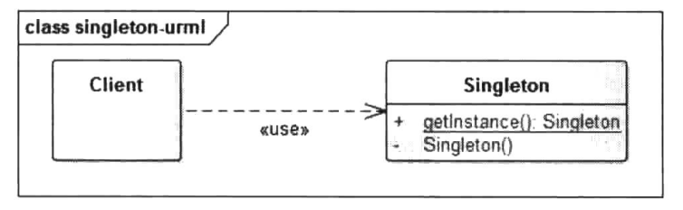

# 单例模式


## 一、概念


### 1、介绍

单例模式是应用最广的模式之一，也可能是很多初级工程师唯一会使用的设计模式。在应用这个模式时，单例对象的类必须保证只有一个实例存在。许多时候整个系统只需要拥有一个全局对象，这样有利于我们协调系统整体的行为。如在一个应用中，应该只有一个ImageLoader实例，这个ImageLoader中又含有线程池、缓存系统、网络请求等，很消耗资源，因此，没有理由让它构造多个实例。这种不能自由构造对象的情况，就是单例模式的使用场景。


### 2、定义

确保某一个类只有一个实例，而且自行实例化并向整个系统提供这个实例。


### 3、使用场景

确保某个类有且只有一个对象的场景，避免产生多个对象消耗过多的资源，或者某种类型的对象只应该有且只有一个。例如，创建一个对象需要消耗的资源过多，如要访问IO和数据库等资源，这时就要考虑使用单例模式。


### 4、UML类图



角色介绍：

1. Client：客户端；
2. Singleton：单例类。

实现单例模式主要有如下几个关键点：

1. 构造函数不对外开放，一般为Private；
2. 通过一个静态方法或者枚举返回单例类对象；
3. 确保单例类的对象有且只有一个，尤其是在多线程环境下；
4. 确保单例类对象在反序列化时不会重新构建对象。

通过将单例类的构造函数私有化，使得客户端代码不能通过w的形式手动构造单例类的对象。单例类会暴露一个公有静态方法，客户端需要调用这个静态方法获取到单例类的唯一对象，在获取这个单例对象的过程中需要确保线程安全，即在多线程环境下构造单例类的对象也是有且只有一个，这也是单例模式实现中比较困难的地方。


## 二、示例

下面通过模拟电脑回收站的例子来进行说明。


### 1、饿汉式单例

类加载就初始化，无论是否使用，都会产生一个实例。

```java
package cn.pangchun.scaffold.design_patterns.singleton;

/**
 * 饿汉式单例模式
 * 1.缺点：无论是否使用，都会产生一个实例
 *
 * @author pangchun
 * @since 2023/10/19
 */
public class HungryRecycleBin {

    /**
     * 静态变量：类加载便初始化得到实例对象
     */
    private static final HungryRecycleBin INSTANCE = new HungryRecycleBin();

    /**
     * 私有构造方法
     */
    private HungryRecycleBin() {}

    /**
     * 公开的静态函数，对外暴露获取单例对象的接口
     * @return 单例对象
     */
    public static HungryRecycleBin getInstance() {
        return INSTANCE;
    }
}
```

测试类：

```java
/**
 * 饿汉式单例模式
 */
@Test
@SneakyThrows
public void testHungrySingleton() {
    final HungryRecycleBin recycleBin1 = HungryRecycleBin.getInstance();
    final HungryRecycleBin recycleBin2 = HungryRecycleBin.getInstance();
    final HungryRecycleBin recycleBin3 = HungryRecycleBin.getInstance();

    System.out.println("recycleBin1.toString() = " + recycleBin1.toString());
    System.out.println("recycleBin2.toString() = " + recycleBin2.toString());
    System.out.println("recycleBin3.toString() = " + recycleBin3.toString());

    // 打印结果：三个对象的内存地址一致，说明是同一个实例
    // recycleBin1.toString() = cn.pangchun.scaffold.design_patterns.singleton.HungryRecycleBin@484a5ddd
    // recycleBin2.toString() = cn.pangchun.scaffold.design_patterns.singleton.HungryRecycleBin@484a5ddd
    // recycleBin3.toString() = cn.pangchun.scaffold.design_patterns.singleton.HungryRecycleBin@484a5ddd
}
```


### 2、懒汉式单例

懒汉模式是声明一个静态对象，并且在用户第一次调用getInstance时进行初始化，而上述的饿汉模式是在声明静态对象时就己经初始化。

多线程不加锁（synchronized）的时候，会产生多个实例。

```java
package cn.pangchun.scaffold.design_patterns.singleton;

/**
 * 懒汉式单例模式
 * 1.缺点：每次获取单例都要进行同步，消耗资源
 *
 * @author pangchun
 * @since 2023/10/19
 */
public class LazyRecycleBin {

    private static LazyRecycleBin instance;

    /**
     * 私有构造方法
     */
    private LazyRecycleBin() {}

    /**
     * 公开的静态函数，对外暴露获取单例对象的接口
     * 1.synchronized保证多线程下单例对象的唯一性
     * 2.每次获取单例都要synchronized，消耗不必要的资源
     * @return 单例对象
     */
    public static synchronized LazyRecycleBin getInstance() {
        if (instance == null) {
            instance = new LazyRecycleBin();
        }
        return instance;
    }
}
```

测试类：

```java
/**
 * 懒汉式单例模式
 */
@Test
@SneakyThrows
public void testLazySingleton() {
    final LazyRecycleBin recycleBin1 = LazyRecycleBin.getInstance();
    final LazyRecycleBin recycleBin2 = LazyRecycleBin.getInstance();
    final LazyRecycleBin recycleBin3 = LazyRecycleBin.getInstance();

    System.out.println("recycleBin1.toString() = " + recycleBin1.toString());
    System.out.println("recycleBin2.toString() = " + recycleBin2.toString());
    System.out.println("recycleBin3.toString() = " + recycleBin3.toString());

    // 打印结果：三个对象的内存地址一致，说明是同一个实例
    // recycleBin1.toString() = cn.pangchun.scaffold.design_patterns.singleton.LazyRecycleBin@5bdb9c69
    // recycleBin2.toString() = cn.pangchun.scaffold.design_patterns.singleton.LazyRecycleBin@5bdb9c69
    // recycleBin3.toString() = cn.pangchun.scaffold.design_patterns.singleton.LazyRecycleBin@5bdb9c69
}
```

读者可能已经发现了，getInstance()方法中添加了synchronized关键字，也就是getInstance是一个同步方法，这就是上面所说的在多线程情况下保证单例对象唯一性的手段。细想一下，大家可能会发现一个问题，即使instance已经被初始化（第一次调用时就会被初始化instance),每次调用getInstance方法都会进行同步，这样会消耗不必要的资源，这也是懒汉单例模式存在的最大问题。

最后总结一下，懒汉单例模式的优点是单例只有在使用时才会被实例化，在一定程度上节约了资源：缺点是第一次加载时需要及时进行实例化，反应稍慢，最大的问题是每次调用getInstance都进行同步，造成不必要的同步开销。这种模式一般不建议使用。


### 3、DCL懒汉式单例

DCL方式实现单例模式的优点是既能够在需要时才初始化单例，又能够保证线程安全，且单例对象初始化后调用getInstance不进行同步锁。

- DCL（double-checked locking）表示双重检锁，加锁以防止多线程创建多个实例；
- 指令重排：编译器、JVM 或者 CPU 都有可能出于优化等目的，对于实际指令执行的顺序进行调整；
- 为什么要禁止指令重排：多线程环境中线程交替执行，由于编译器指令重排的存在，两个线程使用的变量能否保证一致性是无法确认的，结果无法预测；
- DCL 的优点是，既能够在需要时才初始化单例，又能够保证线程安全，且单例对象初始化后调用getInstance不进行同步锁；缺点是，第一次加载时反应稍慢，且 volatile 多少会影响性能。

```java
package cn.pangchun.scaffold.design_patterns.singleton;

/**
 * double check lock 双重检锁单例模式
 * 
 * @author pangchun
 * @since 2023/10/19
 */
public class DclRecycleBin {

    /**
     * volatile防止指令重排，每次都从主内存中获取instance对象
     */
    private volatile static DclRecycleBin instance = null;

    /**
     * 私有构造方法
     */
    private DclRecycleBin() {}

    /**
     * 公开的静态函数，对外暴露获取单例对象的接口
     * @return 单例对象
     */
    public static DclRecycleBin getInstance() {
        // 判空，避免不必要的同步
        if (instance == null) {
            synchronized (DclRecycleBin.class) {
                // 判空，避免多线程下，因为instance = new DclRecycleBin();语句的指令重排序，导致DCL失效，创建多个实例对象
                if (instance == null) {
                    instance = new DclRecycleBin();
                }
            }
        }
        return instance;
    }
}
```

测试类：

```java
/**
 * DCL单例模式
 */
@Test
@SneakyThrows
public void testDclSingleton() {
    final DclRecycleBin recycleBin1 = DclRecycleBin.getInstance();
    final DclRecycleBin recycleBin2 = DclRecycleBin.getInstance();
    final DclRecycleBin recycleBin3 = DclRecycleBin.getInstance();

    System.out.println("recycleBin1.toString() = " + recycleBin1.toString());
    System.out.println("recycleBin2.toString() = " + recycleBin2.toString());
    System.out.println("recycleBin3.toString() = " + recycleBin3.toString());

    // 打印结果：三个对象的内存地址一致，说明是同一个实例
    // recycleBin1.toString() = cn.pangchun.scaffold.design_patterns.singleton.DclRecycleBin@37e64e37
    // recycleBin2.toString() = cn.pangchun.scaffold.design_patterns.singleton.DclRecycleBin@37e64e37
    // recycleBin3.toString() = cn.pangchun.scaffold.design_patterns.singleton.DclRecycleBin@37e64e37
}
```

本程序的亮点自然都在getInstance方法上，可以看到getInstance方法中对instance进行了两次判空：第一层判断主要是为了避免不必要的同步，第二层的判断则是为了在null的情况下创建实例。这是什么意思呢？是不是有点摸不着头脑，下面就一起来分析一下。
假设线程A执行到 instance = new DclRecycleBin() 语句，这里看起来是一句代码，但实际上它并不是一个原子操作，这句代码最终会被编译成多条汇编指令，它大致做了3件事情：

1. 给 DclRecycleBin 的实例分配内存；
2. 调用 DclRecycleBin() 构造函数，初始化成员字段；
3. 将 instance对象指向分配的内存空间，此时的 instance 就不再是 null 了。

但是，由于Java编译器允许处理器乱序执行，以及JDK1.5之前JMM(Java Memory Model,即Java内存模型)中Cache、寄存器到主内存回写顺序的规定，上面的第二和第三的顺序是无法保证的。也就是说，执行顺序可能是1-2-3也可能是1-3-2。如果是后者，并且在3执行完毕、2未执行之前，被切换到线程B上，这 Instance因为已经在线程A内执行过了第三点，Instance已经是非空了，所以，线程B直接取走Instance,再使用时就会出错，这就是DCL失效问题，而且
这种难以跟踪难以重现的错误很可能会隐藏很久。

在JDK1.5之后，SUN官方已经注意到这种问题，调整了JVM,具体化了volatile关键字，因此，如果JDK是l.5或之后的版本，只需要将sInstance的定义改成 private volatile static DclRecycleBin instance = null; 就可以保证Instance对象每次都是从主内存中读取，就可以使用DCL的写法来完成单例模式。当然，volatile或多或少也会影响到性能，但考虑到程序的正确性，牺牲这点性能还是值得的。

DCL的优点：资源利用率高，第一次执行getInstance时单例对象才会被实例化，效率高。缺点：第一次加载时反应稍慢，也由于Java内存模型的原因偶尔会失败。在高并发环境下也有一定的缺陷，虽然发生概率很小。DCL模式是使用最多的单例实现方式，它能够在需要时才实例化单例对象，并且能够在绝大多数场景下保证单例对象的唯一性，除非你的代码在并发场景比较复杂或者低于JDK6版本下使用，否则，这种方式一般能够满足需求。


### 4、静态内部类单例

DCL虽然在一定程度上解决了资源消耗、多余的同步、线程安全等问题，但是，它还是在某些情况下出现失效的问题。这个问题被称为双重检查锁定(DCL)失效，在《Java并发编程实践》一书的最后谈到了这个问题，并指出这种“优化”是丑陋的，不赞成使用。而建议使用如下的代码替代：

```java
package cn.pangchun.scaffold.design_patterns.singleton;

/**
 * 静态内部类单例模式
 * 
 * @author pangchun
 * @since 2023/10/19
 */
public class StaticRecycleBin {

    /**
     * 私有构造方法
     */
    private StaticRecycleBin() {}

    /**
     * 公开的静态函数，对外暴露获取单例对象的接口
     * @return 单例对象
     */
    public static StaticRecycleBin getInstance() {
        return SingletonHolder.instance;
    }

    /**
     * 静态内部类
     */
    private static class SingletonHolder {
        private static final StaticRecycleBin instance = new StaticRecycleBin();
    }
}
```

当第一次加载StaticRecycleBin类时并不会初始化Instance.,只有在第一次调用getInstance方法时才会导致Instance被初始化。因此，第一次调用getInstance方法会导致虚拟机加载SingletonHolder类，这种方式不仅能够确保线程安全，也能够保证单例对象的唯一性，同时也延迟了单例的实例化，所以这是推荐使用的单例模式实现方式。


### 5、枚举类单例

枚举单例既写法简单，同时是线程安全的。

```java
package cn.pangchun.scaffold.design_patterns.singleton;

/**
 * 枚举单例
 *
 * @author pangchun
 * @since 2023/10/19
 */
public enum EnumRecycleBin {

    // 枚举单例
    Instance;

    public void doSomething() {
        System.out.println("do something...");
    }
}
```

写法简单是枚举单例最大的优点，枚举在Jva中与普通的类是一样的，不仅能够有字段，还能够有自己的方法。最重要的是默认枚举实例的创建是线程安全的，并且在任何情况下它都是一个单例。为什么这么说呢？在上述的几种单例模式实现中，在一个情况下它们会出现重新创建对象的情况，那就是反序列化。

通过序列化可以将一个单例的实例对象写到磁盘，然后再读回来，从而有效地获得一个实例。即使构造函数是私有的，反序列化时依然可以通过特殊的途径去创建类的一个新的实例，相当于调用该类的构造函数。反序列化操作提供了一个很特别的钩子函数，类中具有一个私有的、被实例化的方法readResolve(),这个方法可以让开发人员控制对象的反序列化。

例如，上述几个示例中如果要杜绝单例对象在被反序列化时重新生成对象，那么必须加入如下方法：

```java
private Object readResolve() throws ObjectStreamException {
    return Instance;
}
```

也就是在readResolve方法中将sInstance对象返回，而不是默认的重新生成一个新的对象。**而对于枚举，并不存在这个问题，因为即使反序列化它也不会重新生成新的实例。**


### 6、使用容器实现单例模式

在学习了上述各类单例模式的实现之后，再来看看一种另类的实现，具体代码如下：

```java
package cn.pangchun.scaffold.design_patterns.singleton;

import java.util.HashMap;
import java.util.Map;

/**
 * 使用容器实现单例模式
 * 
 * @author pangchun
 * @since 2023/10/19
 */
public class SingletonManager {

    private static Map<String, Object> map = new HashMap<>();

    private SingletonManager() {
    }

    public static void registerService(String key, Object instance) {
        if (!map.containsKey(key)) {
            map.put(key, instance);
        }
    }

    public static Object getService(String key) {
        return map.get(key);
    }
}
```

在程序的初始，将多种单例类型注入到一个统一的管理类中，在使用时根据ky获取对象对应类型的对象。这种方式使得我们可以管理多种类型的单例，并且在使用时可以通过统一的接口进行获取操作，降低了用户的使用成本，也对用户隐藏了具体实现，降低了耦合度。不管以哪种形式实现单例模式，它们的核心原理都是将构造函数私有化，并且通过静态方法获取一个唯一的实例，在这个获取的过程中必须保证线程安全、防止反序列化导致重新生成实例对象
等问题。选择哪种实现方式取决于项目本身，如是否是复杂的并发环境、JDK版本是否过低、单例对象的资源消耗等。


