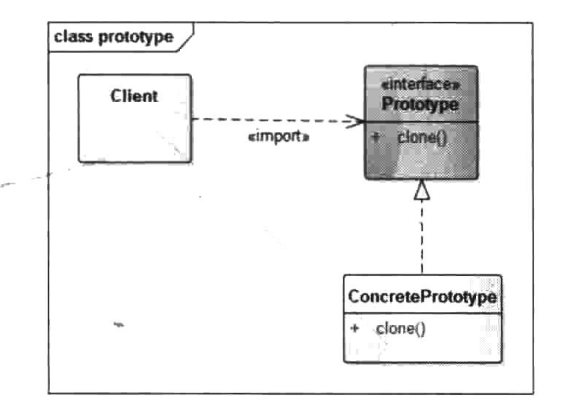

# 原型模式


## 一、概念


### 1、介绍

原型模式是一个创建型的模式。原型二字表明了该模式应该有一个样板实例，用户从这个样板对象中复制出一个内部属性一致的对象，这个过程也就是我们俗称的“克隆”。被复制的实例就是我们所称的“原型”，这个原型是可定制的。原型模式多用于创建复杂的或者构造耗时的实例，因为这种情况下，复制一个已经存在的实例可使程序运行更高效。


### 2、定义

用原型实例指定创建对象的种类，并通过拷贝这些原型创建新的对象。


### 3、使用场景

1. 类初始化需要消化非常多的资源，这个资源包括数据、硬件资源等，通过原型拷贝避免这些消耗。
2. 通过new产生一个对象需要非常繁琐的数据准备或访问权限，这时可以使用原型模式。
3. 一个对象需要提供给其他对象访问，而且各个调用者可能都需要修改其值时，‘可以考虑使用原型模式拷贝多个对象供调用者使用，即保护性拷贝。

需要注意的是，通过实现Cloneable接口的原型模式在调用clone函数构造实例时并不一定比通过new操作速度快，只有当通过new构造对象较为耗时或者说成本较高时，通过clone方法才能够获得效率上的提升。因此，在使用Cloneable时需要考虑构建对象的成本以及做一些效率上的测试。当然，实现原型模式也不一定非要实现Cloneable接口，也有其他的实现方式，本章将会对这些一一说明。


### 4、UML类图



角色介绍：

1. Client：客户端用户。
2. Prototype：抽象类或者接口，声明具备clone能力。
3. ConcretePrototype：具体的原型类。


## 二、示例

下面通过模拟文档拷贝的例子来进行说明。

一个文档内包含文字和图片，现在要对已经完成的文档进行修改，用户不想直接在文档上修改，想拷贝一份来修改。（保护性拷贝）


### 1、浅克隆

对于引用对象的修改，会同时反映到原型上。

```java
package cn.pangchun.scaffold.design_patterns.prototype;

import lombok.Data;

import java.util.ArrayList;
import java.util.List;

/**
 * 原型模式-浅拷贝/深拷贝
 *
 * @author pangchun
 * @since 2023/10/19
 */
@Data
public class WordDocument implements Cloneable {

    /**
     * 文本
     */
    private String text;

    /**
     * 图片集合，List是引用类型，浅拷贝时，在克隆对象上的修改会反映在原型对象上
     */
    private ArrayList<String> mImages = new ArrayList<>();

    @Override
    public WordDocument clone() {
        try {
            final WordDocument doc = (WordDocument) super.clone();
            doc.text = text;
            doc.mImages = mImages;
            return doc;
        } catch (Exception e) {
            e.printStackTrace();
        }
        return null;
    }

    /**
     * 添加图片
     * @param img 图片
     */
    public void addImage(String img) {
        mImages.add(img);
    }

    /**
     * 展示文档内容
     */
    public void showDocument() {
        System.out.println("---------- document start -------------");
        System.out.println("text = " + text);
        System.out.println("Images List: ");
        for (String mImage : mImages) {
            System.out.println("image name: " + mImage);
        }
        System.out.println("---------- document end -------------");
    }
}
```

测试类：

```java
/**
 * 原型模式-浅克隆
 */
@Test
@SneakyThrows
public void testShallowPrototype() {
    // 构建文档对象
    final WordDocument originDoc = new WordDocument();
    // 编辑文档
    originDoc.setText("这是一篇文档");
    originDoc.addImage("图片1");
    originDoc.addImage("图片2");
    originDoc.addImage("图片3");
    originDoc.showDocument();

    // 以原始文档为原型，拷贝一份副本
    final WordDocument doc2 = originDoc.clone();
    doc2.showDocument();
    // 修改副本的文本内容，不会影响原文档
    doc2.setText("这是修改过的副本");
    doc2.showDocument();

    originDoc.showDocument();

    // 修改副本的图片，原文档的图片内容也被改变，因为List是引用类型，浅拷贝后，原文档和副本的mImages是同一个对象
    doc2.addImage("图片4");
    doc2.showDocument();

    originDoc.showDocument();
}
```

结果输出：

```bash
---------- document start -------------
text = 这是一篇文档
Images List: 
image name: 图片1
image name: 图片2
image name: 图片3
---------- document end -------------
---------- document start -------------
text = 这是一篇文档
Images List: 
image name: 图片1
image name: 图片2
image name: 图片3
---------- document end -------------
---------- document start -------------
text = 这是修改过的副本
Images List: 
image name: 图片1
image name: 图片2
image name: 图片3
---------- document end -------------
---------- document start -------------
text = 这是一篇文档
Images List: 
image name: 图片1
image name: 图片2
image name: 图片3
---------- document end -------------
---------- document start -------------
text = 这是修改过的副本
Images List: 
image name: 图片1
image name: 图片2
image name: 图片3
image name: 图片4
---------- document end -------------
---------- document start -------------
text = 这是一篇文档
Images List: 
image name: 图片1
image name: 图片2
image name: 图片3
image name: 图片4
---------- document end -------------
```

从打印结果中可以看到，doc2是通过originDoc.clone(）创建的，并且doc2第一次输出的时候和originDoc输出是一样的，即doc2是originDoc的一份拷贝，它们的内容是一样的，而doc2修改了文本内容以后并不会影响originDoc的文本内容，这就保证了originDoc的安全性。还需要注意的是，通过cloe拷贝对象时并不会执行构造函数！因此，如果在构造函数中需要一些特殊的初始化操作的类型**，在使用Cloneable实现拷贝时，需要注意构造函数不会执行的问题。**


### 2、深克隆

深克隆是指，在拷贝对象时，对于引用类型的字段也要采用拷贝的形式，而不是单纯引用的形式。

对于引用对象的修改，不会影响原对象，需要在重写克隆方法时，对引用对象也执行克隆方法。

只需要修改一下clone方法即可：

```java
/**
 * 深拷贝
 */
@Override
public WordDocument clone() {
    try {
        final WordDocument doc = (WordDocument) super.clone();
        doc.text = text;
        // 对mImages对象也执行clone()函数，执行深拷贝
        doc.mImages = (ArrayList<String>) this.mImages.clone();
        return doc;
    } catch (Exception e) {
        e.printStackTrace();
    }
    return null;
}
```

测试类：

```java
/**
 * 原型模式-深克隆
 */
@Test
@SneakyThrows
public void testDeepPrototype() {
    // 构建文档对象
    final WordDocument originDoc = new WordDocument();
    // 编辑文档
    originDoc.setText("这是一篇文档");
    originDoc.addImage("图片1");
    originDoc.addImage("图片2");
    originDoc.addImage("图片3");

    // 以原始文档为原型，拷贝一份副本
    final WordDocument doc2 = originDoc.clone();
    // 修改副本的内容
    doc2.setText("这是修改过的副本");
    doc2.addImage("图片4");

    doc2.showDocument();
    originDoc.showDocument();
}
```

结果输出：

```bash
---------- document start -------------
text = 这是修改过的副本
Images List: 
image name: 图片1
image name: 图片2
image name: 图片3
image name: 图片4
---------- document end -------------
---------- document start -------------
text = 这是一篇文档
Images List: 
image name: 图片1
image name: 图片2
image name: 图片3
---------- document end -------------
```


