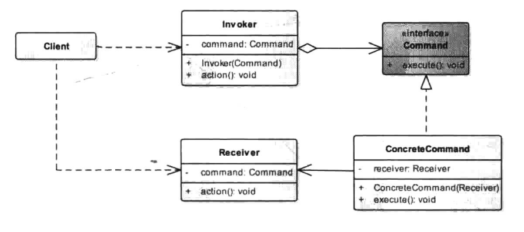

# 命令模式


## 一、概念


### 1、介绍

命令模式(Command Pattern),是行为型设计模式之一。命令模式相对于其他的设计模式来说并没有那么多的条条框框，其实它不是一个很“规矩”的模式，不过，就是基于这一点，命令模式相对于其他的设计模式更为灵活多变。我们接触比较多的命令模式个例无非就是程序菜单命令，如在操作系统中，我们点击“关机”命令，系统就会执行一系列的操作，如先是暂停处理事件，保存系统的一些配置，然后结束程序进程，最后调用内核命令关闭计算机等，对于这一系列的命令，用户不用去管，用户只需点击系统的关机按钮即可完成如上一系列的命令。而我们的命令模式其实也与之相同，将一系列的方法调用封装，用户只需调用一个方法执行，那么所有这些被封装的方法就会被挨个执行调用。

本质上就是，一个命令其实是对一段底层代码的调用，这个命令会持有底层代码逻辑对象的引用，当执行这个命令时，这个命令本质上还是去调用这个底层对象的方法。


### 2、定义与使用

将一个请求封装成一个对象，从而让用户使用不同的请求把客户端参数化；对请求排队或者记录请求日志，以及支持可撤销的操作。

使用场景：

1. 需要抽象出待执行的动作，然后以参数的形式提供出来一类似于过程设计中的回调机制，而命令模式正是回调机制的一个面向对象的替代品。
2. 在不同的时刻指定、排列和执行请求。一个命令对象可以有与初始请求无关的生存期。
3. 需要支持取消操作。
4. 支持修改日志功能，这样当系统崩溃时，这些修改可以被重做一遍。
5. 需要支持事务操作。


### 3、UML类图




- Receiver：接收者角色。

  > 该类负责具体实施或执行一个请求，说得通俗点就是，执行具体逻辑的角色，以本章开头的“关机”命令操作为例，其接收者角色就是真正执行各项关机逻辑的底层代码。任何一个类都可以成为一个接收者，而在接收者类中封装具体操作逻辑的方法我们则称为行动方法。

- Command：命令角色。

  > 定义所有具体命令类的抽象接口。

- ConcreteCommand：具体命令角色。

  > 该类实现了Command接口，在execute方法中调用接收者角色的相关方法，在接收者和命令执行的具体行为之间加以弱耦合。而execute则通常称为执行方法，如本文开头所述“关机的”操作实现，具体可能还包含很多相关的操作，比如保存数据、关闭文件、结束进程等，如果将这一系列具体的逻辑处理看作接收者，那么调用这些具体逻辑的方法就可以看作是执行方法。

- Invoker：请求者角色。

  > 该类的职责就是调用命令对象执行具体的请求，相关的方法我们称为行动方法，还是用“关机”为例，“关机”这个菜单命令一般就对应一个关机方法，我们点击了“关机”命令后，由这个关机方法去调用具体的命令执行具体的逻辑，这里的“关机”对应的这个方法就可以看做是请求者。（可以在invoker对象中使用list保存历史命令，以便支持撤销等操作）

- Client：客户端角色，指人。


## 二、示例


### 1、示例一 - 俄罗斯方块

用命令模式展示俄罗斯方块的几个按钮的操控过程。

一般来说，俄罗斯方块游戏中都有4个按钮，两个左右移动的按钮，一个快速落下的按钮，还有一个变化方块形状的按钮，这是比较经典的游戏原型。一个玩游戏的人就相当于我们的客户端，而游戏上的4个按钮就相当于请求者，或者也可以称为调用者，执行具体按钮命令的逻辑方法可以看作是命令角色，当然，游戏内部具体是怎么实现的我们不知道，也不在这里探讨，仅作例子分析，最后真正执行处理具体逻辑的则是游戏本身，你可以看作是各种机器码计算处理来执行的具体逻辑，这里我们将它看作是接收者角色。

逻辑分析比较清楚了，我们来将其“翻译”成代码，首先是我们的接收者，这里以俄罗斯方块游戏本身作为接收者角色。

接收者是唯一处理具体逻辑代码的地方，其他地方或类都是直接或间接地调用到该类地方法。

```java
package cn.pangchun.scaffold.design_patterns.command;

/**
 * 接收者角色：底层逻辑代码实现
 *
 * @author pangchun
 * @since 2023/10/9
 */
public class TetrisMachine {

    /**
     * 真正处理 向左移动 操作的逻辑代码
     */
    public void toLeft() {
        System.out.println("向左移动");
    }

    /**
     * 真正处理 向右移动 操作的逻辑代码
     */
    public void toRight() {
        System.out.println("向右移动");
    }

    /**
     * 真正处理 改变形状 操作的逻辑代码
     */
    public void transform() {
        System.out.println("改变形状");
    }

    /**
     * 真正处理 快速落下 操作的逻辑代码
     */
    public void fastToBottom() {
        System.out.println("快速落下");
    }
}
```

接下来定义一个接口作为命令角色的抽象。

```java
package cn.pangchun.scaffold.design_patterns.command;

/**
 * 命令角色
 *
 * @author pangchun
 * @since 2023/10/9
 */
public interface Command {

    /**
     * 命令执行方法
     */
    void execute();
}
```

然后定义4个具体的命令，向左移动，向右移动，改变形状，快速落下。

```java
package cn.pangchun.scaffold.design_patterns.command;

import lombok.AllArgsConstructor;
import lombok.Data;

/**
 * 具体命令角色：向左移动
 * 
 * @author pangchun
 * @since 2023/10/9
 */
@Data
@AllArgsConstructor
public class LeftCommand implements Command {

    /**
     * 持有一个对接收者对象(游戏机)的引用
     */
    private TetrisMachine tetrisMachine;

    @Override
    public void execute() {
        // 调用游戏机里具体的逻辑操作
        tetrisMachine.toLeft();
    }
}
```

```java
package cn.pangchun.scaffold.design_patterns.command;

import lombok.AllArgsConstructor;
import lombok.Data;

/**
 * 具体命令角色：向右移动
 * 
 * @author pangchun
 * @since 2023/10/9
 */
@Data
@AllArgsConstructor
public class RightCommand implements Command {

    /**
     * 持有一个对接收者对象(游戏机)的引用
     */
    private TetrisMachine tetrisMachine;

    @Override
    public void execute() {
        // 调用游戏机里具体的逻辑操作
        tetrisMachine.toRight();
    }
}
```

```java
package cn.pangchun.scaffold.design_patterns.command;

import lombok.AllArgsConstructor;
import lombok.Data;

/**
 * 具体命令角色：改变形状
 * 
 * @author pangchun
 * @since 2023/10/9
 */
@Data
@AllArgsConstructor
public class TransformCommand implements Command {

    /**
     * 持有一个对接收者对象(游戏机)的引用
     */
    private TetrisMachine tetrisMachine;

    @Override
    public void execute() {
        // 调用游戏机里具体的逻辑操作
        tetrisMachine.transform();
    }
}
```

```java
package cn.pangchun.scaffold.design_patterns.command;

import lombok.AllArgsConstructor;
import lombok.Data;

/**
 * 具体命令角色：快速落下
 * 
 * @author pangchun
 * @since 2023/10/9
 */
@Data
@AllArgsConstructor
public class FallCommand implements Command {

    /**
     * 持有一个对接收者对象(游戏机)的引用
     */
    private TetrisMachine tetrisMachine;

    @Override
    public void execute() {
        // 调用游戏机里具体的逻辑操作
        tetrisMachine.fastToBottom();
    }
}
```

对于请求者，我们用一个 Buttons 类来表示，命令由按钮来执行。

```java
package cn.pangchun.scaffold.design_patterns.command;

import lombok.Data;
import lombok.experimental.Accessors;

/**
 * 请求者角色
 * 
 * @author pangchun
 * @since 2023/10/9
 */
@Data
@Accessors(chain = true)
public class Buttons {

    /**
     * 持有命令对象的引用
     */
    private LeftCommand leftCommand;
    private RightCommand rightCommand;
    private TransformCommand transformCommand;
    private FallCommand fallCommand;

    /**
     * 按下按钮 向左移动
     */
    public void toLeft() {
        leftCommand.execute();
    }

    /**
     * 按下按钮 向右移动
     */
    public void toRight() {
        rightCommand.execute();
    }

    /**
     * 按下按钮 改变形状
     */
    public void transform() {
        transformCommand.execute();
    }

    /**
     * 按下按钮 快速落下
     */
    public void fall() {
        fallCommand.execute();
    }
}
```

最后，由客户端来决定如何调用。

```java
    /**
     * 命令模式
     */
    @Test
    public void testCommand() {
        // 首先要有俄罗斯方块游戏
        final TetrisMachine tetrisMachine = new TetrisMachine();

        // 根据游戏我们构造四种命令
        final LeftCommand leftCommand = new LeftCommand(tetrisMachine);
        final RightCommand rightCommand = new RightCommand(tetrisMachine);
        final TransformCommand transformCommand = new TransformCommand(tetrisMachine);
        final FallCommand fallCommand = new FallCommand(tetrisMachine);

        // 按钮可以执行不同的命令
        final Buttons buttons = new Buttons();
        buttons.setLeftCommand(leftCommand)
                .setRightCommand(rightCommand)
                .setTransformCommand(transformCommand)
                .setFallCommand(fallCommand);

        // 具体按哪个按钮玩家说了算
        buttons.toLeft();
        buttons.toRight();
        buttons.transform();
        buttons.fall();
    }
```

```bash
向左移动
向右移动
改变形状
快速落下
```

调用逻辑做得如此复杂，这是因为开发起来方便，每次我们增加或修改游戏功能只需修改TetrisMachine类就行了，然后对应地改一改Player类，一切都很方便。但是，对开发者自己来说是方便了，那么，如果有一天开发者不再负责这个项目了呢？这样的逻辑留给后来者，没人会觉得方便。设计模式有一条重要的原则：对修改关闭对扩展开放，大家可以细细体会。除此之外，使用命令模式的另一个好处是可以实现命令记录的功能，如在上例中，我们在请求者Buttons里使用一个数据结构来存储执行过的命令对象，以此可以方便地知道刚刚执行过哪些命令动作，并可以在需要时恢复，具体代码大家可自行尝试，这里不再给出。

### 2、示例二 - 计算器

使用命令模式，模拟一个计算器，由加、减、乘、除、结算、归零、撤销、恢复等八个命令组成。撤销、恢复这两个命令，可以通过在给每个命令中添加undo方法，然后在请求者角色Invoker中将一系列已执行的命令用List保存起来，就既能支持Undo，也能支持Redo操作。

首先，需要一个接收者角色，真正实现计算器的底层逻辑。（加、减、乘、除、结算、归零）

```java
package cn.pangchun.scaffold.design_patterns.command.calculator;

import cn.pangchun.scaffold.support.exception.ParameterException;
import lombok.Data;

/**
 * 接收者角色：真正实现计算器底层逻辑
 *
 * @author pangchun
 * @since 2023/10/10
 */
@Data
public class CalculatorMachine {

    /**
     * 记录结果
     */
    private Double result = (double) 0;

    /**
     * 加法
     * @param v 加几
     * @return 运算结果
     */
    public double add(double v) {
        this.result = result + v;
        return result;
    }

    /**
     * 减法
     * @param v 减几
     * @return 运算结果
     */
    public double subtract(double v) {
        this.result = result - v;
        return result;
    }

    /**
     * 乘法
     * @param v 乘几
     * @return 运算结果
     */
    public double multiply(double v) {
        this.result = result * v;
        return result;
    }

    /**
     * 除法
     * @param v 除几
     * @return 运算结果
     */
    public double divide(double v) {
        if (0 == v) {
            throw new ParameterException("除法运算参数异常，被除数不能为零");
        }
        this.result = result / v;
        return result;
    }

    /**
     * 结算
     * @return 运算结果
     */
    public double settle() {
        return result;
    }

    /**
     * 归零
     */
    public void zero() {
        setResult((double) 0);
    }
}
```

然后，抽象命令角色。（执行、撤销）

```java
package cn.pangchun.scaffold.design_patterns.command.calculator.command;

/**
 * 抽象命令角色: 加减乘除、撤销
 *
 * @author pangchun
 * @since 2023/10/10
 */
public interface CalculatorCommand {

    /**
     * 执行命令
     * @return 运算结果
     */
    double execute();

    /**
     * 撤销
     */
    void undo();
}
```

实现具体命令。

```java
package cn.pangchun.scaffold.design_patterns.command.calculator.command.impl;

import cn.pangchun.scaffold.design_patterns.command.calculator.CalculatorMachine;
import cn.pangchun.scaffold.design_patterns.command.calculator.command.CalculatorCommand;
import lombok.Data;

/**
 * 具体命令角色: 加法
 * 
 * @author pangchun
 * @since 2023/10/10
 */
@Data
public class AddCommand implements CalculatorCommand {

    private CalculatorMachine machine;

    /**
     * 运算参数
     */
    private double param;

    /**
     * 上一次运算结果: 每次计算前保存一下上一次的结果，执行撤销命令时可以直接获取
     */
    private double lastRs;

    @Override
    public double execute() {
        this.setLastRs(machine.getResult());
        return machine.add(param);
    }

    @Override
    public void undo() {
        machine.setResult(lastRs);
    }

    public AddCommand(CalculatorMachine machine, double param) {
        this.machine = machine;
        this.param = param;
    }
}
```

```java
package cn.pangchun.scaffold.design_patterns.command.calculator.command.impl;

import cn.pangchun.scaffold.design_patterns.command.calculator.CalculatorMachine;
import cn.pangchun.scaffold.design_patterns.command.calculator.command.CalculatorCommand;
import lombok.AllArgsConstructor;
import lombok.Data;

/**
 * 具体命令角色: 减法
 * 
 * @author pangchun
 * @since 2023/10/10
 */
@Data
@AllArgsConstructor
public class SubtractCommand implements CalculatorCommand {

    private CalculatorMachine machine;

    /**
     * 运算参数
     */
    private double param;

    /**
     * 上一次运算结果: 每次计算前保存一下上一次的结果，执行撤销命令时可以直接获取
     */
    private double lastRs;

    @Override
    public double execute() {
        this.setLastRs(machine.getResult());
        return machine.subtract(param);
    }

    @Override
    public void undo() {
        machine.setResult(lastRs);
    }

    public SubtractCommand(CalculatorMachine machine, double param) {
        this.machine = machine;
        this.param = param;
    }
}
```

```java
package cn.pangchun.scaffold.design_patterns.command.calculator.command.impl;

import cn.pangchun.scaffold.design_patterns.command.calculator.CalculatorMachine;
import cn.pangchun.scaffold.design_patterns.command.calculator.command.CalculatorCommand;
import lombok.AllArgsConstructor;
import lombok.Data;

/**
 * 具体命令角色: 乘法
 * 
 * @author pangchun
 * @since 2023/10/10
 */
@Data
@AllArgsConstructor
public class MultiplyCommand implements CalculatorCommand {

    private CalculatorMachine machine;

    /**
     * 运算参数
     */
    private double param;

    /**
     * 上一次运算结果: 每次计算前保存一下上一次的结果，执行撤销命令时可以直接获取
     */
    private double lastRs;

    @Override
    public double execute() {
        this.setLastRs(machine.getResult());
        return machine.multiply(param);
    }

    @Override
    public void undo() {
        machine.setResult(lastRs);
    }

    public MultiplyCommand(CalculatorMachine machine, double param) {
        this.machine = machine;
        this.param = param;
    }
}
```

```java
package cn.pangchun.scaffold.design_patterns.command.calculator.command.impl;

import cn.pangchun.scaffold.design_patterns.command.calculator.CalculatorMachine;
import cn.pangchun.scaffold.design_patterns.command.calculator.command.CalculatorCommand;
import lombok.AllArgsConstructor;
import lombok.Data;

/**
 * 具体命令角色: 除法
 * 
 * @author pangchun
 * @since 2023/10/10
 */
@Data
@AllArgsConstructor
public class DivideCommand implements CalculatorCommand {

    private CalculatorMachine machine;

    /**
     * 运算参数
     */
    private double param;

    /**
     * 上一次运算结果: 每次计算前保存一下上一次的结果，执行撤销命令时可以直接获取
     */
    private double lastRs;

    @Override
    public double execute() {
        this.setLastRs(machine.getResult());
        return machine.divide(param);
    }

    @Override
    public void undo() {
        machine.setResult(lastRs);
    }

    public DivideCommand(CalculatorMachine machine, double param) {
        this.machine = machine;
        this.param = param;
    }
}
```

```java
package cn.pangchun.scaffold.design_patterns.command.calculator.command.impl;

import cn.pangchun.scaffold.design_patterns.command.calculator.CalculatorMachine;
import lombok.AllArgsConstructor;

/**
 * 具体命令角色: 结算
 * 
 * @author pangchun
 * @since 2023/10/10
 */
@AllArgsConstructor
public class SettleCommand {

    private CalculatorMachine machine;

    public double settle() {
        return machine.settle();
    }
}
```

```java
package cn.pangchun.scaffold.design_patterns.command.calculator.command.impl;

import cn.pangchun.scaffold.design_patterns.command.calculator.CalculatorMachine;
import lombok.AllArgsConstructor;

/**
 * 具体命令角色: 归零
 * 
 * @author pangchun
 * @since 2023/10/10
 */
@AllArgsConstructor
public class ZeroCommand {

    private CalculatorMachine machine;

    public void zero() {
        machine.zero();
    }
}
```

然后需要一个请求者角色，由请求者去执行这些命令。在这里需要进行判断，撤销和重做是否可以执行，使用list集合按顺序保存执行过的命令，便可以完成连续撤销的操作。

```java
package cn.pangchun.scaffold.design_patterns.command.calculator;

import cn.pangchun.scaffold.design_patterns.command.calculator.command.CalculatorCommand;
import cn.pangchun.scaffold.design_patterns.command.calculator.command.impl.*;
import cn.pangchun.scaffold.support.exception.BusinessException;
import lombok.Data;
import lombok.experimental.Accessors;

import java.util.ArrayList;
import java.util.Collections;
import java.util.List;

/**
 * 请求者角色：与客户端直接交互
 *
 * @author pangchun
 * @since 2023/10/10
 */
@Data
@Accessors(chain = true)
public class CalculatorInvoker {

    /**
     * 计算器: 用于构造命令对象
     */
    private CalculatorMachine machine;

    /**
     * 引用命令对象
     */
    private SettleCommand settleCommand;
    private ZeroCommand zeroCommand;

    /**
     * 计算列表
     */
    private final List<CalculatorCommand> calculateList = Collections.synchronizedList(new ArrayList<>());

    /**
     * 重做列表
     */
    private final List<CalculatorCommand> redoList = Collections.synchronizedList(new ArrayList<>());

    /**
     * 加法
     * @param v 加几
     * @return 运算结果
     */
    public double add(double v) {
        // 构造加法命令
        final AddCommand command = new AddCommand(machine, v);
        calculateList.add(command);
        redoList.clear();
        return command.execute();
    }

    /**
     * 减法
     * @param v 减几
     * @return 运算结果
     */
    public double subtract(double v) {
        // 构造减法命令
        final SubtractCommand command = new SubtractCommand(machine, v);
        calculateList.add(command);
        redoList.clear();
        return command.execute();
    }

    /**
     * 乘法
     * @param v 乘几
     * @return 运算结果
     */
    public double multiply(double v) {
        // 构造乘法命令
        final MultiplyCommand command = new MultiplyCommand(machine, v);
        calculateList.add(command);
        redoList.clear();
        return command.execute();
    }

    /**
     * 除法
     * @param v 除几
     * @return 运算结果
     */
    public double divide(double v) {
        // 构造除法命令
        final DivideCommand command = new DivideCommand(machine, v);
        calculateList.add(command);
        redoList.clear();
        return command.execute();
    }

    /**
     * 结算
     * @return 运算结果
     */
    public double settle() {
        return settleCommand.settle();
    }

    /**
     * 归零
     */
    public void zero() {
        // 清楚撤销和重做列表
        calculateList.clear();
        redoList.clear();
        zeroCommand.zero();
    }

    /**
     * 是否可以撤销
     * @return ...
     */
    public boolean canUndo() {
        return calculateList.size() > 0;
    }

    /**
     * 是否可以重做
     * @return ...
     */
    public boolean canRedo() {
        return redoList.size() > 0;
    }

    /**
     * 撤销上一步的命令
     */
    public void undo() {
        if (!canUndo()) {
            throw new BusinessException("当前没有可撤销的操作");
        }
        final CalculatorCommand undo = calculateList.get(calculateList.size() - 1);
        calculateList.remove(calculateList.size() - 1);
        undo.undo();
        redoList.add(undo);
    }

    /**
     * 重做上一步撤销的命令
     */
    public void redo() {
        if (!canRedo()) {
            throw new BusinessException("当前没有可重做的操作");
        }
        final CalculatorCommand redo = redoList.get(redoList.size() - 1);
        redoList.remove(redoList.size() - 1);
        redo.execute();
        calculateList.add(redo);
    }
}
```

在上面的代码中，可以发现，每次执行加减乘除操作都是新建一个命令对象，然后把命令对象按顺序存入list中，这样就能够完成连续的撤销操作。

最终，由客户端来决定如何进行计算。

```java
/**
     * 命令模式 - 计算器
     */
    @Test
    public void testCommand2() {
        // 首先有计算器
        final CalculatorMachine machine = new CalculatorMachine();

        // 构造结算和归零两个命令，其他命令需要结合数字按钮来构造，就直接放在CalculatorInvoker中，每次运算会先构造一个新的命令
        final SettleCommand settleCommand = new SettleCommand(machine);
        final ZeroCommand zeroCommand = new ZeroCommand(machine);

        // 计算器的按钮执行不同的命令
        final CalculatorInvoker invoker = new CalculatorInvoker();
        invoker.setMachine(machine)
                .setSettleCommand(settleCommand)
                .setZeroCommand(zeroCommand);

        // 由用户进行操作
        System.out.println("invoker.add(100) = " + invoker.add(100));
        System.out.println("invoker.add(200) = " + invoker.add(200));
        System.out.println("invoker.subtract(100) = " + invoker.subtract(100));
        System.out.println("invoker.divide(2) = " + invoker.divide(2));
        System.out.println("invoker.multiply(4) = " + invoker.multiply(4));
        if (invoker.canUndo()) {
            invoker.undo();
            System.out.println("invoker.settle() = " + invoker.settle());
        }
        System.out.println("invoker.divide(3) = " + invoker.divide(3));
        if (invoker.canUndo()) {
            invoker.undo();
            System.out.println("invoker.settle() = " + invoker.settle());
        }
        if (invoker.canRedo()) {
            invoker.redo();
            System.out.println("invoker.settle() = " + invoker.settle());
        }
    }
```

结果输出

```bash
invoker.add(100) = 100.0
invoker.add(200) = 300.0
invoker.subtract(100) = 200.0
invoker.divide(2) = 100.0
invoker.multiply(4) = 400.0
invoker.settle() = 100.0
invoker.divide(3) = 33.333333333333336
invoker.settle() = 100.0
invoker.settle() = 33.333333333333336
```


