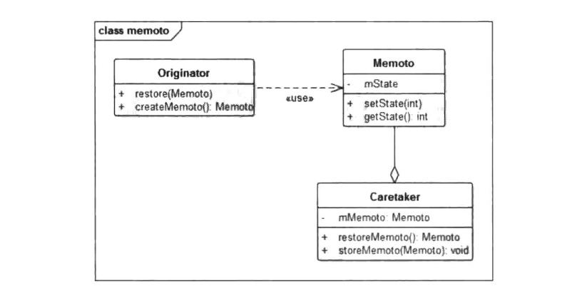

# 备忘录模式


## 一、概念


### 1、介绍

备忘录模式是一种行为模式，该模式用于保存对象当前状态，并且在之后可以再次恢复到此状态，这有点像我们平时说的“后悔药”。备忘录模式实现的方式需要保证被保存的对象状态不能被对象从外部访问，目的是为了保护好被保存的这些对象状态的完整性以及内部实现不向外暴露。


### 2、定义

在不破坏封闭的前提下，捕获一个对象的内部状态，并在该对象之外保存这个状态，这样，以后就可将该对象恢复到原先保存的状态。


### 3、使用场景

1. 需要保存一个对象在某一个时刻的状态或部分状态。
2. 如果用一个接口来让其他对象得到这些状态，将会暴露对象的实现细节并破坏对象的封装性，一个对象不希望外界直接访问其内部状态，通过中间对象可以间接访问其内部状态。


### 3、UML类图




- Originator：负责创建一个备忘录，可以记录、恢复自身的内部状态。同时Originator还可以根据需要决定Memento存储自身的哪些内部状态。
- Memento：备忘录角色，用于存储Originator的内部状态，并且可以防止Originator以外的对象访问Memento.。
- Caretaker：负责存储备忘录，不能对备忘录的内容进行操作和访问，只能够将备忘录传递给其他对象。


## 二、示例


### 1、示例

对备忘录模式来说，比较贴切的场景应该是游戏中的存档功能，该功能就是将游戏进度存储到本地文件系统或者数据库中，下次再次进入时从本地加载进度，使得玩家能够继续上一次的游戏之旅，这里我们就以“使命召唤”这款游戏为例来简单演示一下备忘录模式的实现。

首先我们建立游戏类、备忘录类、Caretaker类，玩游戏到某个节点对游戏进行存档，然后退出游戏，再重新进入时从存档中读取进度，并且进入存档时的进度。

首先看游戏类。

```java
package cn.pangchun.scaffold.design_patterns.memoto;

/**
 * 使命召唤游戏
 * 
 * @author pangchun
 * @since 2023/10/17
 */
public class CallOfDuty {

    // 第几关
    private int mCheckpoint = 1;
    // 血量
    private int mLifeValue = 100;
    // 武器
    private String mWeapon = "沙漠之鹰";

    /**
     * 玩游戏
     */
    public void play() {
        System.out.println("玩游戏：" + String.format("第%d关", mCheckpoint) + "奋战杀敌中");
        mLifeValue -= 10;
        System.out.println("进度升级啦");
        mCheckpoint++;
        System.out.println("到达" + String.format("第%d关", mCheckpoint));
    }

    /**
     * 退出游戏
     */
    public void quit() {
        System.out.println("-------------");
        System.out.println("退出游戏前的属性：" + this.toString());
        System.out.println("退出游戏");
        System.out.println("-------------");
    }

    /**
     * 创建备忘录
     * @return 备忘录
     */
    public Memoto createMemoto() {
        final Memoto memoto = new Memoto();
        memoto.mCheckpoint = mCheckpoint;
        memoto.mLifeValue = mLifeValue;
        memoto.mWeapon = mWeapon;
        return memoto;
    }

    /**
     * 恢复游戏进度
     * @param memoto 备忘录
     */
    public void restore(Memoto memoto) {
        this.mCheckpoint = memoto.mCheckpoint;
        this.mLifeValue = memoto.mLifeValue;
        this.mWeapon = memoto.mWeapon;
        System.out.println("恢复后的游戏属性：" + this.toString());
    }

    @Override
    public String toString() {
        return "CallOfDuty{" +
                "mCheckpoint=" + mCheckpoint +
                ", mLifeValue=" + mLifeValue +
                ", mWeapon='" + mWeapon + '\'' +
                '}';
    }
}
```

在CallOfDuty游戏类中，我们存储了几个关键字段，关卡、人物的生命值、武器，当调用play函数玩游戏时，我们对关卡和人物的生命值进行修改。在该类中可以通过createMemoto函数来创建该用户的备忘录对象，也就是将自身的状态保存到一个Memoto对象中。外部可以通过restore函数将CallOfDuty对象的状态从备忘录对象中恢复。

我们先来看看备忘录对象，它只是存储CallOfDuty对象的字段，具体代码如下：

```java
package cn.pangchun.scaffold.design_patterns.memoto;

/**
 * 备忘录角色：只负责存储数据
 *
 * @author pangchun
 * @since 2023/10/17
 */
public class Memoto {

    // 第几关
    public int mCheckpoint;
    // 血量
    public int mLifeValue;
    // 武器
    public String mWeapon;
}
```

这是一个无状态、无操作的实体类，只负责用来存储Originator角色的一些数据，防止外部直接访问Originator。

而备忘录的操作者则是Caretaker角色，我们看看相关的代码：

```java
package cn.pangchun.scaffold.design_patterns.memoto;

/**
 * CareTaker：负责管理备忘录
 * 
 * @author pangchun
 * @since 2023/10/17
 */
public class CareTaker {

    private Memoto memoto;

    /**
     * 存档
     * @param memoto 备忘录
     */
    public void archive(Memoto memoto) {
        this.memoto = memoto;
    }

    /**
     * 获取存档
     * @return 备忘录
     */
    public Memoto getMemoto() {
        return this.memoto;
    }
}
```

Caretaker类的职责很简单，就是负责管理Memoto对象，也就是备忘录对象。

我们再来看看客户端使用的代码。

```java
/**
 * 备忘录模式 - 使命召唤游戏
 */
@Test
public void testMemoto() {
    // 构造游戏对象
    final CallOfDuty game = new CallOfDuty();
    // 打游戏
    game.play();

    final CareTaker careTaker = new CareTaker();
    // 存档
    careTaker.archive(game.createMemoto());
    // 退出游戏
    game.quit();
    // 恢复游戏
    game.restore(careTaker.getMemoto());
}
```

输出结果：

```bash
玩游戏：第1关奋战杀敌中
进度升级啦
到达第2关
-------------
退出游戏前的属性：CallOfDuty{mCheckpoint=2, mLifeValue=90, mWeapon='沙漠之鹰'}
退出游戏
-------------
恢复后的游戏属性：CallOfDuty{mCheckpoint=2, mLifeValue=90, mWeapon='沙漠之鹰'}
```

上述过程大致有如下4步：

(1)开始游戏，闯关升级：
(2)游戏退出之前进行存档：
(3)退出游戏：
(4)重新启动游戏，从存档中恢复游戏进度。

CallOfDuty在这里为Originator角色，也就是需要存储数据的对象，在这里并没有直接存储CallOfDuty的对象，而是通过Memoto对CallOfDuty对象的数据进行存储，然后再存储Memoto对象，最终对Memoto的存取操作则交给Caretaker对象。在这个过程中，各个角色职责清晰、单一，代码也比较简单，即对外屏蔽了对CallOfDuty角色的直接访问，在满足了对象状态存取功能的同时也使得该模块的结构保持清晰、整洁。


