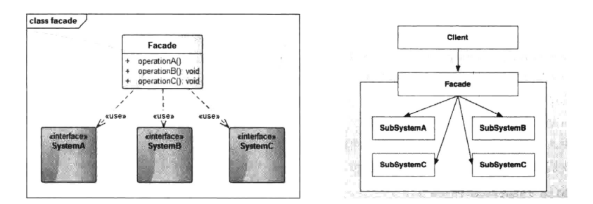
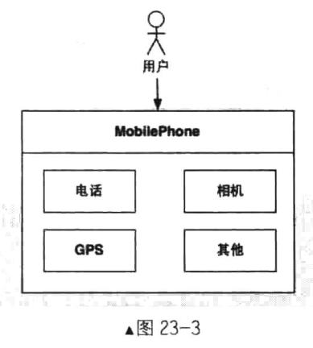

# 外观模式


## 一、概念


### 1、介绍

外观模式(Facade)在开发过程中的运用频率非常高，尤其是在现阶段各种第三方SDK充斥我们的周边，而这些SDK很大概率会使用外观模式。通过一个外观类使得整个系统的接口只有一个统一的高层接口，这样能够降低用户的使用成本，也对用户屏蔽了很多实现细节。当然，在我们的开发过程中，外观模式也是我们封装API的常用手段，例如网络模块、ImageLoader模块等。


### 2、定义

要求一个子系统的外部与其内部的通信必须通过一个统一的对象进行。门面模式(Facade模式)提供一个高层次的接口，使得子系统更易于使用。


### 3、使用场景

1. 为一个复杂子系统提供一个简单接口。子系统往往因为不断演化而变得越来越复杂，甚至可能被替换。大多数模式使用时都会产生更多、更小的类，在这使子系统更具可重用性的同时也更容易对子系统进行定制、修改，这种易变性使得隐藏子系统的具体实现变得尤为重要。Facade可以提供一个简单统一的接口，对外隐藏子系统的具体实现、隔离变化：
2. 当你需要构建一个层次结构的子系统时，使用Facade模式定义子系统中每层的入口点。如果子系统之间是相互依赖的，你可以让它们仅通过Facade接口进行通信，从而简化了它们之间的依赖关系。


### 4、UML类图

外观模式接口比较简单，就是通过一个统一的接口对外提供服务，使得外部程序只通过一个类就可以实现系统内部的多种功能，而这些实现功能的内部子系统之间可能也有交互，或者说完成一个功能需要几个子系统之间进行协作，如果没有封装，那么用户就需要操作几个子系统的交互逻辑，容易出现错误。而通过外观类来对外屏蔽这些复杂的交互，降低用户的使用成本。它的结构如下图所示：



角色介绍：

1. Facade：系统对外的统一接口，系统内部系统地工作；
1. SystemA、SystemB、SystemC：子系统接口；


## 示例


### 1、示例

生活中使用外观模式的例子非常多，任何一个类似中央调度结构的组织都类似外观模式。举个简单的例子，手机就是一个外观模式的例子，它集合了电话功能、短信功能、GPS、拍照等于一身，通过手机你就可以完成各种功能。而不是当你打电话时使用一个诺基亚1100，要拍照时非得用一个相
机，如果是这样每使用一个功能你就必须操作特定的设备，会使得整个过程很繁琐。而手机给了你一个统一的入口，集电话、上网、拍照等功能于一身，使用方便，操作简单。结构图如图23-3所示。



下面我们来简单模拟一下手机的外观模式实现，首先我们建立一个MobilePhone类。代码大致如下。

```java
package cn.pangchun.scaffold.design_patterns.facade;

/**
 * 外观者角色：手机，是统一地入口，包含通话、拍摄的功能
 *
 * @author pangchun
 * @since 2023/10/25
 */
public class MobilePhone {

    private DialSystem dialSystem = new DialSystemImpl();
    private CameraSystem cameraSystem = new CameraSystemImpl();

    public void dial() {
        dialSystem.dial();
    }

    public void videoChat() {
        System.out.println("---> 视频聊天接通中");
        cameraSystem.open();
        dialSystem.dial();
    }

    public void hangup() {
        dialSystem.hangup();
    }

    public void takePicture() {
        cameraSystem.open();
        cameraSystem.takePicture();
    }

    public void closeCamera() {
        cameraSystem.close();
    }
}
```

MobilePhone类中含有两个子系统，也就是拨号系统和拍照系统，MobilePhone将这两个系统封装起来，为用户提供一个统一的操作接口，也就是说用户只需要通过MobilePhone这个类就可以操作打电话和拍照这两个功能。用户不需要知道有Phone这个接口以及它的实现类是Phonelmpl,同样也不需要知道Camera相关的信息，通过MobilePhone就可以包揽一切。而在MobilePhone中也封装了两个子系统的交互，例如视频电话时需要先打开摄像头，然后再开始拨号，如果没有这步的封装，每次用户实现视频通话功能时都需要手动打开摄像头、进行拨号，这样会增加用户的使用成本，外观模式使得这些操作更加简单、易用。

我们来看看Phone接口和Phonelmpl。

```java
package cn.pangchun.scaffold.design_patterns.facade;

/**
 * 子系统：拨号系统
 *
 * @author pangchun
 * @since 2023/10/25
 */
public interface DialSystem {

    /**
     * 拨号
     */
    void dial();

    /**
     * 挂断
     */
    void hangup();
}
```

```java
package cn.pangchun.scaffold.design_patterns.facade;

/**
 * 具体的子系统：通话
 * 
 * @author pangchun
 * @since 2023/10/25
 */
public class DialSystemImpl implements DialSystem {
    @Override
    public void dial() {
        System.out.println("打电话");
    }

    @Override
    public void hangup() {
        System.out.println("挂断");
    }
}
```

代码很简单，就是单纯的抽象与实现。Camera也是类似的实现，具体代码如下。

```java
package cn.pangchun.scaffold.design_patterns.facade;

/**
 * 子系统：拍摄系统
 *
 * @author pangchun
 * @since 2023/10/25
 */
public interface CameraSystem {

    /**
     * 打开相机
     */
    void open();

    /**
     * 拍摄
     */
    void takePicture();

    /**
     * 关闭相机
     */
    void close();
}
```

```java
package cn.pangchun.scaffold.design_patterns.facade;

/**
 * 具体的子系统：拍照
 *
 * @author pangchun
 * @since 2023/10/25
 */
public class CameraSystemImpl implements CameraSystem {
    @Override
    public void open() {
        System.out.println("打开相机");
    }

    @Override
    public void takePicture() {
        System.out.println("拍照");
    }

    @Override
    public void close() {
        System.out.println("关闭相机");
    }
}
```

测试类：

```java
/**
 * 外观模式 - 手机子系统
 */
@Test
public void testFacade() {
    final MobilePhone mobilePhone = new MobilePhone();
    mobilePhone.takePicture();
    mobilePhone.videoChat();

    // 打印结果
    // 打开相机
    // 拍照
    // ---> 视频聊天接通中
    // 打开相机
    // 打电话
}
```

从上述代码中可以看到，外观模式就是统一接口封装。将子系统的逻辑、交互隐藏起来，为用户提供一个高层次的接口，使得系统更加易用，同时也对外隐藏了具体的实现，这样即使具体的子系统发生了变化，用户也不会感知到，因为用户使用的是Facade高层接口，内部的变化对于用户来说并不可见。这样一来就将变化隔离开来，使得系统也更为灵活。


