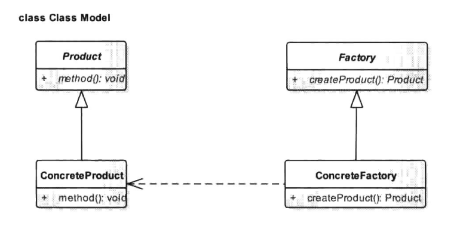

# 工厂方法模式


## 一、概念


### 1、介绍

工厂方法模式(Factory Pattern),是创建型设计模式之一。工厂方法模式是一种结构简单的模式，其在我们平时开发中应用很广泛，也许你并不知道，但是你已经使用了无数次该模式了，如Android中的Activity里的各个生命周期方法，以onCreate方法为例，它就可以看作是一个工厂方法，我们在其中可以构造我们的View并通过setContentView返回给framework处理等，相关内容我们下面再讲，先来看看工厂方法的模式定义。


### 2、定义

定义一个用于创建对象的接口，让子类决定实例化哪个类。


### 3、使用场景

在任何需要生成复杂对象的地方，都可以使用工厂方法模式。复杂对象适合使用工厂模式，用new就可以完成创建的对象无需使用工厂模式。


### 4、UML类图



角色介绍：

1. Factory：抽象工厂，定义创建产品的抽象方法；
2. ConcreteFactory：具体工厂，实现创建产品的具体方法；
3. Product：抽象产品，产品基类；
4. ConcreteProduct：具体产品。


根据类图，我们可以得出如下一个工厂方法模式的通用模式代码。

抽象产品：

```java
package cn.pangchun.scaffold.design_patterns.factory;

/**
 * 抽象产品类
 *
 * @author pangchun
 * @since 2023/10/20
 */
public abstract class Product {

    /**
     * 产品的抽象方法，由具体的子类去实现
     */
    public abstract void method();
}
```

具体产品：

```java
package cn.pangchun.scaffold.design_patterns.factory;

/**
 * 具体产品类A
 *
 * @author pangchun
 * @since 2023/10/20
 */
public class ConcreteProductA extends Product {
    @Override
    public void method() {
        System.out.println("具体产品A");
    }
}
```

```java
package cn.pangchun.scaffold.design_patterns.factory;

/**
 * 具体产品类B
 *
 * @author pangchun
 * @since 2023/10/20
 */
public class ConcreteProductB extends Product {
    @Override
    public void method() {
        System.out.println("具体产品B");
    }
}
```

抽象工厂：

```java
package cn.pangchun.scaffold.design_patterns.factory;

/**
 * 抽象产品工厂：定义生产产品的方法
 *
 * @author pangchun
 * @since 2023/10/20
 */
public abstract class Factory {

    /**
     * 抽象方法，生产何种产品由子类决定
     * @return 产品对象
     */
    public abstract Product createProduct();
}
```

具体工厂：

```java
package cn.pangchun.scaffold.design_patterns.factory;

/**
 * 具体工厂A：只生产A类产品
 *
 * @author pangchun
 * @since 2023/10/20
 */
public class FactoryA extends Factory {
    @Override
    public Product createProduct() {
        return new ConcreteProductA();
    }
}
```

```java
package cn.pangchun.scaffold.design_patterns.factory;

/**
 * 具体工厂B：只生产B类产品
 *
 * @author pangchun
 * @since 2023/10/20
 */
public class FactoryB extends Factory {
    @Override
    public Product createProduct() {
        return new ConcreteProductB();
    }
}
```

测试类：客户端

```java
/**
 * 工厂方法模式
 */
@Test
@SneakyThrows
public void testFactory() {
    // 创建工厂
    final FactoryA factoryA = new FactoryA();
    final FactoryB factoryB = new FactoryB();

    // 通过工厂生产产品
    final Product productA = factoryA.createProduct();
    final Product productB = factoryB.createProduct();

    productA.method();
    productB.method();

    // 结果输出
    // 具体产品A
    // 具体产品B
}
```

这种为每一个产品都定义一个工厂，每个工厂各司其职，这种模式叫做工厂方法模式。

如果我们只有一个工厂，想要生产多种产品，可以给抽象工厂的createProduct方法添加一个Class类的参数，根据class参数，使用反射来生产产品，这种叫做静态工厂模式，代码如下：

修改抽象工厂：

```java
public abstract class Factory {
    /**
     * 抽象工厂方法
     * @param tClass 产品对象类型
     * @return 产品对象
     */
    public abstract <T extends Product> T createProduct(Class<T> tClass);
}
```

修改具体工厂A：

```java
public class FactoryA extends Factory {
    @Override
    public <T extends Product> T createProduct(Class<T> tClass) {
        Product p = null;
        try {
            // 通过反射生成产品对象
            p = (Product) Class.forName(tClass.getName()).newInstance();
        } catch (Exception e) {
            e.printStackTrace();
        }
        return (T) p;
    }
}
```

客户端：

```java
/**
 * 工厂方法模式
 */
@Test
@SneakyThrows
public void testFactory() {
    // 创建工厂
    final FactoryA factoryA = new FactoryA();

    // 通过工厂生产产品
    final Product productA = factoryA.createProduct(ConcreteProductA.class);
    final Product productB = factoryA.createProduct(ConcreteProductB.class);

    productA.method();
    productB.method();

    // 结果输出
    // 具体产品A
    // 具体产品B
}
```


## 二、示例

工厂方法模式十分简单，这里就不再举例了，代码都是重复的。
