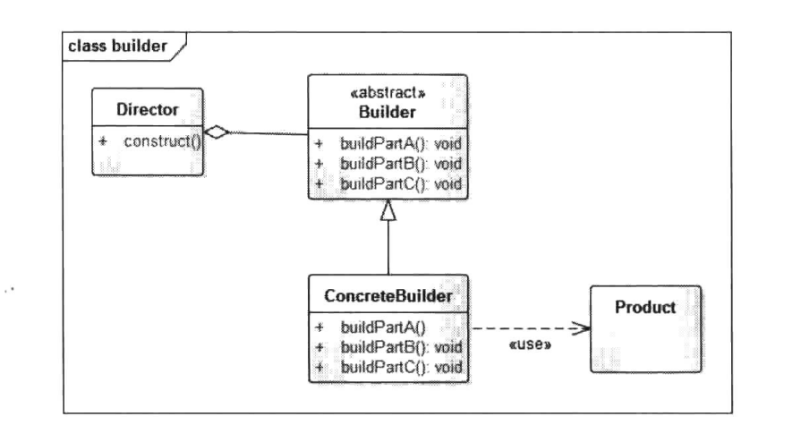

# 建造者模式


## 一、概念


### 1、介绍

Builder模式是一步一步创建一个复杂对象的创建型模式，它允许用户在不知道内部构建细节的情况下，可以更精细地控制对象的构造流程。该模式是为了将构建复杂对象的过程和它的部件解耦，使得构建过程和部件的表示隔离开来。因为一个复杂的对象有很多大量组成部分，如汽车，有车轮、方向盘、发动机，还有各种小零件等，如何将这些部件装配成一辆汽车，这个装配过程很漫长，也很复杂，对于这种情况，为了在构建过程中对外部隐藏实现细节，就可以使用Builder模式将部件和组装过程分离，使得构建过程和部件都可以自由扩展，两者之间的耦合也降到最低。


### 2、定义

将一个复杂对象的构建与它的表示分离，使得同样的构建过程可以创建不同的表示。


### 3、使用场景

1. 相同的方法，不同的执行顺序，产生不同的事件结果时。
2. 多个部件或零件，都可以装配到一个对象中，但是产生的运行结果又不相同时。
3. 产品类非常复杂，或者产品类中的调用顺序不同产生了不同的作用，这个时候使用建造者模式非常合适。
4. 当初始化一个对象特别复杂，如参数多，且很多参数都具有默认值时。


### 4、UML类图



角色介绍：

1. Product：产品类-产品的抽象类。
2. Builder：抽象的建造者，规范产品的组建，由子类实现具体的组件过程。
3. ConcreteBuilder：具体的建造者。
4. Director：指挥者，统一组装过程，实际开发中，Director角色常常被忽略，而直接使用一个Builder来进行对象的组装，通常为链式调用。


## 二、示例

下面通过模拟电脑装机的例子来进行说明。

电脑装机可以简单分为三个步骤，安装主机、安装显示器、安装操作系统。


### 1、示例

抽象产品角色：

```java
package cn.pangchun.scaffold.design_patterns.builder;

import lombok.Data;

/**
 * 笔记本电脑：抽象产品角色
 *
 * @author pangchun
 * @since 2023/10/20
 */
@Data
public abstract class Laptop {

    /**
     * 主板、显示器、操作系统 属性
     */
    protected String board;
    protected String display;
    protected String os;

    protected Laptop() {}

    /**
     * 设置主板
     * @param board 主板信息
     */
    public void setBoard(String board) {
        this.board = board;
    }

    /**
     * 设置显示器
     * @param display 显示器信息
     */
    public void setDisplay(String display) {
        this.display = display;
    }

    /**
     * 设置操作系统信息：由子类去实现
     */
    public abstract void setOs();
}
```

具体产品角色：

```java
package cn.pangchun.scaffold.design_patterns.builder;

/**
 * Macbook：具体产品角色
 *
 * @author pangchun
 * @since 2023/10/20
 */
public class Macbook extends Laptop {
    @Override
    public void setOs() {
        this.os = "Mac OS x 10.10";
    }
}
```

抽象建造者角色：规范产品组件的步骤

```java
package cn.pangchun.scaffold.design_patterns.builder;

/**
 * 抽象建造者角色：规范产品组件的步骤
 *
 * @author pangchun
 * @since 2023/10/20
 */
public abstract class Builder {

    /**
     * 设置主板
     * @param board 主板信息
     */
    public abstract void buildBoard(String board);

    /**
     * 设置显示器
     * @param display 显示器信息
     */
    public abstract void buildDisplay(String display);

    /**
     * 设置操作系统
     */
    public abstract void buildOs();

    /**
     * 组件产品
     * @return 笔记本产品
     */
    public abstract Laptop create();
}
```

具体的建造者角色：

```java
package cn.pangchun.scaffold.design_patterns.builder;

/**
 * MacbookBuilder：具体的建造者角色
 *
 * @author pangchun
 * @since 2023/10/20
 */
public class MacbookBuilder extends Builder {

    private final Macbook laptop = new Macbook();

    @Override
    public void buildBoard(String board) {
        laptop.setBoard(board);
    }

    @Override
    public void buildDisplay(String display) {
        laptop.setDisplay(display);
    }

    @Override
    public void buildOs() {
        laptop.setOs();
    }

    @Override
    public Laptop create() {
        return this.laptop;
    }
}
```

指挥者角色：

```java
package cn.pangchun.scaffold.design_patterns.builder;

/**
 * 指挥者角色
 * 
 * @author pangchun
 * @since 2023/10/20
 */
public class Director {

    private final Builder builder;

    public Director(Builder builder) {
        this.builder = builder;
    }

    /**
     * 组建对象：指挥构建过程，这里并没有直接返回产品对象，而是void，产品对象可以直接由 builder.create(); 得到
     * @param board 主板信息
     * @param display 显示器信息
     */
    public void construct(String board, String display) {
        builder.buildBoard(board);
        builder.buildDisplay(display);
        builder.buildOs();
    }
}
```

测试类：

```java
/**
 * 建造者模式
 */
@Test
@SneakyThrows
public void testBuilder() {
    // 建造者
    final MacbookBuilder macbookBuilder = new MacbookBuilder();
    // 指挥者
    final Director director = new Director(macbookBuilder);
    // 封装构建过程
    director.construct("英特尔主板", "Retina显示器");
    // 构建产品，输出信息
    System.out.println("macbookBuilder = " + macbookBuilder.create());

    // 输出结果
    // macbookBuilder = Laptop(board=英特尔主板, display=Retina显示器, os=Mac OS x 10.10)
}
```

上述示例中，通过具体的MacbookBuilder来构建Macbook对象，而Director封装了构建复杂产品对象的过程，对外隐藏构建细节。Builder与Director一起将一个复杂对象的构建与它的表示分离，使得同样的构建过程可以创建不同的对象。

值得注意的是，在现实开发过程中，Director角色经常会被省略。而直接使用一个Builder来进行对象的组装，这个Builder通常为链式调用，**它的关键点是每个setter方法都返回自身，也就是return this**,这样就使得setter方法可以链式调用，代码大致如下：

```java
/**
 * 设置显示器
 * @param display 显示器信息
 * @return 返回builder，以便链式调用
 */
@Override
Builder buildDisplay(String display) {
    laptop.setDisplay(display);
    return this;
}
```

```java
// 链式调用
macbookBuilder.buildDisplay("Retina显示器").buildOs().create();
```

通过这种形式不仅去除了Director角色，整个结构也更加简单，也能对Product对象的组装过程有更精细的控制。


