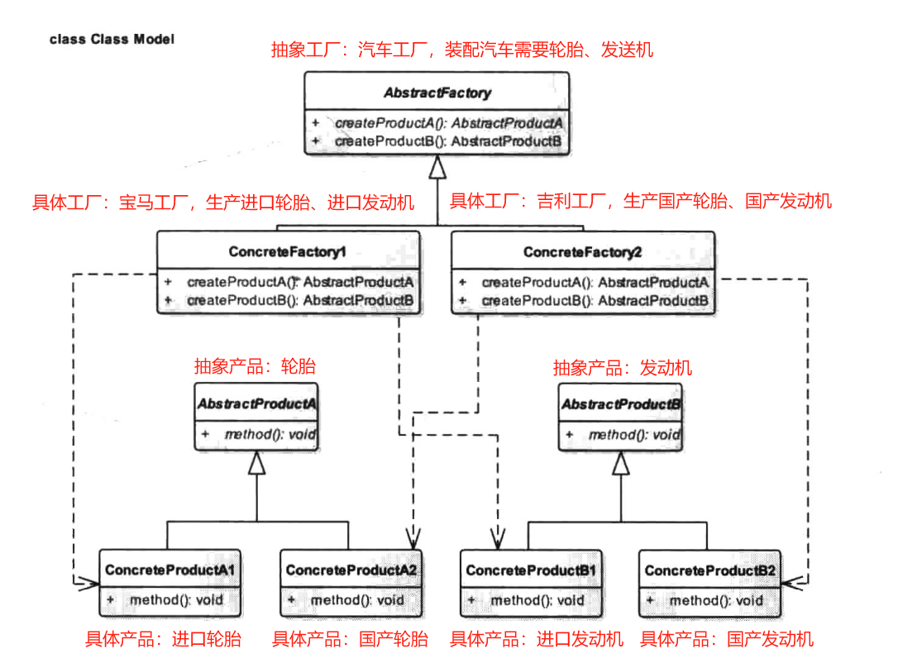
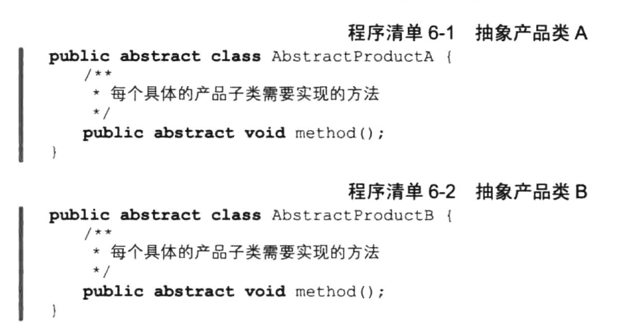
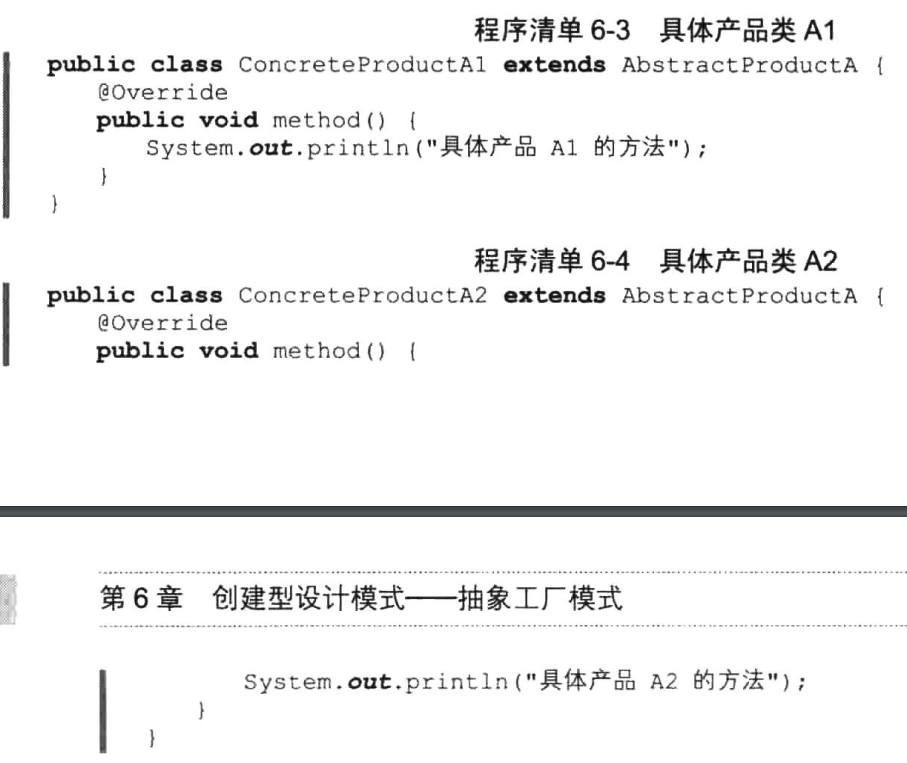
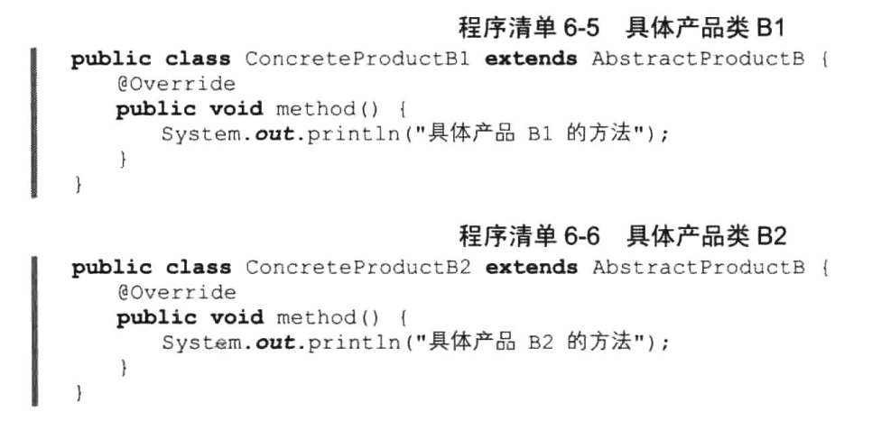
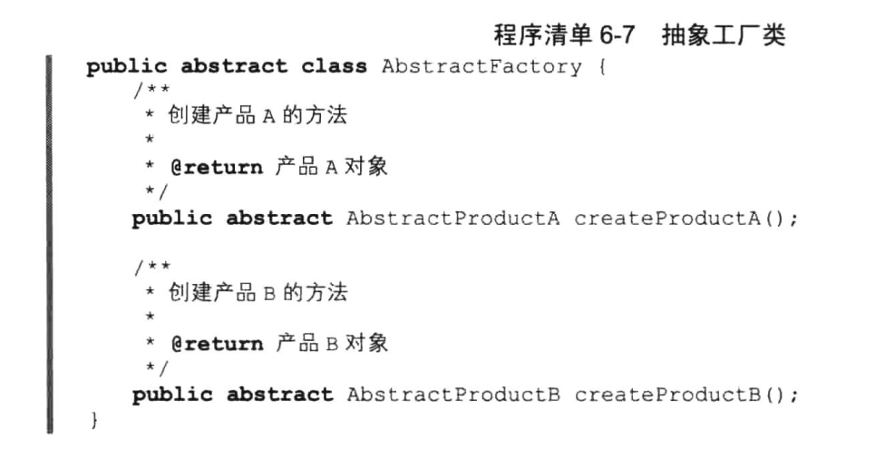
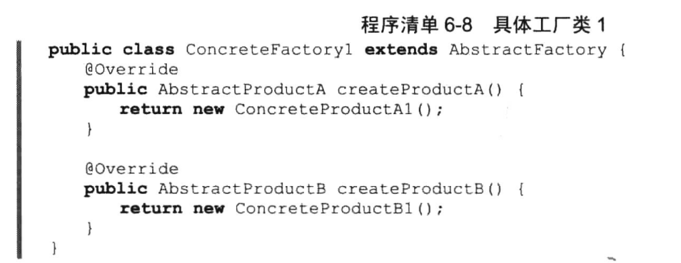
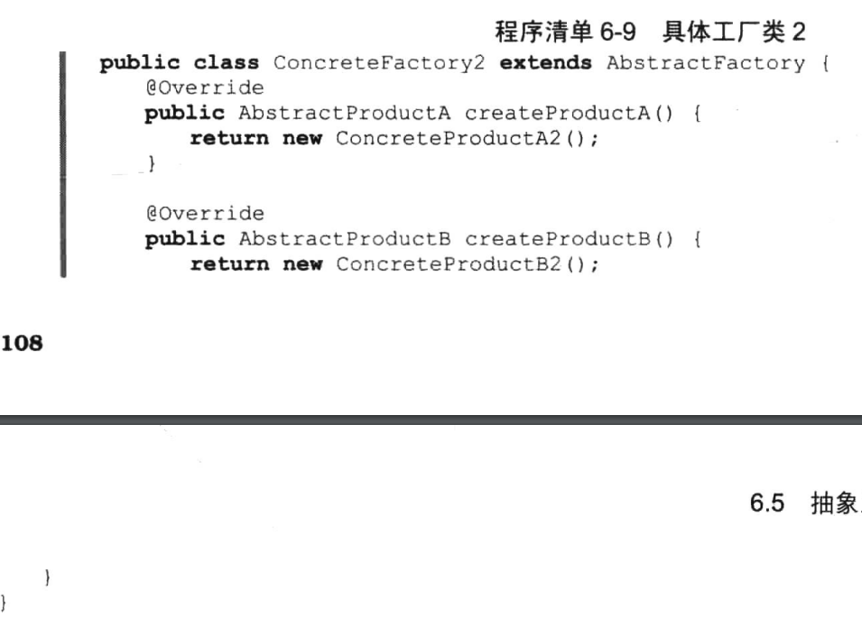

# 抽象工厂模式


## 一、概念


### 1、介绍

抽象工厂模式(Abstract Factory Pattern),也是创建型设计模式之一。第5章中我们已经了解了工厂方法模式，那么这个抽象工厂又是怎么一回事呢？大家联想一下现实生活中的工厂肯定都是具体的，也就是说每个工厂都会生产某一种具体的产品，那么抽象工厂意味着生产出来的产品是不确定的，那这岂不是很奇怪？抽象工厂模式起源于以前对不同操作系统的图形化解决方案，如不同操作系统中的按钮和文本框控件其实现不同，展示效果也不一样，对于每一个操作系统，其本身就构成一个产品类，而按钮与文本框控件也构成一个产品类，两种产品类两种变化，各自有自己的特性，如Android中的Button和Text View,iOS中的Button和TextView,Window Phone中的Button和TextView等。


### 2、定义

为创建一组相关或者是相互依赖的对象提供一个接口，而不需要指定它们的具体类。


### 3、使用场景

一个**对象族**有相同的约束时可以使用抽象工厂模式。是不是听起来很抽象？举个例子，Android、iOS、Window Phone下都有短信软件和拨号软件，两者都属于Software软件的范畴，但是，它们所在的操作系统平台不一样，即便是同一家公司出品的软件，其代码的实现逻辑也是不同的，这时候就可以考虑使用抽象工厂方法模式来产生Android、iOS、Window Phone下的短信软件和拨号软件。


### 4、UML类图



角色介绍：

1. AbstractFactory：抽象工厂角色，它声明了一组用于创建一种产品的方法，每一个方法对应种产品，如上述类图中的AbstractFactory中就定义了两个方法，分别创建产品A和产品B。
2. ConcreteFactory：具体工厂角色，它实现了在抽象工厂中定义的创建产品的方法，生成一组具体产品，这些产品构成了一个产品种类，每一个产品都位于某个产品等级结构中，如上述类图中的ConcreteFactory1和ConcreteFactory2。
3. AbstractProduct：抽象产品角色，它为每种产品声明接口，比如上述类图中的AbstractProductA和AbstractProductB。
4. ConcreteProduct：具体产品角色，它定义具体工厂生产的具体产品对象，实现抽象产品接口中声明的业务方法，如上述类图中的ConcreteProductA1、ConcreteProductA2、ConcreteProductB1和ConcreteProductB2。

根据类图可以总结出如下一个抽象工厂模式的通用模式代码：














## 二、示例


### 1、示例

按照上面那个UML类图的示例可以得到如下的代码：

先抽象出两种产品的抽象类：轮胎抽象类、发动机抽象类

```java
package cn.pangchun.scaffold.design_patterns.abstract_factory;

/**
 * 抽象产品：轮胎
 *
 * @author pangchun
 * @since 2023/10/22
 */
public abstract class Tire {

    public abstract void tire();
}
```

```java
package cn.pangchun.scaffold.design_patterns.abstract_factory;

/**
 * 抽象产品：发动机
 *
 * @author pangchun
 * @since 2023/10/22
 */
public abstract class Engine {

    public abstract void engine();
}
```

然后实现两种产品，分别包括进口和国产两种：

```java
package cn.pangchun.scaffold.design_patterns.abstract_factory;

/**
 * 具体产品：进口轮胎
 *
 * @author pangchun
 * @since 2023/10/22
 */
public class InwardTire extends Tire {
    @Override
    public void tire() {
        System.out.println("进口轮胎");
    }
}
```

```java
package cn.pangchun.scaffold.design_patterns.abstract_factory;

/**
 * 具体产品：国产轮胎
 *
 * @author pangchun
 * @since 2023/10/22
 */
public class HomeMadeTire extends Tire {
    @Override
    public void tire() {
        System.out.println("国产轮胎");
    }
}
```

```java
package cn.pangchun.scaffold.design_patterns.abstract_factory;

/**
 * 具体产品：进口发动机
 *
 * @author pangchun
 * @since 2023/10/22
 */
public class InwardEngine extends Engine {
    @Override
    public void engine() {
        System.out.println("进口发送机");
    }
}
```

```java
package cn.pangchun.scaffold.design_patterns.abstract_factory;

/**
 * 具体产品：国产发送机
 *
 * @author pangchun
 * @since 2023/10/22
 */
public class HomeMadeEngine extends Engine {
    @Override
    public void engine() {
        System.out.println("国产发送机");
    }
}
```

得到产品之后，我们再看一下创建产品的工厂，需要一个汽车的抽象工厂，主要生产轮胎和发动机：

```java
package cn.pangchun.scaffold.design_patterns.abstract_factory;

/**
 * 抽象工厂：汽车工厂
 * 
 * @author pangchun
 * @since 2023/10/22
 */
public abstract class CarFactory {

    /**
     * 生产轮胎
     * @return 轮胎
     */
    public abstract Tire createTire();

    /**
     * 生产引擎
     * @return 殷勤
     */
    public abstract Engine createEngine();
}
```

然后实现抽象工厂，分别由宝马工厂和吉利工厂，它们生产的轮胎和发动机是不同种类的，宝马工厂生产进口类产品，吉利工厂生产国产类产品：

```java
package cn.pangchun.scaffold.design_patterns.abstract_factory;

/**
 * 具体工厂：宝马工厂
 *
 * @author pangchun
 * @since 2023/10/22
 */
public class BmwFactory extends CarFactory {
    @Override
    public Tire createTire() {
        return new InwardTire();
    }

    @Override
    public Engine createEngine() {
        return new InwardEngine();
    }
}
```

```java
package cn.pangchun.scaffold.design_patterns.abstract_factory;

/**
 * 具体工厂：吉利工厂
 *
 * @author pangchun
 * @since 2023/10/22
 */
public class GeelyFactory extends CarFactory {
    @Override
    public Tire createTire() {
        return new HomeMadeTire();
    }

    @Override
    public Engine createEngine() {
        return new HomeMadeEngine();
    }
}
```

测试类：

```java
/**
 * 抽象工厂模式
 */
@Test
public void testAbstractFactory() {
    // 创建一个生产宝马汽车的工厂
    final BmwFactory bmwFactory = new BmwFactory();
    bmwFactory.createTire().tire();
    bmwFactory.createEngine().engine();

    System.out.println("------------------");

    // 创建一个生产吉利汽车的工厂
    final GeelyFactory geelyFactory = new GeelyFactory();
    geelyFactory.createTire().tire();
    geelyFactory.createEngine().engine();

    // 结果输出
    // 进口轮胎
    // 进口发送机
    // ------------------
    // 国产轮胎
    // 国产发送机
}
```

上面我们只模拟了两个车系，宝马和吉利的工厂，如果此时我们需要增加宾利汽车的工厂，那么对应的轮胎、发动机种类又要增加，这里可以看出抽象工厂模式的一个弊端，就是类的陡增，如果工厂类过多，势必导致类的文件非常多，因此在实际开发中一定要权衡慎用。


