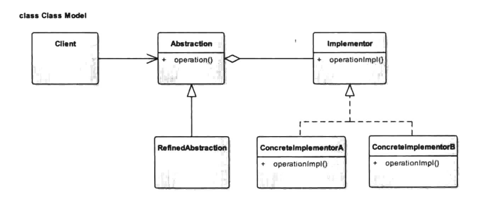
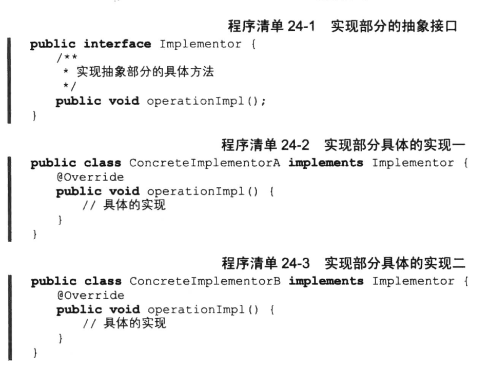
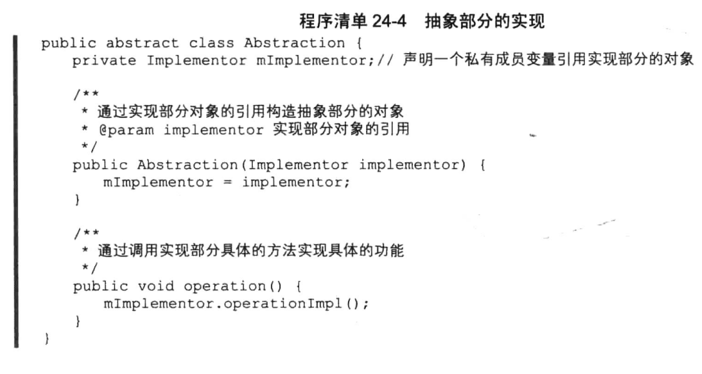
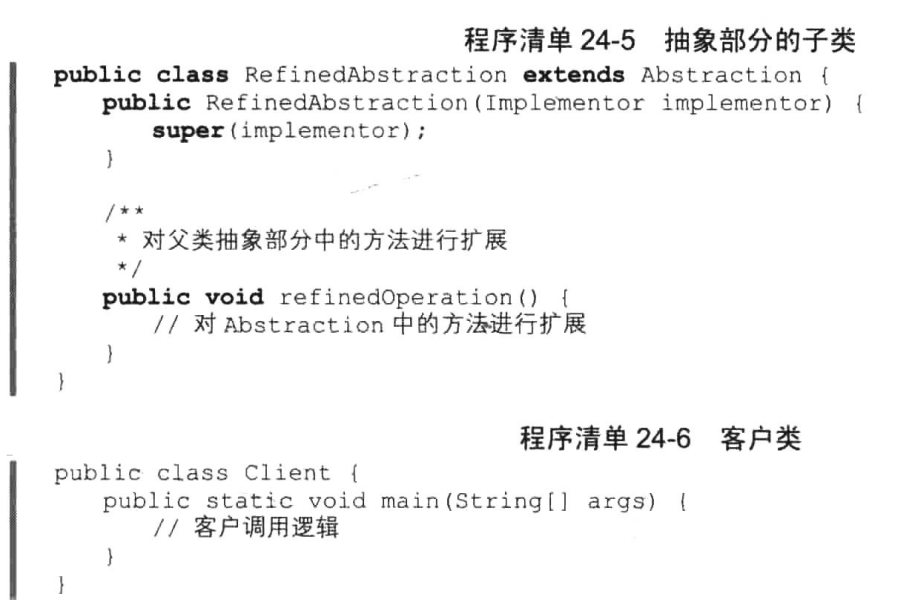

# 桥接模式


## 一、概念


### 1、介绍

桥接模式(Bridge Pattern)也称为桥梁模式，是结构型设计模式之一。在现实生活中大家都知道“桥梁”是连接河道两岸的主要交通枢纽，简而言之其作用就是连接河的两边，而我们的桥接模式与现实中的情况很相似，也是承担着连接“两边”的作用，那么具体是哪两边呢？这里先不着急，我们先来看看该模式的定义。


### 2、定义

将抽象部分与实现部分分离，使它们都可以独立地进行变化。


### 3、使用场景

1. 从模式的定义中我们大致可以了解到，这里“桥梁”的作用其实就是连接“抽象部分”与“实现部分”，但是事实上，任何多维度变化类或者说多个树状类之间的耦合都可以使用桥接模式来实现解耦。
2. 如果一个系统需要在构件的抽象化角色和具体化角色之间增加更多的灵活性，避免在两个层次之间建立静态的继承联系，可以通过桥接模式使它们在抽象层建立一个关联关系。对于那些不希望使用继承或因为多层次继承导致系统类的个数急剧增加的系统，也可以考虑使用桥接模式。
3. 一个类存在两个独立变化的维度，且这两个维度都需要进行扩展。


### 4、UML类图



角色介绍：

1. Abstraction：抽象部分。
   该类保持一个对实现部分对象的引用，抽象部分中的方法需要调用实现部分的对象来实现，该
   类一般为抽象类。
2. RefinedAbstraction：优化的抽象部分。
   抽象部分的具体实现，该类一般是对抽象部分的方法进行完善和扩展。
3. Implementor：实现部分。
   可以为接口或抽象类，其方法不一定要与抽象部分中的一致，一般情况下是由实现部分提供基
   本的操作，而抽象部分定义的则是基于实现部分这些基本操作的业务方法。
4. ConcreteImplementorA/ConcretelmplementorB：实现部分的具体实现。
   完善实现部分中方法定义的具体逻辑。
5. Client：客户类，客户端程序。


根据类图可以得到如下一个通用桥接模式代码。








## 二、示例


### 1、示例

现实生活中有很多桥接模式应用的影子，比如开关与具体的电器，开关的类型有多种，而电器也是各式各样，这两者是独立变化的且又有耦合。还有程序员天天面对的显示屏，对于显示屏来说它的尺寸与生厂商之间也是一种二维关系，具体的尺寸与具体的厂商独立变化。而更贴近生活的例子就是我们在喝咖啡时，大家知道去咖啡馆喝咖啡一般分为4种。大杯加糖、大杯不加糖、小杯加糖、小杯不加糖，对一杯咖啡来说这4种实质上就两种变化，一是大杯小杯，二是加糖不加糖，不
管怎样，我们都先来定义一个咖啡类。

```java
package cn.pangchun.scaffold.design_patterns.bridge;

/**
 * 抽象部分：咖啡，需要保持一个对实现部分对象的引用
 * 
 * @author pangchun
 * @since 2023/10/24
 */
public abstract class Coffee {

    protected CoffeeAdditives additives;

    public Coffee(CoffeeAdditives additives) {
        this.additives = additives;
    }

    /**
     * 咖啡具体什么样子由子类决定
     */
    public abstract void makeCoffee();
}
```

Coffee类中保持了对CoffeeAdditives的引用，以便调用具体的实现。同样地，咖啡还分大杯小杯，定义两个子类继承于Coffee。

```java
package cn.pangchun.scaffold.design_patterns.bridge;

/**
 * 大杯咖啡
 * 
 * @author pangchun
 * @since 2023/10/24
 */
public class LargeCoffee extends Coffee {
    public LargeCoffee(CoffeeAdditives additives) {
        super(additives);
    }

    @Override
    public void makeCoffee() {
        System.out.println("大杯的" + additives.addSomething() + "咖啡");
    }
}
```

```java
package cn.pangchun.scaffold.design_patterns.bridge;

/**
 * 小杯咖啡
 *
 * @author pangchun
 * @since 2023/10/24
 */
public class SmallCoffee extends Coffee {
    public SmallCoffee(CoffeeAdditives additives) {
        super(additives);
    }

    @Override
    public void makeCoffee() {
        System.out.println("小杯的" + additives.addSomething() + "咖啡");
    }
}
```

而对于加进咖啡中的糖，当然也可以选择不加，我们也用一个抽象类定义。

```java
package cn.pangchun.scaffold.design_patterns.bridge;

/**
 * 实现部分：咖啡加糖
 * 
 * @author pangchun
 * @since 2023/10/24
 */
public abstract class CoffeeAdditives {

    /**
     * 具体往咖啡里加什么也是由子类实现
     * @return 具体添加的东西
     */
    public abstract String addSomething();
}
```

注意，这里的CoffeeAdditives其实就对应于上面我们UML类图中的实现部分，而Coffee则对应于抽象部分，这里其实笔者还想多说一句，模式定义中所谓的“抽象”与“实现”实质上对应的是两个独立变化的维度，因此，上文中我们也曾说过，任何多维度变化类或者说多个树状类之间的耦合都可以使用桥接模式来实现解耦。在本例中，我们的Cof类虽是一个抽象类，但它并非是所谓的“抽象部分”，而CoffeeAdditives类也并非一定就是“实现部分”，两者各自为一维度，独立变化，仅此而已，所谓的“抽象与实现分离”更偏向于我们实际的程序开发，两者并不一定挂钩，这里其实就可以看到桥接模式的应用性其实很广泛，并不局限于程序设计。我们再来看CoffeeAdditives对应的两个子类：加糖与不加糖。

```java
package cn.pangchun.scaffold.design_patterns.bridge;

/**
 * 原味
 * 
 * @author pangchun
 * @since 2023/10/24
 */
public class Ordinary extends CoffeeAdditives {
    @Override
    public String addSomething() {
        return "原味";
    }
}
```

```java
package cn.pangchun.scaffold.design_patterns.bridge;

/**
 * 加糖
 * 
 * @author pangchun
 * @since 2023/10/24
 */
public class Sugar extends CoffeeAdditives {
    @Override
    public String addSomething() {
        return "加糖";
    }
}
```

不加糖我们以原味表示，最后来看客户类，将两者进行整合。

```java
/**
 * 桥接模式
 */
@Test
public void testBridge() {
    // 原味
    final Ordinary ordinary = new Ordinary();
    // 加糖
    final Sugar sugar = new Sugar();

    // 大杯原味
    final LargeCoffee largeOrdinary = new LargeCoffee(ordinary);
    // 大杯加糖
    final LargeCoffee largeSugar = new LargeCoffee(sugar);

    // 小杯原味
    final SmallCoffee smallOrdinary = new SmallCoffee(ordinary);
    // 小杯加糖
    final SmallCoffee smallSugar = new SmallCoffee(sugar);

    smallOrdinary.makeCoffee();

    // 打印结果
    // 小杯的原味咖啡
}
```

代码逻辑很简单，不难理解，这里输出结果就不给出了。如果此时咖啡厅为了满足更多人的习惯，推出中杯的咖啡怎么办呢？对应于本例来说，这种需求的变化其实就是Coffee类的变化，定义中杯类扩展Coffee类即可。

同样地，为了增加咖啡口味的种类，我们也可以让CoffeeAdditives类变化起来，增加更多的子类表示，诸如加奶、加蜂蜜、加盐等，具体的代码就不再给出了，相信大家已经很清楚。从本例我们可以看到，不管是Coffee变化了还是CoffeeAdditives变化了，其相对于对方而言都是独立的没有什么过多的交集，两者之间唯一的联系就是Coffee中保持的对CoffeeAdditives的引用，此乃两者之纽带，这就是桥接模式。


