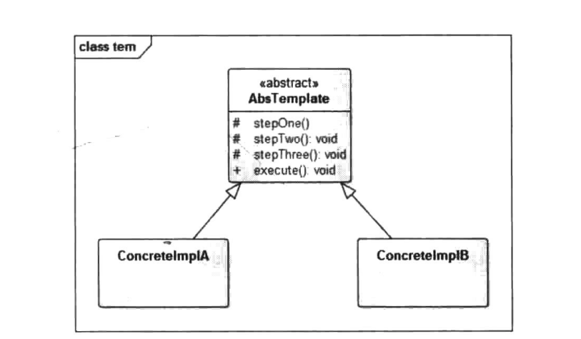

# 模板方法模式


## 一、概念


### 1、介绍

在面向对象开发过程中，通常会遇到这样的一个问题，我们知道一个算法所需的关键步骤，并确定了这些步骤的执行顺序，但是，某些步骤的具体实现是未知的，或者说某些步骤的实现是会随着环境的变化而改变的，例如，执行程序的流程大致如下：

(1)检查代码的正确性；

(2)链接相关的类库；

(3)编译相关代码：

(4)执行程序。

对于不同的程序设计语言，上述4个步骤都是不一样的，但是，它们的执行流程是固定的，这类问题的解决方案就是我们本章要讲的模板方法模式。


### 2、定义

定义一个操作中的算法的框架，而将一些步骤延迟到子类中，使得子类可以不改变一个算法的结构即可重定义该算法的某些特定步骤。


### 3、使用场景

1. 多个子类有公有的方法，并且逻辑基本相同时。
2. 重要、复杂的算法，可以把核心算法设计为模板方法，周边的相关细节功能则由各个子类实现。
3. 重构时，模板方法模式是一个经常使用的模式，把相同的代码抽取到父类中，然后通过钩子函数约束其行为。


### 4、UML类图




- AbsTemplate：抽象类，定义了一套算法框架。

- ConcretelmplA：具体实现类A。

- ConcretelmplB：具体实现类B。


## 二、示例


### 1、示例

模板方法实际上是封装一个固定流程，就像是一套执行模板一样，第一步该做什么，第二步该做什么都已经在抽象类中定义好。而子类可以有不同的算法实现，在框架不被修改的情况下实现某些步骤的算法替换，下面以打开计算机这个动作来简单演示一下模板方法。打开计算机的整个过程都是相对固定的，首先启动计算机电源，计算机检测自身状态没有问题时将进入操作系统，对用户进行验证之后即可登录计算机，下面我们使用模板方法来模拟一下这个过程：

首先创建抽象的模板类，定义算法骨干：

```java
package cn.pangchun.scaffold.design_patterns.template;

/**
 * 抽象电脑：抽象模板角色，定义模板骨架
 * 
 * @author pangchun
 * @since 2023/10/18
 */
public abstract class AbstractComputer {

    protected void powerOn() {
        System.out.println("开启电源");
    }

    protected void checkHardware() {
        System.out.println("硬件检查");
    }

    protected void loadOs() {
        System.out.println("载入操作系统");
    }

    protected void login() {
        System.out.println("小白的计算机无验证，直接进入操作系统");
    }

    /**
     * 启动计算机方法，步骤固定为开启电源、系统检查、加载操作系统、用户登录。该方法为final，防止算法框架被覆写
     */
    public final void startUp() {
        System.out.println("-------- 开机 start ------------");
        powerOn();
        checkHardware();
        loadOs();
        login();
        System.out.println("-------- 关机 end ------------");
    }
}
```

定义程序员电脑，具体的模板角色：

```java
package cn.pangchun.scaffold.design_patterns.template;

/**
 * 程序员的计算机：具体的模板角色
 * 
 * @author pangchun
 * @since 2023/10/18
 */
public class CoderComputer extends AbstractComputer {

    @Override
    protected void login() {
        System.out.println("程序员只需要进行用户和密码验证就行");
    }
}
```

定义军用电脑，具体的模板角色：

```java
package cn.pangchun.scaffold.design_patterns.template;

/**
 * 军用计算机：具体的模板角色
 *
 * @author pangchun
 * @since 2023/10/18
 */
public class MilitaryComputer extends AbstractComputer {

    @Override
    protected void checkHardware() {
        super.checkHardware();
        System.out.println("检查硬件防火墙");
    }

    @Override
    protected void login() {
        System.out.println("进行指纹识别等复杂的用户验证");
    }
}
```

客户端：

```java
/**
 * 模板方法模式 - 电脑启动步骤
 */
@Test
public void testTemplate() {
    final CoderComputer coderComputer = new CoderComputer();
    final MilitaryComputer militaryComputer = new MilitaryComputer();

    coderComputer.startUp();
    militaryComputer.startUp();
}
```

输出结果：

```bash
-------- 开机 start ------------
开启电源
硬件检查
载入操作系统
程序员只需要进行用户和密码验证就行
-------- 关机 end ------------
-------- 开机 start ------------
开启电源
硬件检查
检查硬件防火墙
载入操作系统
进行指纹识别等复杂的用户验证
-------- 关机 end ------------
```

通过上面的例子可以看到，在startUp方法中有一些固定的步骤，依次为开启电源、检查硬件、加载系统、用户登录4个步骤，这4个步骤是计算机开机过程中不会变动。但是，不同用户的这几个步骤的实现可能各不相同，因此，子类需要覆写相应的方法来进行自定义处理，这里需要注意的是startUp为final方法，这样就保证了逻辑流程不能被子类修改，子类只能够改变某一步骤中的具体实现，这样就保证了这个逻辑流程的稳定性。startUp中的这几个算法步骤我们可以称为是一个套路，也称为模板方法，这也是该模式的由来。


