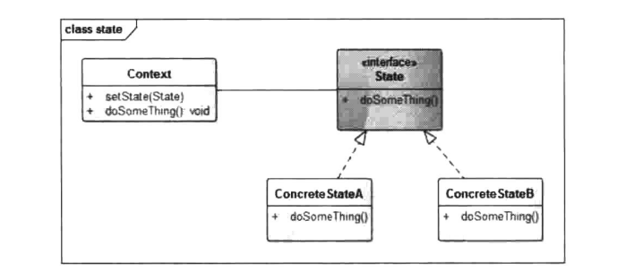

# 状态模式


## 一、概念


### 1、介绍

状态模式中的行为是由状态来决定的，不同的状态下有不同的行为。状态模式和策略模式的结构几乎完全一样，但它们的目的、本质却完全不一样。状态模式的行为是平行的、不可替换的，策略模式的行为是彼此独立、可相互替换的。用一句话来表述，状态模式把对象的行为包装在不同的状态对象里，每一个状态对象都有一个共同的抽象状态基类。状态模式的意图是让一个对象在其内部状态改变的时候，其行为也随之改变。


### 2、定义

当一个对象的内在状态改变时允许改变其行为，这个对象看起来像是改变了其类。


### 3、使用场景

1. 一个对象的行为取决于它的状态，并且它必须在运行时根据状态改变它的行为。

2. 代码中包含大量与对象状态有关的条件语句，例如，一个操作中含有庞大的多分支语句(if-else或switch-case),且这些分支依赖于该对象的状态。

   状态模式将每一个条件分支放入一个独立的类中，这使得你可以根据对象自身的情况将对象的状态作为一个对象，这一对象可以不依赖于其他对象而独立变化，这样通过多态来去除过多的、重复的if-else等分支语句。


### 4、UML类图




- Context：环境类，定义客户感兴趣的接口，维护一个State子类的实例，这个实例定义了对象的当前状态。

- State：抽象状态类或者状态接口，定义一个或者一组接口，表示该状态下的行为。

- ConcreteStateA、ConcreteStateB：具体状态类，每一个具体的状态类实现抽象State中定义的接口，从而达到不同状态下的不同行为。


## 二、示例


### 1、示例

下面我们就以电视遥控器为例来演示一下状态模式的实现。我们首先将电视的状态简单分为开机状态和关机状态，在开机状态下可以通过遥控器进行频道切换、调整音量等操作，但是，此时重复按开机键是无效的：而在关机状态下，频道切换、调整音量、关机都是无效的操作，只有按开机按钮时会生效。也就是说电视的内部状态决定了遥控器的行为，我们看看第一版实现：

```java
package cn.pangchun.scaffold.design_patterns.state;

/**
 * 电视遥控器：对应Context角色，含有开机、关机、下一频道、上一频道、调高音量、调低音量这几个功能
 * 
 * @author pangchun
 * @since 2023/10/17
 */
public class TvController {

    /**
     * 开机状态
     */
    private final static int POWER_ON = 1;
    /**
     * 关机状态
     */
    private final static int POWER_OFF = 2;
    /**
     * 当前遥控器状态：默认关机
     */
    private int mState = POWER_OFF;

    public void powerOn() {
        mState = POWER_ON;
        if (mState == POWER_OFF) {
            System.out.println("开机啦");
        }
    }

    public void powerOff() {
        mState = POWER_OFF;
        if (mState == POWER_ON) {
            System.out.println("关机啦");
        }
    }

    public void nextChannel() {
        if (mState == POWER_ON) {
            System.out.println("下一频道");
        } else {
            System.out.println("两个红灯提示没有开机");
        }
    }

    public void prevChannel() {
        if (mState == POWER_ON) {
            System.out.println("上一频道");
        } else {
            System.out.println("两个红灯提示没有开机");
        }
    }

    public void turnUp() {
        if (mState == POWER_ON) {
            System.out.println("调高音量");
        } else {
            System.out.println("两个红灯提示没有开机");
        }
    }

    public void turnDown() {
        if (mState == POWER_ON) {
            System.out.println("调低音量");
        } else {
            System.out.println("两个红灯提示没有开机");
        }
    }
}
```

可以看到，在TvController类中，通过mState字段存储了电视的状态，并且在各个操作中根据状态来判断是否应该执行。这就导致了在每个功能中都需要使用f-ls,代码重复、相对较为混乱，这是在只有两个状态和简单几个功能函数的情况下，那么当状态变成5个、功能函数变为10个呢？每个函数中都要用f-else进行判断，而这些代码都充斥在一个类中，这些重复的代码无法被提取出来，这使得这个类变得越来越难以维护。

状态模式就是为解决这类的问题而出现的，我们将这些状态用对象来代替，将这些行为封装到对象中，使得在不同的状态下有不同的实现，这样就将这些if-else从TvController类中去掉，整个结构也变得清晰起来。我们看看实现代码：

电视状态接口：定义了电视操作的函数

```java
package cn.pangchun.scaffold.design_patterns.state;

/**
 * 电视状态接口：定义了电视操作的函数
 * 
 * @author pangchun
 * @since 2023/10/17
 */
public interface TvState {
    void nextChannel();
    void prevChannel();
    void turnUp();
    void turnDown();
}
```

关机状态：此时只有开机功能是有效的

```java
package cn.pangchun.scaffold.design_patterns.state;

/**
 * 关机状态：此时只有开机功能是有效的
 * 
 * @author pangchun
 * @since 2023/10/17
 */
public class PowerOffState implements TvState {
    @Override
    public void nextChannel() {
    }

    @Override
    public void prevChannel() {
    }

    @Override
    public void turnUp() {
    }

    @Override
    public void turnDown() {
    }
}
```

开机状态：此时再触发开机功能不做任何操作

```java
package cn.pangchun.scaffold.design_patterns.state;

/**
 * 开机状态：此时再触发开机功能不做任何操作
 * 
 * @author pangchun
 * @since 2023/10/17
 */
public class PowerOnState implements TvState {
    @Override
    public void nextChannel() {
        System.out.println("下一频道");
    }

    @Override
    public void prevChannel() {
        System.out.println("上一频道");
    }

    @Override
    public void turnUp() {
        System.out.println("调高音量");
    }

    @Override
    public void turnDown() {
        System.out.println("调低音量");
    }
}
```

电源操作接口：开机、关机

```java
package cn.pangchun.scaffold.design_patterns.state;

/**
 * 电源操作接口
 *
 * @author pangchun
 * @since 2023/10/17
 */
public interface PowerController {
    void powerOn();

    void powerOff();
}
```

电视遥控器：对应Context角色

```java
package cn.pangchun.scaffold.design_patterns.state;

import lombok.Data;

/**
 * 电视遥控器：对应Context角色，含有开机、关机、下一频道、上一频道、调高音量、调低音量这几个功能
 * 
 * @author pangchun
 * @since 2023/10/17
 */
@Data
public class TvController implements PowerController {

    private TvState tvState;

    @Override
    public void powerOn() {
        setTvState(new PowerOnState());
        System.out.println("开机啦");
    }

    @Override
    public void powerOff() {
        setTvState(new PowerOffState());
        System.out.println("关机啦");
    }

    public void nextChannel() {
        tvState.nextChannel();
    }

    public void prevChannel() {
        tvState.prevChannel();
    }

    public void turnUp() {
        tvState.turnUp();
    }

    public void turnDown() {
        tvState.turnDown();
    }
}
```

客户端调用：

```java
/**
 * 状态模式 - 电视遥控器
 */
@Test
public void testState() {
    final TvController tvController = new TvController();
    // 设置开机状态
    tvController.powerOn();
    // 下一频道
    tvController.nextChannel();
    // 调高音量
    tvController.turnUp();
    // 上一频道
    tvController.prevChannel();
    // 调低音量
    tvController.turnDown();
    // 设置关机状态
    tvController.powerOff();
    // 调高音量，此时不会生效
    tvController.turnUp();
}
```

输出结果：

```bash
开机啦
下一频道
调高音量
上一频道
调低音量
关机啦
```

上述实现中，我们抽象了一个TvState接口，该接口中有操作电视的所有函数，该接口有两个实现类，即开机状态(PowerOnState)和关机状态(PowerOffState)。开机状态下只有开机功能是无效的，也就是说在己经开机的时候用户再按开机键不会产生任何反应：而在关机状态下，只有开机功能是可用的，其他功能都不会生效。同一个操作，如调高音量的turnUp函数，在关机状态下无效，在开机状态下就会将电视的音量调高，也就是说电视的内部状态影响了电视遥控器的行为。

状态模式将这些行为封装到状态类中，在进行操作时将这些功能转发给状态对象，不同的状态有不同的实现，这样就通过多态的形式去除了重复、杂乱的if-®lse语句，这也正是状态模式的精髓所在。


