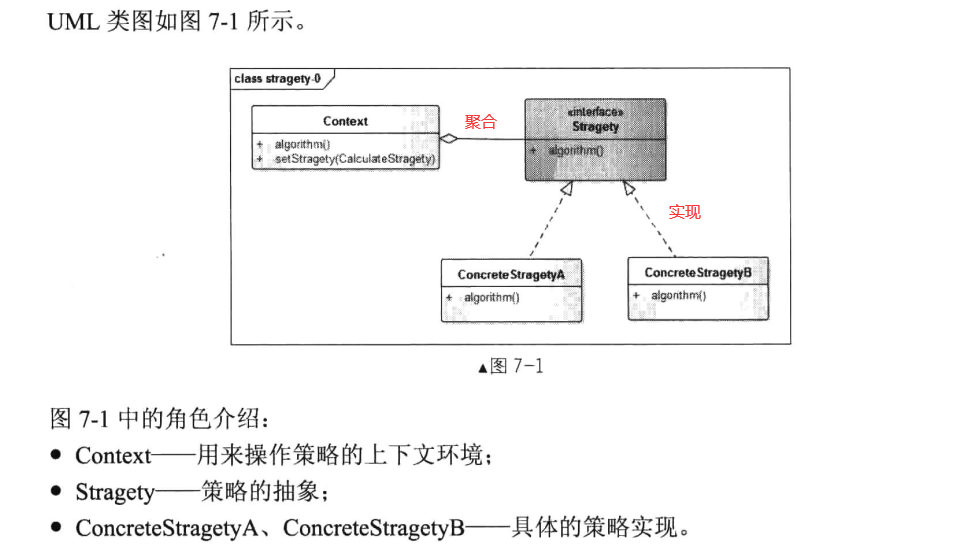

# 策略模式


## 一、概念


### 1、介绍

在软件开发中也常常遇到这样的情况：实现某一个功能可以有多种算法或者策略，我们根据实际情况选择不同的算法或者策略来完成该功能。例如，排序算法，可以使用插入排序、归并排序、冒泡排序等。针对这种情况，一种常规的方法是将多种算法写在一个类中。例如，需要提供多种排序算法，可以将这些算法写到一个类中，每一个方法对应一个具体的排序算法：当然，也可以将这些排序算法封装在一个统一的方法中，通过if.else..或者case等条件判断语句来选择具体的算法这两种实现方法我们都可以称为硬编码。然而，当很多个算法集中在一个类中时，这个类就会变得臃肿，这个类的维护成本会变高，在维护时也更容易引发错误。如果我们需要增加一种新的排序算法，需要修改封装算法类的源代码。明显违反了OCP开闭原则和单一职责原则。如果将这些算法或者策略抽象来，提供一个统一的接口，不同的算法或者策略有不同的实现类，这样在程序客户端就可以通过注入不同的实现对象来实现算法或者策略的动态替换，这种模式的可扩展性、可维护性也就更高，也就是我们本章要说的策略模式。


### 2、定义与使用


策略模式定义了一系列的算法，并将每一个算法封装起来，而且使它们还可以相互替换。策略模式让算法独立于使用它的客户而独立变化。

策略模式的使用场景：

1. 针对同一类型问题的多种处理方式，仅仅是具体行为有差别时。
2. 需要安全地封装多种同一类型的操作时。
3. 出现同一抽象类有多个子类，而又需要使用if-else或者switch-case来选择具体子类时。


### 3、UML类图




## 二、示例


### 1、错误示例

首先看一下我们平时直接使用if-else的情况。

```java
package cn.pangchun.scaffold.test;

import lombok.SneakyThrows;

public class PriceCalculator {

    private static final int BUS = 1;
    private static final int SUBWAY = 2;

    public static void main(String[] args) {
        PriceCalculator calculator = new PriceCalculator();
        int busPrice = calculator.calculatePrice(5, BUS);
        int subwayPrice = calculator.calculatePrice(5, SUBWAY);
        System.out.println("做五公里公交车花费：" + busPrice);
        System.out.println("做五公里地铁花费：" + subwayPrice);

    }

    /**
     * 公交车计价
     * 1.10公里内1元钱，超出10公里，每五公里1元钱，最后不足五公里按五公里收费
     *
     * @param km 里程
     * @return 价格
     */
    private int busPrice(int km) {
        // 超出10公里的里程总数
        int extraTotal = km - 10;
        // 超出距离是5公里的多少倍
        int extraFactor = extraTotal > 0? extraTotal / 5 : 0;
        // 最后不足5公里的里程
        int fraction = extraTotal % 5;
        // 计算价格
        int price = 1 + extraFactor;
        return fraction > 0? ++price : price;
    }

    /**
     * 地铁计价
     * 1.6公里内3元，6-12公里4元，12公里以上6元
     * @param km 里程
     * @return 价格
     */
    private int subwayPrice(int km) {
        if (km <= 6) {
            return 3;
        } else if (km <= 12) {
            return 4;
        } else {
            return 6;
        }
    }

    @SneakyThrows
    int calculatePrice(int km, int type) {
        if (type == BUS) {
            return busPrice(km);
        } else if (type == SUBWAY) {
            return subwayPrice(km);
        } else {
            throw new Exception("未定义的交通工具");
        }
    }
}
```

PriceCalculator有两个显而易见的缺点，首先违背了单一职责原则，它同时承担了计算公交车和地铁计价的职责。

第二是违背了开闭原则，对扩展开放，对修改关闭，如果想要增加出租车计价，需要添加出租车的计价方法，并且在calculatePrice方法中增加一个if用于判断出租车类型。


### 2、正确示例

当我们使用策略模式，需要先定义一个抽象的策略接口，再由具体的实现去编写不同的算法。

```java
package cn.pangchun.scaffold.test;

public interface CalculatorService {
    int calculatePrice(int km);
}
```

```java
package cn.pangchun.scaffold.test;

public class BusCalculatorImpl implements CalculatorService{
    @Override
    public int calculatePrice(int km) {
        // 超出10公里的里程总数
        int extraTotal = km - 10;
        // 超出距离是5公里的多少倍
        int extraFactor = extraTotal > 0? extraTotal / 5 : 0;
        // 最后不足5公里的里程
        int fraction = extraTotal % 5;
        // 计算价格
        int price = 1 + extraFactor;
        return fraction > 0? ++price : price;
    }
}
```

```java
package cn.pangchun.scaffold.test;

public class SubwayCalculatorImpl implements CalculatorService{
    @Override
    public int calculatePrice(int km) {
        if (km <= 6) {
            return 3;
        } else if (km <= 12) {
            return 4;
        } else {
            return 6;
        }
    }
}
```


最后将我们的策略聚合到操作方，将控制权交给操作方。

```java
package cn.pangchun.scaffold.test;

public class PriceCalculator {

    /**
     * 注入策略
     */
    private CalculatorService calculatorService;

    public void setCalculatorService(CalculatorService calculatorService) {
        this.calculatorService = calculatorService;
    }

    int calculatePrice(int km) {
        return this.calculatorService.calculatePrice(km);
    }

    public static void main(String[] args) {
        PriceCalculator calculator = new PriceCalculator();
        calculator.setCalculatorService(new BusCalculatorImpl());
        int price = calculator.calculatePrice(5);
        System.out.println("做五公里公交车花费：" + price);
    }
}
```

使用策略模式后，简化了代码逻辑和结构，更容易扩展，便于后期的升级维护。


### 3、开发示例

在真实的开发中，将抽象接口和实现类定义出来后，需要将这些实现类的bean全部注入到上下文中，再根据参数的类型去判断调用哪个bean的方法，下面是一个真实的例子：

定义枚举：

```java
package cn.pangchun.scaffold.design_patterns.strategy.enums;

import lombok.AllArgsConstructor;
import lombok.Getter;

/**
 * 车费类型枚举
 * 1.通过此枚举去判断，应该调用哪个实现类，每个枚举对应一个策略
 *
 * @author pangchun
 * @since 2023/6/17
 */
@Getter
@AllArgsConstructor
public enum FareTypeEnum {

    // 公交车
    BUS("bus", "公交车"),
    //地铁
    SUBWAY("subway", "地铁");

    /**
     * 编码
     */
    private final String code;

    /**
     * 展示名
     */
    private final String name;
}
```


抽象策略接口：

```java
package cn.pangchun.scaffold.design_patterns.strategy.provider;

import cn.pangchun.scaffold.design_patterns.strategy.enums.FareTypeEnum;

/**
 * 车费数据的提供者
 * 1.抽象策略接口
 *
 * @author pangchun
 * @since 2023/6/17
 */
public interface FareDataProvider {

    /**
     * 是否支持提供策略
     *
     * @param type 车费类型
     * @return 是否支持
     */
    Boolean support(FareTypeEnum type);

    /**
     * 计算车费
     * @param distance 距离
     * @return 车费
     */
    int calculate(int distance);
}
```


实现策略：

```java
package cn.pangchun.scaffold.design_patterns.strategy.provider.impl;

import cn.pangchun.scaffold.design_patterns.strategy.enums.FareTypeEnum;
import cn.pangchun.scaffold.design_patterns.strategy.provider.FareDataProvider;
import org.springframework.stereotype.Component;

/**
 * 公交车车费计算策略实现
 *
 * @author pangchun
 * @since 2023/6/17
 */
@Component
public class BusFareProvider implements FareDataProvider {
    @Override
    public Boolean support(FareTypeEnum type) {
        return FareTypeEnum.BUS.equals(type);
    }

    @Override
    public int calculate(int distance) {
        // 公交1元/km
        return distance;
    }
}
```

```java
package cn.pangchun.scaffold.design_patterns.strategy.provider.impl;

import cn.pangchun.scaffold.design_patterns.strategy.enums.FareTypeEnum;
import cn.pangchun.scaffold.design_patterns.strategy.provider.FareDataProvider;
import org.springframework.stereotype.Component;

/**
 * 地铁车费计算策略实现
 *
 * @author pangchun
 * @since 2023/6/17
 */
@Component
public class SubwayFareProvider implements FareDataProvider {
    @Override
    public Boolean support(FareTypeEnum type) {
        return FareTypeEnum.SUBWAY.equals(type);
    }

    @Override
    public int calculate(int distance) {
        // 地铁2元/km
        return distance * 2;
    }
}
```


在业务逻辑中使用：

```java
package cn.pangchun.scaffold.design_patterns.strategy.service;

import cn.pangchun.scaffold.design_patterns.strategy.enums.FareTypeEnum;
import cn.pangchun.scaffold.design_patterns.strategy.provider.FareDataProvider;
import lombok.SneakyThrows;
import org.springframework.context.ApplicationContext;
import org.springframework.stereotype.Service;

import javax.annotation.Resource;
import java.util.List;

/**
 * 车费service
 *
 * @author pangchun
 * @since 2023/6/17
 */
@Service
public class FareService {

    @Resource
    private List<FareDataProvider> fareDataProviders;

    /**
     * Spring应用上下文环境
     */
    @Resource
    private ApplicationContext applicationContext;

    @SneakyThrows
    public int calculate(FareTypeEnum type, int distance) {
        // 这里使用for循环去调了每个策略实现类的support方法，当返回true时就去调计算车费的方法 (这里获取所有bean可以使用hutool工具提供的SpringUtil.getBeansOfType方法，原理是一样的)
        for (FareDataProvider provider : applicationContext.getBeansOfType(FareDataProvider.class).values()) {
            if (provider.support(type)) {
                return provider.calculate(distance);
            }
        }

        /* 获取所有bean也可以使用@Autowired注解注入的方式
        for (FareDataProvider provider : fareDataProviders) {
            if (provider.support(type)) {
                return provider.calculate(distance);
            }
        }
        */
        
        throw new Exception("未查询到对应的策略");
    }
}
```


测试调用：

```java
import cn.pangchun.scaffold.ScaffoldApplication;
import cn.pangchun.scaffold.adm.core.AdmLoader;
import cn.pangchun.scaffold.design_patterns.strategy.enums.FareTypeEnum;
import cn.pangchun.scaffold.design_patterns.strategy.service.FareService;
import com.google.common.collect.Maps;
import lombok.SneakyThrows;
import lombok.extern.slf4j.Slf4j;
import org.assertj.core.util.Lists;
import org.junit.Test;
import org.junit.runner.RunWith;
import org.springframework.beans.factory.annotation.Autowired;
import org.springframework.boot.test.context.SpringBootTest;
import org.springframework.test.context.junit4.SpringRunner;

import javax.annotation.Resource;
import java.util.ArrayList;
import java.util.HashMap;
import java.util.List;
import java.util.Map;

/**
 * 设计模式的测试类
 *
 * @author pangchun
 * @since 2023/6/17
 */
@RunWith(SpringRunner.class)
@SpringBootTest(classes = ScaffoldApplication.class)
@Slf4j
public class DesignPatternsTest {

    @Resource
    private FareService fareService;

    /**
     * 策略模式
     */
    @Test
    @SneakyThrows
    public void testStrategy() {
         Map<FareTypeEnum, Integer> map = Maps.newHashMap();
         map.put(FareTypeEnum.BUS, 10);
         map.put(FareTypeEnum.SUBWAY, 10);
        for (Map.Entry<FareTypeEnum, Integer> entry : map.entrySet()) {
            FareTypeEnum type = entry.getKey();
            int distance = entry.getValue();
            int money = fareService.calculate(type, distance);
            log.info("乘坐{}，距离{}km，花费{}元", type.getName(), distance, money);
        }
    }
}
```


日志：

```java
2023-06-17 10:57:35.357 INFO [main] DesignPatternsTest : 乘坐公交车，距离10km，花费10元
2023-06-17 10:57:35.358 INFO [main] DesignPatternsTest : 乘坐地铁，距离10km，花费20元
```


