# 组合模式


## 一、概念


### 1、介绍

组合模式(Composite Pattern)也称为部分整体模式(Part-Whole Pattern),结构型设计模式之一，组合模式比较简单，它将一组相似的对象看作一个对象处理，并根据一个树状结构来组合对象，然后提供一个统一的方法去访问相应的对象，以此忽略掉对象与对象集合之间的差别。生活中一个比较典型的例子就是组织结构的树状图。

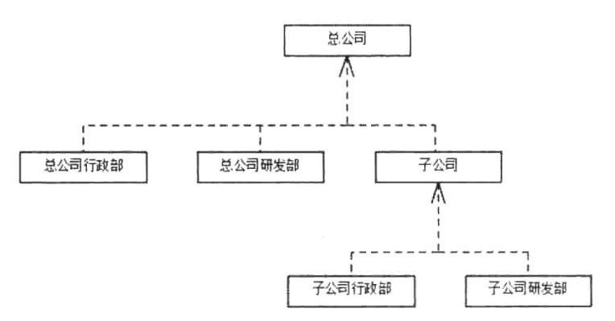


上面是一个公司的组织结构树状图，其中总公司下有行政部与研发部，而且总公司下属还有一个子公司，虽然子公司也包含行政部与研发部，但是从总公司的角度来看子公司就是一个独立的个体，与总公司所属的行政部和研发部平级，如果我们以一个嵌套盒子的形式来展示将会更加直观，比如我们将上述的树形结构转为一个嵌套盒子，总公司则是最外层的盒子，里面包含3个小盒子，分别表示总公司的行政部、研发部和子公司，而子公司内部又包含有研发部与行政部，如图192所示。

在这么一个结构中大家可以看到虽然总公司和子公司其本质不一样，但是它在我们的组织结构中是一样的，我们可以把它们看作一个抽象的公司，在组合模式中我们将这样的一个拥有分支的节点称之为枝干构件，位于树状结构顶部的枝干结构比较特殊，我们称为根结构件，因为其为整个树状图的始端，同样对于像行政部和研发部这样没有分支的结构，我们则称为叶子构件，这样的一个结构就是组合模式的雏形，如图19-3所示。

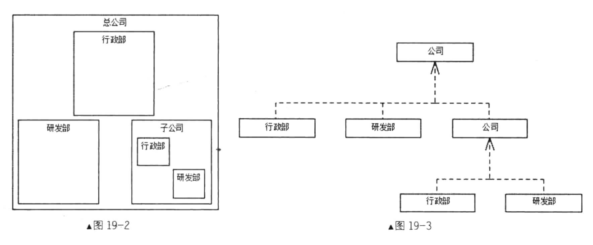


### 2、定义

将对象组合成树形结构以表示“部分-整体”的层次结构，使得用户对单个对象和组合对象的使用具有一致性。


### 3、使用场景

1. 表示对象的部分-整体层次结构时。
2. 从一个整体中能够独立出部分模块或功能的场景。


### 4、UML类图

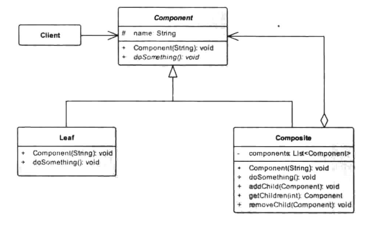

角色介绍：

1. Component：抽象根节点，为组合中的对象声明接口。在适当的情况下，实现所有类共有接口的缺省行为。声明一个接口用于访问和管理Component的子节点。可在递归结构中定义一个接口，用于访问一个父节点，并在合适的情况下实现它。
2. Composite：定义有子节点的那些枝干节点的行为，存储子节点，在Component接口中实现与子节点有关的操作。
3. Leaf：在组合中表示叶子节点对象，叶子节点没有子节点，在组合中定义节点对象的行为。
4. Client：通过Component接口操纵组合节点的对象。


根据类图我们可以得到一个通用的组合模式代码：

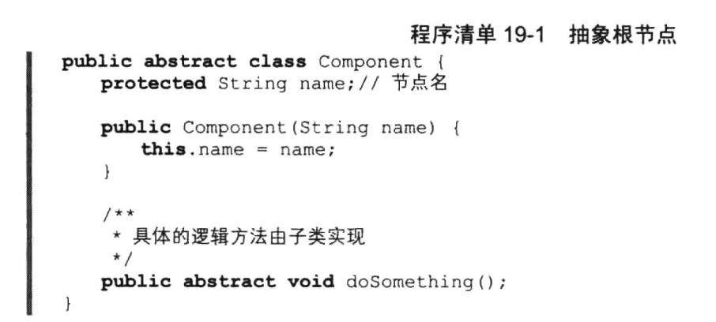

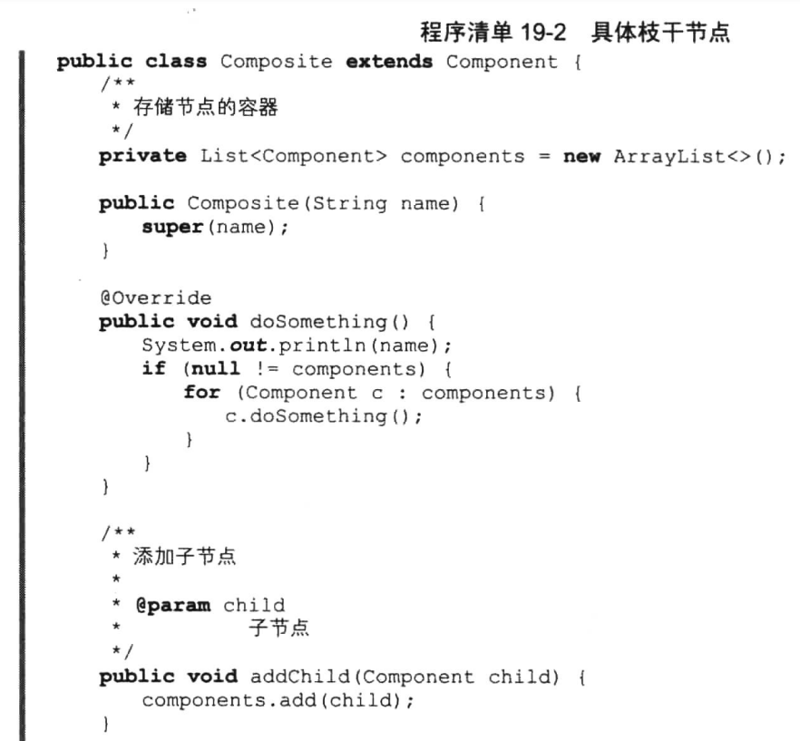

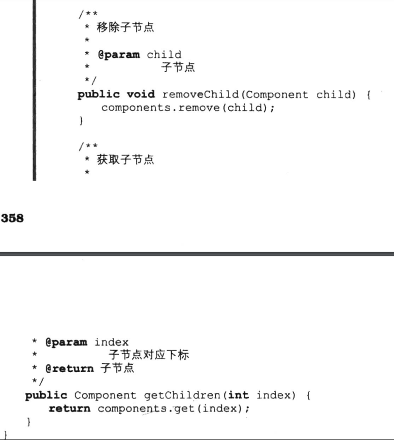

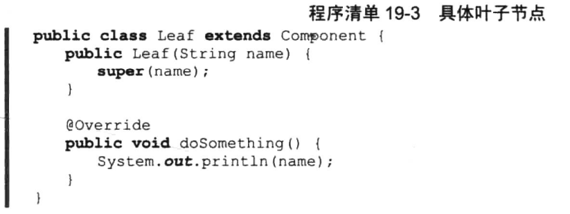

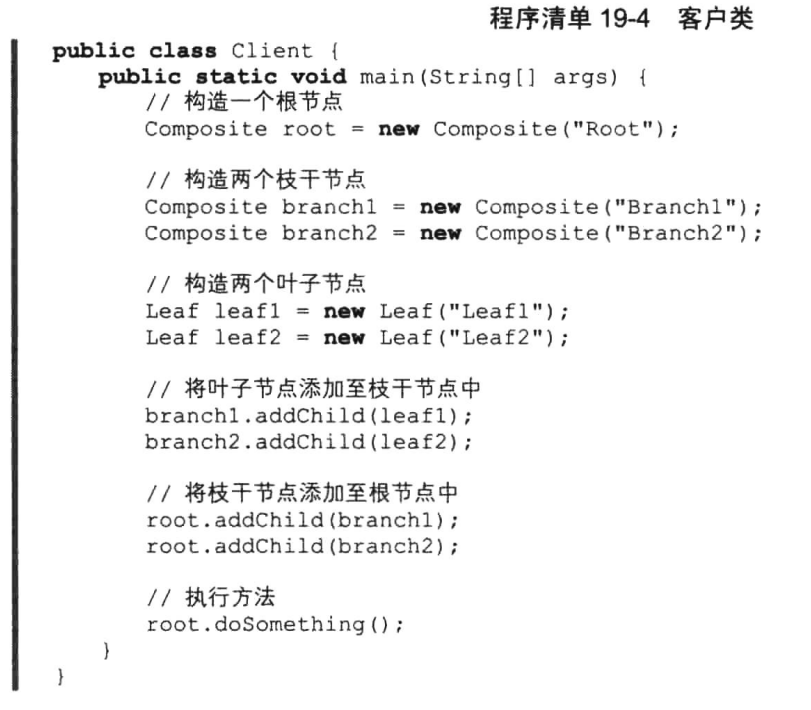

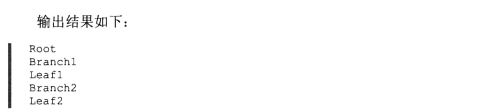

上述的UML类图及其代码实现中有一个很大的弊端不知道大家注意到了没有，我们在Client客户类中直接使用了Component的实现类。

这与本书第一章中所讲到的依赖倒置原则相违背，我们所定义的抽象Component在这里起的作用就不大，既然是面向接口编程，那么我们就该把更多的把焦点放在接口的设计上，如果我们稍微修改上面的类图将位于Composite中的一些实现方法定义到Component中，那么我们会得到一个不一样的组合模式。

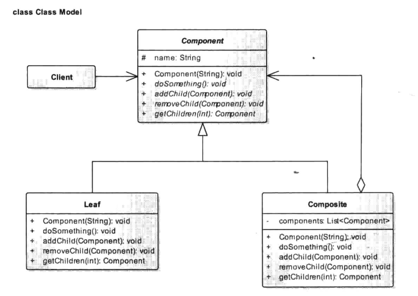

像这样将组合所使用的方法定义在抽象类的方式称为透明的组合模式，而上面我们所说的组合模式则称为安全的组合模式。透明组合模式中不管是叶子节点还是枝干节点都有着相同的结构，那意味着我们无法通过getChildren方法得到子节点的类型，而必须在方法实现的内部进行判断，我们来看看这种方式的组合模式UML类图代码。

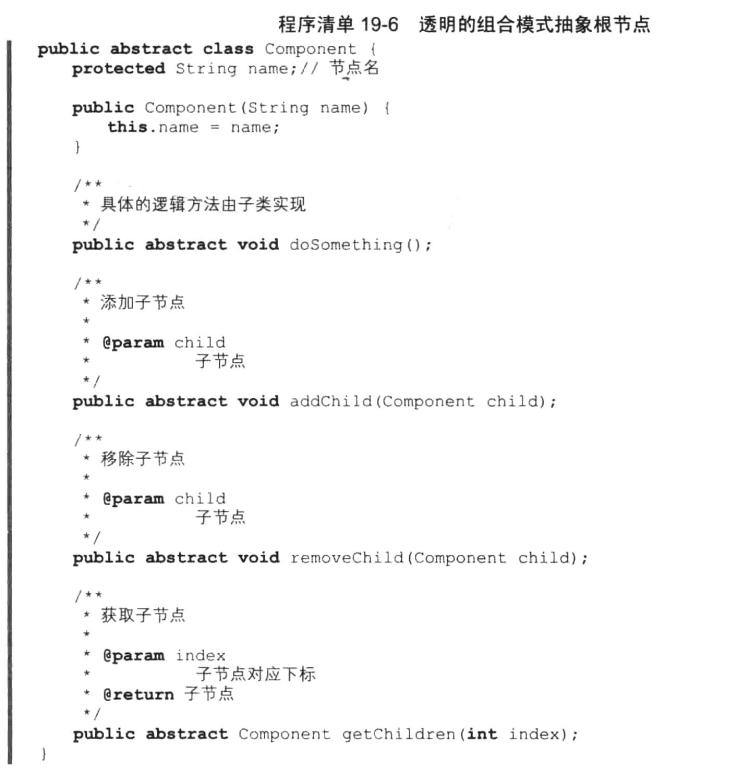

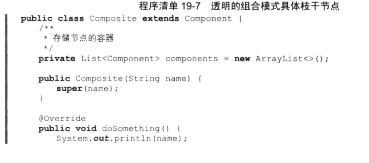

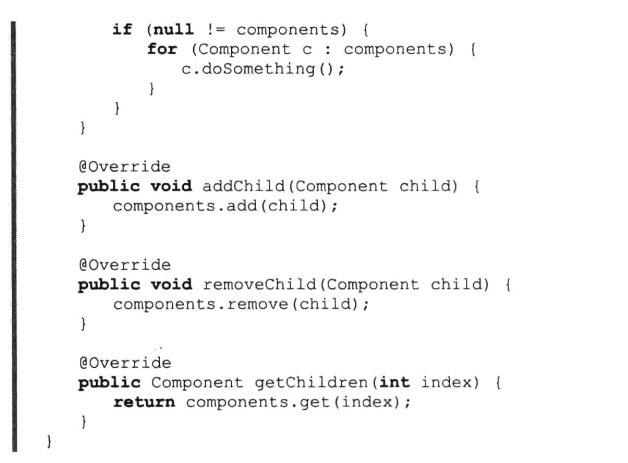

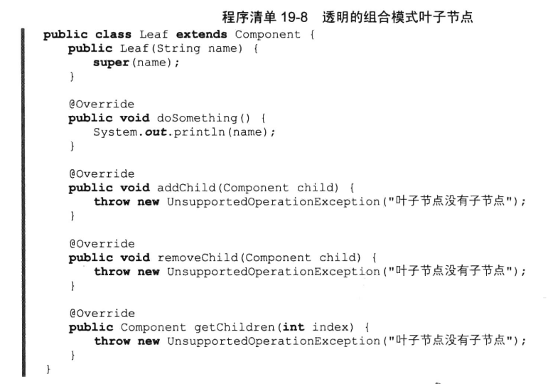

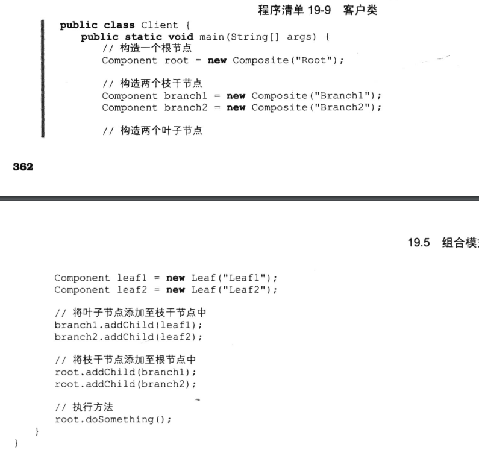


## 二、示例


### 1、示例

对于程序员来说，介绍一些组织结构想必一定会很陌生，但是即便如此，我们也能在其他地方看到组合模式的影子，如果你使用过电脑，知道什么是操作系统，那么对文件和文件夹这两个概念定不会陌生，什么是文件呢？文件就是可以被具体程序执行的对象，那什么又是文件夹呢？文件夹就是可以存放文件和文件夹的对象。

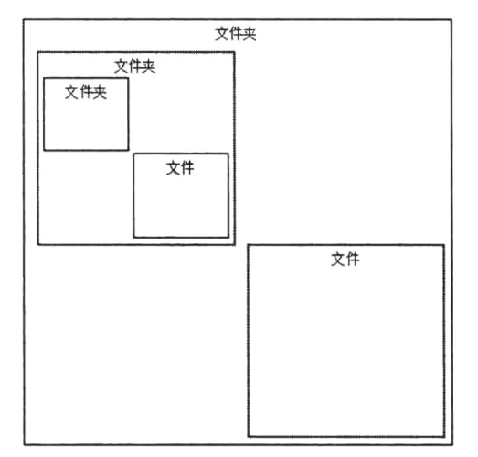

如此一看，操作系统的文件系统其实就是一种典型的组合模式例子，在这里我们就以此为例，看看一个简单的文件系统是如何构成的，首先声明一个D抽象类表示文件和文件夹。

```java
package cn.pangchun.scaffold.design_patterns.composite;

import java.util.ArrayList;
import java.util.List;

/**
 * 表示文件和文件夹的抽象类
 * 
 * @author pangchun
 * @since 2023/10/24
 */
public abstract class Dir {

    /**
     * 声明一个list变量存储文件夹下的所有元素
     */
    protected List<Dir> dirs = new ArrayList<>();

    /**
     * 当前文件夹或文件名
     */
    private String name;

    public Dir(String name) {
        this.name = name;
    }

    /**
     * 添加一个文件或文件夹
     * @param dir 文件或文件夹
     */
    public abstract void addDir(Dir dir);

    /**
     * 移除一个文件或文件夹
     * @param dir 文件或文件夹
     */
    public abstract void rmDir(Dir dir);

    /**
     * 清空文件夹下的所有元素
     */
    public abstract void clear();

    /**
     * 输出文件夹目录结构
     */
    public abstract void print();

    /**
     * 获取文件夹下所有的文件或子文件夹
     * @return 文件夹下所有的文件或子文件夹
     */
    public abstract List<Dir> getFiles();

    /**
     * 获取文件或文件夹名
     * @return 文件或文件夹名
     */
    public String getName() {
        return name;
    }
}
```

在该抽象类中我们定义了相关的抽象方法，大家可以看到这里用到的就是所谓的透明的组合模式，这里要实现的功能很简单，只是简单地打印一下目录结构，因此，声明一个成员变量来存储当前文件或文件夹的名称并提供对应的getter方法。接下来就是具体的文件夹类，该类中我们实现具体的文件夹方法逻辑：

```java
package cn.pangchun.scaffold.design_patterns.composite;

import java.util.Iterator;
import java.util.List;

/**
 * 文件夹类
 * 
 * @author pangchun
 * @since 2023/10/24
 */
public class Folder extends Dir {
    public Folder(String name) {
        super(name);
    }

    @Override
    public void addDir(Dir dir) {
        dirs.add(dir);
    }

    @Override
    public void rmDir(Dir dir) {
        dirs.remove(dir);
    }

    @Override
    public void clear() {
        dirs.clear();
    }

    @Override
    public void print() {
        System.out.println(getName() + "(");
        final Iterator<Dir> iterator = dirs.iterator();
        while (iterator.hasNext()) {
            final Dir dir = iterator.next();
            dir.print();
            if (iterator.hasNext()) {
                System.out.println(", ");
            }
        }
        System.out.println(")");
    }

    @Override
    public List<Dir> getFiles() {
        return dirs;
    }
}
```

像addDir、mDir在这里的方法中实现逻辑都比较简单，这里主要就是print方法用来输出文件夹的目录结构，该方法逻辑也比较简单，首先输出自己的名字，也就是当前文件夹名，然后迭代遍历子元素，调用子元素的print方法输出其目录结构，如果遇到子元素还是个文件夹，那么递归遍历直至所有的输出元素均为文件为止。接下来看看文件类的实现。

```java
package cn.pangchun.scaffold.design_patterns.composite;

import java.util.List;

/**
 * 文件类
 * 
 * @author pangchun
 * @since 2023/10/24
 */
public class File extends Dir {
    public File(String name) {
        super(name);
    }

    @Override
    public void addDir(Dir dir) {
        throw new UnsupportedOperationException("文件对象不支持此操作");
    }

    @Override
    public void rmDir(Dir dir) {
        throw new UnsupportedOperationException("文件对象不支持此操作");
    }

    @Override
    public void clear() {
        throw new UnsupportedOperationException("文件对象不支持此操作");
    }

    @Override
    public void print() {
        System.out.println(getName());
    }

    @Override
    public List<Dir> getFiles() {
        throw new UnsupportedOperationException("文件对象不支持此操作");
    }
}
```

文件类相对于文件夹类来说既不支持添加也不支持删除，因为文件不能作为文件夹来使用，它本是文件系统中的最小分割单位，因此，这里我们虽然实现了D中的一些添加、删除等操作方法，但是，其实现逻辑只是抛出一个不支持异常，因为就文件本身来说就不支持对应的操作。最后，在一个客户类中构建目录结构并输出。

```java
/**
 * 组合模式 - 文件树
 */
@Test
public void testComposite() {
    // 构造一个对象表示C盘根目录
    final Folder root = new Folder("C盘");

    // c盘下有一个文件 用户必看.txt
    root.addDir(new File("用户必看.txt"));

    // c盘下还有3个文件夹，分别是Windows、PerfLogs、Program File
    final Folder dirWin = new Folder("Windows");
    final Folder dirPer = new Folder("PerfLogs");
    final Folder dirPro = new Folder("Program File");

    root.addDir(dirWin);
    root.addDir(dirPer);
    root.addDir(dirPro);

    // Windows文件夹下有文件 explorer.exe
    dirWin.addDir(new File("explorer.exe"));

    // PerfLogs文件夹下有文件 null.txt
    dirPer.addDir(new File("null.txt"));

    // Program File文件夹下有文件夹 idea
    final Folder dirIdea = new Folder("idea");
    dirPro.addDir(dirIdea);
    // idea文件夹下有文件 test.java
    dirIdea.addDir(new File("test.java"));

    // 打印文件结构
    root.print();
}
```

输出结果：

```bash
C盘(
用户必看.txt
, 
Windows(
explorer.exe
)
, 
PerfLogs(
null.txt
)
, 
Program File(
idea(
test.java
)
)
)
```


