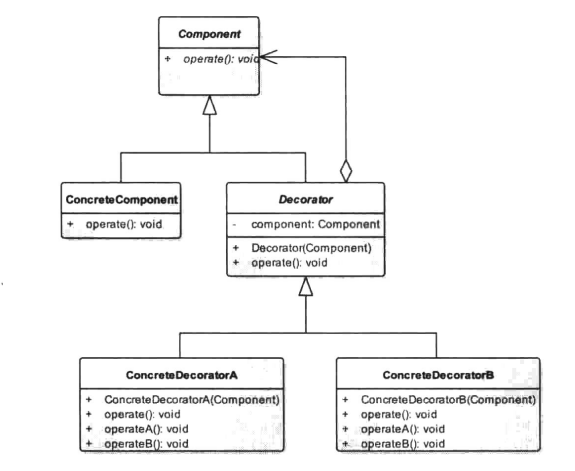

# 装饰模式


## 一、概念


### 1、介绍

装饰模式(Decorator Pattern)也称为包装模式(Wrapper Pattern),结构型设计模式之一，其使用一种对客户端透明的方式来动态地扩展对象的功能，同时它也是继承关系的一种替代方案之一。在现实生活中你也可以看见很多装饰模式的例子，或者可以大胆地说装饰模式无处不在，就拿人来说，人需要各式各样的衣着，不管你穿着怎样，但是，对于个人的本质来说是不变的，充其量只是在外面披上一层遮羞物而已，这就是装饰模式，装饰物也许各不相同但是装饰的对象本质是不变的。


### 2、定义

动态地给一个对象添加一些额外的职责。就增加功能来说，装饰模式相比生成子类更为灵活。


### 3、使用场景

需要透明且动态地扩展类的功能时。


### 4、UML类图



角色介绍：

1. Component：抽象组件。
   可以是一个接口或抽象类，其充当的就是被装饰的原始对象。
2. ConcreteComponent：组件具体实现类。
   该类是Component类的基本实现，也是我们装饰的具体对象。
3. Decorator：抽象装饰者。
   顾名思义，其承担的职责就是为了装饰我们的组件对象，其内部一定要有一个指向组件对象的
   引用。在大多数情况下，该类为抽象类，需要根据不同的装饰逻辑实现不同的具体子类。当然，如
   果装饰逻辑单一，只有一个的情况下我们可以省略该类直接作为具体的装饰者。
4. ConcreteDecoratorA：装饰者具体实现类。
   只是对抽象装饰者作出具体的实现。
5. ConcreteDecoratorB：同上
6. Client：客户类

根据类图可以总结出一个装饰模式的通用模式代码：


## 二、示例


### 1、示例

还是看文章开头我们所讲到的那个例子，人总是要穿衣服的，我们将人定义为一个抽象类，将其穿衣的行为定义为一个抽象方法。

```java
package cn.pangchun.scaffold.design_patterns.decorator;

/**
 * 抽象的人
 * 
 * @author pangchun
 * @since 2023/10/24
 */
public abstract class Person {

    /**
     * 人有穿衣服的一个行为
     */
    public abstract void dressed();
}
```

该类其实就是上面我们所提及的抽象组件类，也就是我们需要装饰的原始对象，那么具体装饰谁呢？我们需要一个具体的实现类。

```java
package cn.pangchun.scaffold.design_patterns.decorator;

/**
 * 需要装饰的原始对象
 * 
 * @author pangchun
 * @since 2023/10/24
 */
public class Boy extends Person {
    @Override
    public void dressed() {
        System.out.println("穿了内衣内裤");
    }
}
```

Boy类继承于Person类，该类仅对Person中的dressed方法作了具体的实现，而Boy类则是我们所要装饰的具体对象，现在需要一个装饰者来装饰我们的这个B0y对象，这里定义一个PersonCloth类来表示人所穿着的衣服。

```java
package cn.pangchun.scaffold.design_patterns.decorator;

/**
 * 装饰者：需要保持一个对被装饰者的引用
 * 
 * @author pangchun
 * @since 2023/10/24
 */
public abstract class PersonCloth extends Person {

    protected Person person;

    public PersonCloth(Person person) {
        this.person = person;
    }

    @Override
    public void dressed() {
        person.dressed();
    }
}
```

在PersonCloth类中我们保持了一个对Person类的引用，可以方便地调用具体被装饰对象中的方法，这也是为什么我们可以在不破坏原类层次结构的情况下为类增加一些功能，我们只需要在被装饰对象的相应方法前或后增加相应的功能逻辑即可。在装饰物只有一个的情况下，可不必声明一个抽象类作为装饰者抽象的提取，仅需定义一个普通的类表示装饰者即可，这里为了表明示例我们定义两种衣服类型，一个类ExpensiveCloth表示高档衣服。

```java
package cn.pangchun.scaffold.design_patterns.decorator;

/**
 * 具体的装饰者：昂贵的衣服
 * 
 * @author pangchun
 * @since 2023/10/24
 */
public class ExpensiveCloth extends PersonCloth {

    public ExpensiveCloth(Person person) {
        super(person);
    }

    private void dressShirt() {
        System.out.println("穿件短袖");
    }

    private void dressLeather() {
        System.out.println("穿件皮衣");
    }

    private void dressJean() {
        System.out.println("穿条牛仔裤");
    }

    @Override
    public void dressed() {
        super.dressed();
        dressShirt();
        dressLeather();
        dressJean();
    }
}
```

逻辑依旧很简单不再多说，而另一个类CheapCloth则表示便宜的衣服。

```java
package cn.pangchun.scaffold.design_patterns.decorator;

/**
 * 具体的装饰者：便宜的衣服
 * 
 * @author pangchun
 * @since 2023/10/24
 */
public class CheapCloth extends PersonCloth {

    public CheapCloth(Person person) {
        super(person);
    }

    private void dressShorts() {
        System.out.println("穿条短裤");
    }

    @Override
    public void dressed() {
        super.dressed();
        dressShorts();
    }
}
```

这两个类本质上并没有区别，两者都是为原本Boy类中的dressed方法提供功能扩展，不过这种扩展并非是直接修改原有的方法逻辑或结构，更恰当地说，仅仅是在另一个类中将原有方法和新逻辑进行封装整合而已。最后我们来看看客户类中的调用。

```java
/**
 * 装饰模式 - 人穿衣服
 */
@Test
public void testDecorator() {
    // 首先有一个男孩
    final Boy person = new Boy();

    // 穿一套便宜的衣服
    final CheapCloth cheapCloth = new CheapCloth(person);
    cheapCloth.dressed();

    System.out.println("-------------");

    // 穿一套昂贵的衣服
    final ExpensiveCloth expensiveCloth = new ExpensiveCloth(person);
    expensiveCloth.dressed();
}
```

输出结果：

```bash
穿了内衣内裤
穿条短裤
-------------
穿了内衣内裤
穿件短袖
穿件皮衣
穿条牛仔裤
```


