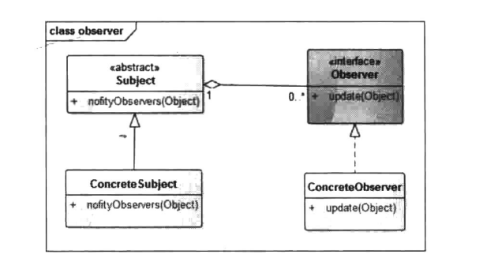

# 观察者模式


## 一、概念


### 1、介绍

观察者模式是一个使用率非常高的模式，它最常用的地方是GU1系统、订阅一发布系统。因为这个模式的一个重要作用就是解耦，将被观察者和观察者解耦，使得它们之间的依赖性更小，甚至做到毫无依赖。以GUI系统来说，应用的UⅡ具有易变性，尤其是前期随着业务的改变或者产品的需求修改，应用界面也会经常性变化，但是业务逻辑基本变化不大，此时，GUI系统需要一套机制来应对这种情况，使得UI层与具体的业务逻辑解耦，观察者模式此时就派上用场了。


### 2、定义

定义对象间一种一对多的依赖关系，使得每当一个对象改变状态，则所有依赖于它的对象都会得到通知并被自动更新。


### 3、使用场景

1. 关联行为场景，需要注意的是，关联行为是可拆分的，而不是“组合”关系。
2. 事件多级触发场景。
3. 跨系统的消息交换场景，如消息队列、事件总线的处理机制。


### 4、UML类图




- Subject：抽象主题，也就是被观察(Observable)的角色。

  抽象主题角色把所有观察者对象的引用保存在一个集合里，每个主题都可以有任意数量的观察者，抽象主题提供一个接口，可以增加和删除观察者对象。

- ConcreteSubject：具体主题。

  该角色将有关状态存入具体观察者对象，在具体主题的内部状态发生改变时，给所有注册过的观察者发出通知，也叫具体被观察者角色。

- Observer：抽象观察者。

  该角色是观察者的抽象类，它定义了一个更新接口，使得在得到主题的更改通知时更新自己。

- ConcreteObserver：具体的观察者。

  该角色实现抽象观察者角色所定义的更新接口，以便在主题的状态发生变化时更新自身的状态。


### 5、Observer接口

观察者模式是一种十分常用的设计模式，在java标准库中有一个Observer接口，和一个Observable类。

观察者角色要实现的接口：Observer

```java
/**
 * A class can implement the {@code Observer} interface when it
 * wants to be informed of changes in observable objects.
 *
 * @author  Chris Warth
 * @see     java.util.Observable
 * @since   1.0
 *
 * @deprecated
 * This interface has been deprecated. See the {@link Observable}
 * class for further information.
 */
@Deprecated(since="9")
public interface Observer {
```

被观察角色要继承的类：Observable

```java
 * @deprecated
 * This class and the {@link Observer} interface have been deprecated.
 * The event model supported by {@code Observer} and {@code Observable}
 * is quite limited, the order of notifications delivered by
 * {@code Observable} is unspecified, and state changes are not in
 * one-for-one correspondence with notifications.
 * For a richer event model, consider using the
 * {@link java.beans} package.  For reliable and ordered
 * messaging among threads, consider using one of the concurrent data
 * structures in the {@link java.util.concurrent} package.
 * For reactive streams style programming, see the
 * {@link java.util.concurrent.Flow} API.
 */
@Deprecated(since="9")
public class Observable {
    private boolean changed = false;
    private Vector<Observer> obs;
```

并且我们发现这两个都是@Deprecated的，并且根据注释，推荐我们去使用 `java.util.concurrent.Flow`。

这里是作为了解，知道一下，等用到的时候再去研究它怎么使用，在下面的示例中我们还是使用这两个接口和类来处理。


## 二、示例


### 1、示例

开发技术前线网站(www.devtf.cn)是一个聚合了关于Android、iOS新技术文章的开源库等内容的网站，在这里可以看到新的技术、强大的开源库、新的信息，经常浏览这类网站不仅能够开阔眼界，也能让我们接触到前言的科技信息。

开发技术前线不仅是个内容发布页面，也支持用户邮箱订阅，每周发布周报后会将优质的内容推送给订阅用户，这种模式叫做发布一订阅模式，它的另一个名称是观察者模式。

让我们来简单模拟一下开发技术前线的发布-订阅的过程。

首先定义观察者，程序员。

```java
package cn.pangchun.scaffold.design_patterns.observer;

import lombok.AllArgsConstructor;
import lombok.Data;

import java.util.Observable;
import java.util.Observer;

/**
 * 程序员：具体的观察者角色
 *
 * @author pangchun
 * @since 2023/10/17
 */
@Data
@AllArgsConstructor
public class Coder implements Observer {

    private String name;

    @Override
    public void update(Observable o, Object arg) {
        System.out.println("你好：" + name + ", 技术前线网站更新啦, 内容：" + arg);
    }
}
```

其次，定义被观察角色，技术网站，每当技术网站发布新内容，都要通知已经订阅的所有程序员。

```java
package cn.pangchun.scaffold.design_patterns.observer;

import java.util.Observable;

/**
 * 技术前线网站：被观察的角色
 *
 * @author pangchun
 * @since 2023/10/17
 */
public class DevTechFrontier extends Observable {

    /**
     * 发布新的内容
     * 当它更新时，要通知所有程序员
     * @param content 新内容
     */
    public void postNewPublication(String content) {
        // 标识状态或内容发生改变
        setChanged();
        // 通知所有观察者
        notifyObservers(content);
    }
}
```

客户端，完成订阅与发布。

```java
/**
 * 观察者模式 - 技术网站发布订阅
 */
@Test
public void testObserver() {
    // 被观察的角色
    final DevTechFrontier devTechFrontier = new DevTechFrontier();
    // 观察者
    final Coder coder1 = new Coder("张三");
    final Coder coder2 = new Coder("李四");
    final Coder coder3 = new Coder("王五");

    // 订阅
    devTechFrontier.addObserver(coder1);
    devTechFrontier.addObserver(coder2);
    devTechFrontier.addObserver(coder3);

    // 发布
    devTechFrontier.postNewPublication("Linux内核最新消息");
}
```

输出结果：

```bash
你好：王五, 技术前线网站更新啦, 内容：Linux内核最新消息
你好：李四, 技术前线网站更新啦, 内容：Linux内核最新消息
你好：张三, 技术前线网站更新啦, 内容：Linux内核最新消息
```


### 2、思考

**思考：如何改成异步通知，使得所有观察者可以并发同时处理？**


