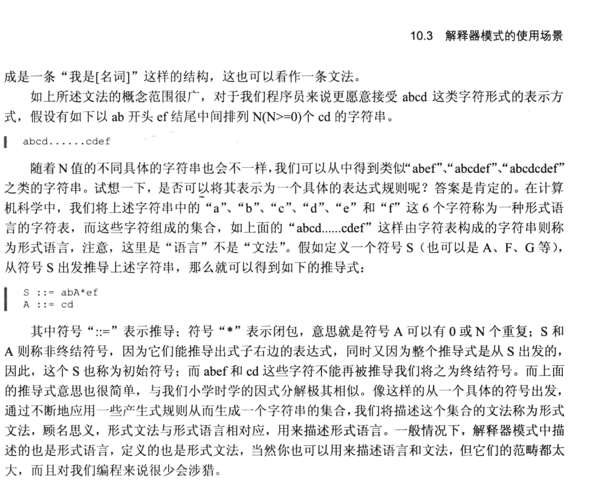

# 解释器模式


## 一、概念


### 1、介绍

解释器模式(Interpreter Pattern)是一种用得比较少的行为型模式，其提供了一种解释语言的语法或表达式的方式，该模式定义了一个表达式接口，通过该接口解释一个特定的上下文。在这么多的设计模式中，解释器模式在实际运用上相对来说要少很多，因为我们很少会自己去构造一个语言的文法。虽然如此，既然它能够在设计模式中有一席之位，那么必定有它的可用之处，本章会以最直白的言语来阐述清楚解释器模式是如何工作的。


### 2、定义

给定一个语言，定义它的文法的一种表示，并定义一个解释器，该解释器使用该表示来解释语言中的句子。





### 3、使用场景


### 3、UML类图


- AbstractExpression：抽象表达式。
  声明一个抽象的解释操作父类，并定义一个抽象的解释方法，其具体的实现在各个具体的子类
  解释器中完成。
- TerminalExpression：终结符表达式。
  实现文法中与终结符有关的解释操作。文法中每一个终结符都有一个具体的终结表达式与之
  对应。
- NonterminalExpression：非终结符表达式。
  实现文法中与非终结符有关的解释操作。
- Context：上下文环境类。
  包含解释器之外的全局信息。
- Client:客户类。
  解析表达式，构建抽象语法树，执行具体的解释操作等。

根据类图可以得出如下一个解释器模式的通用模式代码。


## 二、示例


### 1、示例

一个比较常见的场景是对算数表达式的解释，如表达式“m+n+p”,如果我们使用解释器模式对该表达式进行解释，那么代表数字的m、n和p三个字母我们就可以看成是终结符号，而“+”这个算术运算符号则可当作非终结符号。同样地，我们可以先创建一个抽象解释器表示数学运算。

```java
package cn.pangchun.scaffold.design_patterns.interpret;

/**
 * 抽象的算数运算解释器：为所有解释器共性的提取
 * 
 * @author pangchun
 * @since 2023/10/12
 */
public abstract class ArithmeticExpression {

    /**
     * 抽象的解析方法
     * 具体的解析逻辑由具体的子类实现
     * @return 解析得到具体的值
     */
    public abstract int interpret();
}
```

在该抽象解释器的解释方法interpret中，我们没有像前面的例子那样使用一个Context对象作为interpret方法的签名，在本例中运算的结果都是作为参数返回，因此，没有必要使用额外的对象存储信息。ArithmeticExpression有两个直接子类NumExpression和OperatorExpression,其中NumExpression用于对数字进行解释：

```java
package cn.pangchun.scaffold.design_patterns.interpret;

import lombok.AllArgsConstructor;
import lombok.Data;
import lombok.EqualsAndHashCode;

/**
 * 数字解释器：仅仅解释数字
 * 
 * @author pangchun
 * @since 2023/10/12
 */
@Data
@AllArgsConstructor
@EqualsAndHashCode(callSuper = true)
public class NumberExpression extends ArithmeticExpression {

    private int num;

    @Override
    public int interpret() {
        return num;
    }
}
```

代码很简单，逻辑也很明确，就不多说了。OperatorExpression依然是一个抽象类，其声明两个ArithmeticExpression类型的成员变量存储运算符号两边的数字解释器，这两个成员变量会在构造方法中被赋值。

```java
package cn.pangchun.scaffold.design_patterns.interpret;

import lombok.AllArgsConstructor;
import lombok.Data;
import lombok.EqualsAndHashCode;

/**
 * 运算符号抽象解释器：为所有运算符号解释器共性的提取，运算符号有可能为加、减、乘、除等不同符号
 * 
 * @author pangchun
 * @since 2023/10/12
 */

@Data
@AllArgsConstructor
@EqualsAndHashCode(callSuper = true)
public abstract class OperatorExpression extends ArithmeticExpression {

    /**
     * 声明两个成员变量，存储运算符号两边的数字解释器
     * protected: 子类可以直接访问，不需要通过getter方法
     */
    protected ArithmeticExpression exp1,exp2;
}
```

OperatorExpression也有一个直接子类AdditionExpression,顾名思义其表示对加法运算进行解释，其逻辑都很简单，就不做过多说明了。

```java
package cn.pangchun.scaffold.design_patterns.interpret;

import lombok.Data;
import lombok.EqualsAndHashCode;

/**
 * 加法运算符号解释器
 *
 * @author pangchun
 * @since 2023/10/12
 */
public class AdditionExpression extends OperatorExpression{

    public AdditionExpression(ArithmeticExpression exp1, ArithmeticExpression exp2) {
        super(exp1, exp2);
    }

    @Override
    public int interpret() {
        return exp1.interpret() + exp2.interpret();
    }
}
```

以上就是我们用到的全部解释器，除此之外，我们创建一个ArithmeticCalculator类来处理一些相关的业务。

```java
package cn.pangchun.scaffold.design_patterns.interpret;

import java.util.Deque;
import java.util.Stack;

/**
 * 计算器：处理与解释一些相关的业务
 * 
 * @author pangchun
 * @since 2023/10/12
 */
public class ArithmeticCalculator {

    /**
     * 声明一个栈，存储并操作所有相关的解释器
     */
    private final Stack<ArithmeticExpression> stack = new Stack<ArithmeticExpression>();

    /**
     * 构造方法，在实例化的时候把表达式传进来
     * @param expression 表达式
     */
    public ArithmeticCalculator(String expression) {
        // 声明两个临时变量，存储运算符号两边的数字解释器
        ArithmeticExpression exp1,exp2;

        // 使用空格分割表达式字符串
        final String[] elements = expression.split(" ");

        // 循环遍历表达式元素数组
        for (int i = 0; i < elements.length; i++) {
            // 判断运算符号
            switch (elements[i].charAt(0)) {
                case '+':
                    // 如果是加号，则将栈中的解释器弹出作为运算符左边的解释器
                    exp1 = stack.pop();

                    // 同时将运算符号数组下标下一个元素构造为数字解释器
                    exp2 = new NumberExpression(Integer.parseInt(elements[++i]));

                    // 通过上面两个数字解释器构造一个加法运算解释器并压入栈中
                    stack.push(new AdditionExpression(exp1,exp2));
                    break;
                default:
                    // 如果是数字(只有加号和数字)，则构造数字解释器并压入栈中
                    stack.push(new NumberExpression(Integer.parseInt(elements[i])));
                    break;
            }
        }
    }

    /**
     * 计算最终结果
     * @return 最终的计算结果
     */
    public int calculate() {
        return stack.pop().interpret();
    }
}
```

这里要注意的是，为了简化问题我们约定表达式字符串的每个元素之间必须使用空格间隔开，如“1 + 22 + 333 + 4444”这样的表达式字符串则是合法的，而“1+22+333+4444”则不合法，因此，我们才能在Calculator的构造方法中通过空格来拆分字符串。Calculator类的逻辑很好理解，这里还是以“1 + 22 + 333 + 4444”这个字符串为例，首先将其拆分为有7个元素组成的字符串数组，然后循环遍历，首先遍历到的元素为1，那么将其作为参数构造一个NumExpression对象压入栈，其次是加号运算符，此时我们则将刚才压入栈的由元素1作为参数构造的NumExpression对象抛出作为加号运算符左边的数字解释器，而右边的数字解释器呢？我们只需要将当前数组下标+1获取到数组元素中加号右边的数字22，将其作为参数构造一个NumExpression对象即可，最后通过左右两个数字解释器作为参数构造一个AdditionExpression加法解释器对象压入栈即可，这个过程其实就是在构建语法树，只不过我们将其单独封装在了一个类里而不是在Client客户类里进行，最后，我们公布一个calculate方法执行解释并返回结果。后面的Client客户类就很简单了，构造一个Calculator对象，调用calculate方法输出结果即可。

客户端代码。

```java
/**
 * 解释器模式 - 计算器
 */
@Test
public void testInterpreter() {
    final ArithmeticCalculator calculator = new ArithmeticCalculator("1 + 22 + 333 + 4444");
    System.out.println("1 + 22 + 333 + 4444 = " + calculator.calculate());
}
```

结果打印。

```bash
1 + 22 + 333 + 4444 = 4800
```

上面我们只定义了加法解释器，要添加一个减法解释器也是一样的，大家可以自行尝试。


### 2、小结

这里我们可以看到解释器模式的一个优点，就是灵活性强，上面的例子中我们只实现了对加减法的解释计算，如果想实现更多的运算法则，如乘除取余等，只需创建对应的运算解释器即可，但是混合运算要比简单的加减法运算复杂得多，还要考虑不同符号的运算优先级，这也是文章开头我们说，在“简单的语言”中适用解释器模式。从上面的两个例子中可以看到，具体的文法规则与解释器之间其实是由对应关系的，大多数情况下两者之间是一一对应的关系，即一条文法对应一个解释器，当然，我们也可以为一条文法创建多个不同的解释器，但是反过来就不行。这个很好理解，如上例中对于加法解释器我们实现的是对加法运算的解释，其对应一个解释器AdditionExpression,当然也可以再为其创建一个解释器XXXXXXExpression,但是一个解释器却不能即解释加法运算又解释减法运算，否则就违背了解释
器模式的定义。说到解释器模式的定义，我们提到过抽象语法树，而我们在上面两个例子中都有构建抽象语法树的相关逻辑，第一个例子中我们在客户类里构建由17个数字和一个数字或字母构成的语法树：而第二个例子则根据具体表达式动态构建相应的语法树。从这点可以看出解释器模式并不包含对抽象语法树的构建，其构建逻辑应由客户根据具体的情况去生成。将一条具体的文法通过一个解释器解释，把复杂的文法规则分离为简单的功能进行解释，最后将其组合成一棵抽象语法树解释执行。至此，我们可以看到解释器模式的原理与本质：将复杂的问题简单化、模块化，分离实现、解释执行。

