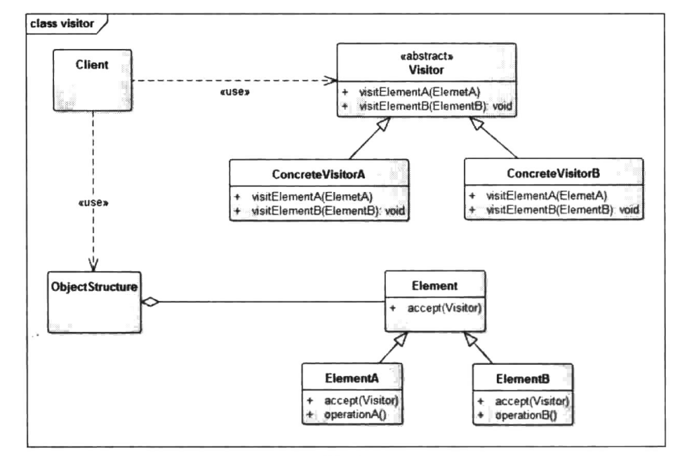

# 访问者模式


## 一、概念


### 1、介绍

访问者模式是一种将数据操作与数据结构分离的设计模式，它是《设计模式》中23种设计模式中最复杂的一个，但它的使用频率并不高，正如《设计模式》的作者GO℉对访问者模式的描述：大多数情况下，你并需要使用访问者模式，但是当你一旦需要使用它时，那你就是真地需要它了。

访问者模式的基本想法是，软件系统中拥有一个由许多对象构成的、比较稳定的对象结构，这些对象的类都拥有一个accept方法用来接受访问者对象的访问。访问者是一个接口，它拥有一个Visit方法，这个方法对访问到的对象结构中不同类型的元素作出不同的处理。在对象结构的一次访问过程中，我们遍历整个对象结构，对每一个元素都实施accept方法，在每一个元素的accept方法中会调用访问者的vst方法，从而使访问者得以处理对象结构的每一个元素，我们可以针对对象结构设计不同的访问者类来完成不同的操作，达到区别对待的效果。


### 2、定义

封装一些作用于某种数据结构中的各元素的操作，它可以在不改变这个数据结构的前提下定义作用于这些元素的新的操作。


### 3、使用场景

1. 对象结构比较稳定，但经常需要在此对象结构上定义新的操作。
2. 需要对一个对象结构中的对象进行很多不同的并且不相关的操作，而需要避免这些操作“污染”这些对象的类，也不希望在增加新操作时修改这些类。


### 4、UML类图




- Visitor：接口或者抽象类

  它定义了对每一个元素(Element).访问的行为，它的参数就是可以访问的元素，它的方法个数理论上来讲与元素个数是一样的，因此，访问者模式要求元素的类族要稳定，如果经常添加、移除元素类，必然会导致频繁地修改Visitor接口，如果出现这种情况，则说明不适合使用访问者模式。

- Concrete Visitor：具体的访问者

  它需要给出对每一个元素类访问时所产生的具体行为。

- Element：元素接口或者抽象类

  它定义了一个接受访问者(accept)的方法，其意义是指每一个元素都要可以被访问者访问。

- ElementA、ElementB：具体的元素类

  它提供接受访问方法的具体实现，而这个具体的实现，通常情况下是使用访问者提供的访问该元素类的方法。

- ObjectStructure：定义当中所提到的对象结构，对象结构是一个抽象表述，它内部管理了元素集合，并且可以迭代这些元素供访问者访问。


## 二、示例


### 1、示例

访问者模式是一个结构、概念都较为复杂的模式，使用频率也不高，但是并不代表可以将它的作用忽略，当有合适的场景时，访问者模式会带来意想不到的灵活性，所以，我们首先通过一个简单的示例来学习它的典型应用。

在年终时，公司都会给员工进行业绩考核，以此来评定该员工的绩效及年终奖、晋升等，这些评定都是由公司高层来负责，但是，不同领域的管理人员对于员工的评定标准是不一样的，为了简单明了地说明问题，我们把员工简单分为工程师和经理，评定员工的分别为CEO和CTO,我们假定CTO只关注工程师的代码量、经理的新产品数量，而CEO关注的是工程师的KPI和经理的KPI以及新产品数量，从中可以看出，CEO和CTO对于不同员工的关注点是不一样的，这就需要对不同的员工类型进行不同的处理。访问者模式此时可以派上用场了，我们看看下面相关代码的实现：

抽象元素：员工基类

```java
package cn.pangchun.scaffold.design_patterns.visitor;

import lombok.AllArgsConstructor;

import java.util.Random;

/**
 * 抽象元素：员工基类
 * 
 * @author pangchun
 * @since 2023/10/19
 */
public abstract class Staff {

    public String name;
    public int kpi;

    /**
     * 构造函数
     * @param name 员工姓名
     */
    public Staff(String name) {
        this.name = name;
        this.kpi = new Random().nextInt(10);
    }

    /**
     * 接受visitor的访问
     * @param visitor 访问者
     */
    public abstract void accept(Visitor visitor);
}
```

Staf类定义了员工的基本信息及一个accept方法，accept方法表示接受访问者的访问，由子类具体实现。下面看看工程师和经理的相关代码：

具体元素：工程师

```java
package cn.pangchun.scaffold.design_patterns.visitor;

import java.util.Random;

/**
 * 具体元素：工程师
 * 
 * @author pangchun
 * @since 2023/10/19
 */
public class Engineer extends Staff {
    /**
     * 构造函数
     *
     * @param name 员工姓名
     */
    public Engineer(String name) {
        super(name);
    }

    @Override
    public void accept(Visitor visitor) {
        visitor.visit(this);
    }

    /**
     * 工程师这一年写的代码数量
     * @return 代码行数
     */
    public int getCodeLines() {
        return new Random().nextInt(10 * 10000);
    }
}
```

具体元素：产品经理

```java
package cn.pangchun.scaffold.design_patterns.visitor;

import java.util.Random;

/**
 * 具体元素：产品经理
 * 
 * @author pangchun
 * @since 2023/10/19
 */
public class Manager extends Staff {

    private int products;

    /**
     * 构造函数
     *
     * @param name 员工姓名
     */
    public Manager(String name) {
        super(name);
        this.products = new Random().nextInt(10);
    }

    @Override
    public void accept(Visitor visitor) {
        visitor.visit(this);
    }

    /**
     * 一年内做的产品数量
     * @return 产品数量
     */
    public int getProducts() {
        return products;
    }
}
```

在工程师类中添加了获取代码行数的函数，而在经理类型中则添加了获取新产品数量的函数，它们的职责是不一样的，也正是由于它们的差异性才使得访问者模式能够发挥它的作用。Staff、Engineer、Manager3个类型就是对象结构，这些类型相对稳定，不会发生变化。然后将这些员工添加到一个业务报表类中，公司高层可以通过该报表类的showReport函数查看所有员工的业绩，具体代码如下：

ObjectStructure角色：员工业务报表

```java
package cn.pangchun.scaffold.design_patterns.visitor;

import java.util.LinkedList;
import java.util.List;

/**
 * ObjectStructure角色：员工业务报表
 * 
 * @author pangchun
 * @since 2023/10/19
 */
public class BusinessReport {

    private List<Staff> mStaffs = new LinkedList<>();

    public BusinessReport() {
        mStaffs.add(new Manager("王经理"));
        mStaffs.add(new Engineer("工程师-a"));
        mStaffs.add(new Engineer("工程师-b"));
        mStaffs.add(new Engineer("工程师-c"));
        mStaffs.add(new Engineer("工程师-d"));
    }

    /**
     * 为访问者展示报表
     * @param visitor 访问者
     */
    public void showReport(Visitor visitor) {
        for (Staff staff : mStaffs) {
            staff.accept(visitor);
        }
    }
}
```

Visitor声明了两个visit函数，分别是对工程师和经理的访问函数。

抽象访问者Visitor：

```java
package cn.pangchun.scaffold.design_patterns.visitor;

/**
 * 抽象访问者Visitor
 * 
 * @author pangchun
 * @since 2023/10/19
 */
public interface Visitor {

    /**
     * 访问工程师类型
     * @param engineer 工程师
     */
    void visit(Engineer engineer);

    /**
     * 访问产品经理类型
     * @param manager 产品经理
     */
    void visit(Manager manager);
}
```

首先定义了一个Visitor接口，该接口有两个visit函数，参数分别为Engineer、Manager,也就是说对于Engineer、Manager的访问会调用两个不同的方法，以此达成区别对待、差异化处理。具体的实现类为CEOVisitor、CTOVisitor类。

具体访问者：CEO

```java
package cn.pangchun.scaffold.design_patterns.visitor;

/**
 * 具体访问者：CEO，只关注业绩
 * 
 * @author pangchun
 * @since 2023/10/19
 */
public class CeoVisitor implements Visitor {
    @Override
    public void visit(Engineer engineer) {
        System.out.println("工程师：" + engineer.name + " , kpi: " + engineer.kpi);
    }

    @Override
    public void visit(Manager manager) {
        System.out.println("经理：" + manager.name + " , kpi: " + manager.kpi + " , 新产品数量：" + manager.getProducts());
    }
}
```

在CEO的访问者中，CEO只关注Engineer员工的KPI,而对于Manager类型的员工除了KPI之外还有该Manager本年度新开发产品的数量。两类员工的关注点略有不同，通过两个visitor方法分别进行处理。而如果我们不使用Visitor模式，只通过一个visit函数进行处理，那么就需要在这个visit函数中对不同的员工类型进行判断，然后分别进行处理，代码大致如下：


这就导致了if-lse逻辑的嵌套以及类型的强制转换，难以扩展和维护，当类型较多时，这个ReportUtil就会很复杂。而使用Visitor模式，通过同一个函数对不同的元素类型进行相应的处理，使得结构更加清晰、灵活性更高。

例如，CEO的关注点主要是在业绩上，而CTO更关注的是员工在技术层面的贡献，因此，我们添加一个CTO的Visitor类：

具体访问者：CTO

```java
package cn.pangchun.scaffold.design_patterns.visitor;

/**
 * 具体访问者：CTO，CTO更关注的是员工在技术层面的贡献
 * 
 * @author pangchun
 * @since 2023/10/19
 */
public class CtoVisitor implements Visitor {
    @Override
    public void visit(Engineer engineer) {
        System.out.println("工程师：" + engineer.name + " , 代码数量: " + engineer.getCodeLines());
    }

    @Override
    public void visit(Manager manager) {
        System.out.println("经理：" + manager.name + " , 新产品数量：" + manager.getProducts());
    }
}
```

CTO的Visitor中只关注工程师写的代码量，而经理只关注他的新产品数量。不同的visit函数会对元素进行不同的操作，而通过注入不同的Visitor又可以替换掉访问者的具体实现，使得对元素的操作变得更灵活，可扩展性更高，同时也消除了类型转换、if-lse等“丑陋”的代码。

客户端：

```java
/**
 * 访问者模式 - 员工报表
 */
@Test
public void testVisitor() {
    // 构建报表
    final BusinessReport report = new BusinessReport();
    // CEO访问者
    System.out.println("====这是给CEO看的报表=====");
    report.showReport(new CeoVisitor());
    // CTO访问者
    System.out.println("====这是给CTO看的报表=====");
    report.showReport(new CtoVisitor());
}
```

输出结果：

```bash
====这是给CEO看的报表=====
经理：王经理 , kpi: 4 , 新产品数量：5
工程师：工程师-a , kpi: 9
工程师：工程师-b , kpi: 7
工程师：工程师-c , kpi: 7
工程师：工程师-d , kpi: 9
====这是给CTO看的报表=====
经理：王经理 , 新产品数量：5
工程师：工程师-a , 代码数量: 53661
工程师：工程师-b , 代码数量: 72816
工程师：工程师-c , 代码数量: 49531
工程师：工程师-d , 代码数量: 65236
```

访问者模式最大的优点就是增加访问者非常容易，我们从代码中可以看到，如果要增加一个访问者，你新创建一个实现了Visitor接口的类，然后实现两个visit函数来对不同的元素进行不同的操作，从而达到数据对象与数据操作相分离的效果。如果不使用访问者模式，而又想对不同的元素进行不同的操作，那么必定需要使用fse和类型转换，这使得代码难以升级维护。此时，访问者模式的作用便体现出来了。


