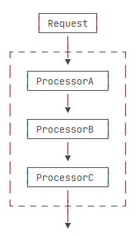
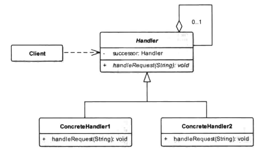

# 责任链模式


## 一、概念


### 1、介绍

责任链模式(Iterator Pattern),是行为型设计模式之一。什么是“链”？我们将多个节点首尾相连所构成的模型称为链，比如生活中常见的锁链，就是由一个个圆角长方形的铁环串起来的结构。对于链式结构，每个节点都可以被拆开再连接，因此，链式结构也具有很好的灵活性。将这样一种结构应用于编程领域，将每一个节点看作是一个对象，每一个对象拥有不同的处理逻辑，将一个请求从链式的首端发出，沿着链的路径依次传递给每一个节点对象，直至有对象处理这个请求为止，我们将这样的一种模式称为责任链模式，这样的解释是不是更通俗易懂呢？我们还是看看责任链模式的标准定义。


### 2、定义与使用


使多个对象都有机会处理请求，从而避免请求的发送者和接收者之间的耦合关系。将这些对象连成一条链，并沿着这条链传递该请求，直到有对象处理它为止。

使用场景：

1. 多个对象可以处理同一请求，但具体由哪个对象处理则在运行时动态决定。
2. 在请求处理者不明确的情况下向多个对象中的一个提交一个请求。
3. 需要动态指定一组对象处理请求。




### 3、UML类图




- Handler：抽象处理者角色，声明一个请求处理的方法，并在其中保持一个对下一个处理节点Handler对象的引用。
- ConcreteHandler：具体处理者角色，对请求进行处理，如果不能处理则将该请求转发给下一个节点上的处理对象。


## 二、示例

财务审批就是一个责任链模式，假设员工申请报销一笔费用，有3级审核人，分别是财务（10000元以下）、主管（30000元以下）、总经理（任意金额），用责任链模式设置这个审批流程，每个审核者只关心自己责任范围内的请求，并且处理它。对于超出自己责任范围的，扔给下一个审核者处理，这样，将来继续添加审核者的时候，不用改动现有逻辑。


### 1、示例

首先，抽象出请求对象，它将会在责任链上传递。

```java
package cn.pangchun.scaffold.design_patterns.responsibility.request;

import lombok.AllArgsConstructor;
import lombok.Data;

import java.math.BigDecimal;

/**
 * 费用报销请求对象
 *
 * @author pangchun
 * @since 2023/10/8
 */
@Data
@AllArgsConstructor
public class BillApplyRequest {

    /**
     * 申请人
     */
    private String username;

    /**
     * 申请金额
     */
    private BigDecimal bill;
}
```

抽象出处理器。

```java
package cn.pangchun.scaffold.design_patterns.responsibility.handler;

import cn.pangchun.scaffold.design_patterns.responsibility.request.BillApplyRequest;

/**
 * 处理者角色
 *
 * @author pangchun
 * @since 2023/10/8
 */
public interface BillApplyHandler {

    /**
     * 判断可否处理本次请求
     *
     * @param req 请求对象
     * @return 返回判断结果(false-无法处理)
     */
    Boolean support(BillApplyRequest req);

    /**
     * 处理请求
     *
     * @param req 请求对象
     * @return 返回处理结果(true-通过/false-拒绝/null-无法处理，转交给下一个处理者)
     */
    Boolean process(BillApplyRequest req);
}
```

实现具体的处理器，每个处理器有自己不同的逻辑。这里对应的财务、主管、经理都有不用的权限。

```java
package cn.pangchun.scaffold.design_patterns.responsibility.handler.impl;

import cn.pangchun.scaffold.design_patterns.responsibility.handler.BillApplyHandler;
import cn.pangchun.scaffold.design_patterns.responsibility.request.BillApplyRequest;
import lombok.extern.slf4j.Slf4j;

import java.math.BigDecimal;

/**
 * 财务
 *
 * @author pangchun
 * @since 2023/10/8
 */
@Slf4j
public class FinanceHandler implements BillApplyHandler {

    private static final BigDecimal LIMIT_BILL = BigDecimal.valueOf(10000);

    @Override
    public Boolean support(BillApplyRequest req) {
        return LIMIT_BILL.compareTo(req.getBill()) > 0;
    }

    @Override
    public Boolean process(BillApplyRequest req) {
        final Boolean flag = this.support(req);
        if (!flag) {
            log.info("申请结果：转交下一审核人处理；" +
                            "原因：申报金额过大，当前审核人权限不足；" +
                            "处理人：财务；" +
                            "申请人：{}；" +
                            "申报金额：{}",
                    req.getUsername(), req.getBill());
            return null;
        } else {
            if ("Bob".equalsIgnoreCase(req.getUsername())) {
                log.info("申请结果：未通过；" +
                                "原因：员工是Bob，我对他不爽；" +
                                "处理人：财务；" +
                                "申请人：{}；" +
                                "申报金额：{}",
                        req.getUsername(), req.getBill());
                return false;
            } else {
                log.info("申请结果：通过；" +
                                "处理人：财务；" +
                                "申请人：{}；" +
                                "申报金额：{}",
                        req.getUsername(), req.getBill());
                return true;
            }
        }
    }
}
```

```java
package cn.pangchun.scaffold.design_patterns.responsibility.handler.impl;

import cn.pangchun.scaffold.design_patterns.responsibility.handler.BillApplyHandler;
import cn.pangchun.scaffold.design_patterns.responsibility.request.BillApplyRequest;
import lombok.extern.slf4j.Slf4j;

import java.math.BigDecimal;

/**
 * 主管
 *
 * @author pangchun
 * @since 2023/10/8
 */
@Slf4j
public class ManagerHandler implements BillApplyHandler {

    private static final BigDecimal LIMIT_BILL = BigDecimal.valueOf(30000);

    @Override
    public Boolean support(BillApplyRequest req) {
        return LIMIT_BILL.compareTo(req.getBill()) > 0;
    }

    @Override
    public Boolean process(BillApplyRequest req) {
        final Boolean flag = this.support(req);
        if (!flag) {
            log.info("申请结果：转交下一审核人处理；" +
                            "原因：申报金额过大，当前审核人权限不足；" +
                            "处理人：主管；" +
                            "申请人：{}；" +
                            "申报金额：{}",
                    req.getUsername(), req.getBill());
            return null;
        } else {
            if ("Alan".equalsIgnoreCase(req.getUsername())) {
                log.info("申请结果：未通过；" +
                                "原因：员工是Alan，我对他不爽；" +
                                "处理人：主管；" +
                                "申请人：{}；" +
                                "申报金额：{}",
                        req.getUsername(), req.getBill());
                return false;
            } else {
                log.info("申请结果：通过；" +
                                "处理人：主管；" +
                                "申请人：{}；" +
                                "申报金额：{}",
                        req.getUsername(), req.getBill());
                return true;
            }
        }
    }
}
```

```java
package cn.pangchun.scaffold.design_patterns.responsibility.handler.impl;

import cn.pangchun.scaffold.design_patterns.responsibility.handler.BillApplyHandler;
import cn.pangchun.scaffold.design_patterns.responsibility.request.BillApplyRequest;
import lombok.extern.slf4j.Slf4j;

import java.math.BigDecimal;

/**
 * 总经理
 *
 * @author pangchun
 * @since 2023/10/8
 */
@Slf4j
public class CeoHandler implements BillApplyHandler {

    @Override
    public Boolean support(BillApplyRequest req) {
        return true;
    }

    @Override
    public Boolean process(BillApplyRequest req) {
        log.info("申请结果：通过；" +
                        "处理人：总经理；" +
                        "申请人：{}；" +
                        "申报金额：{}",
                req.getUsername(), req.getBill());
        return true;
    }
}
```

有了不同的`Handler`后，我们还要把这些`Handler`组合起来，变成一个链，并通过一个统一入口处理。

```java
package cn.pangchun.scaffold.design_patterns.responsibility;

import cn.pangchun.scaffold.design_patterns.responsibility.handler.BillApplyHandler;
import cn.pangchun.scaffold.design_patterns.responsibility.request.BillApplyRequest;
import com.google.common.collect.Lists;
import lombok.Data;

import java.util.List;

/**
 * 统一请求入口
 * 
 * @author pangchun
 * @since 2023/10/8
 */
@Data
public class BillApplyHandlerChain {

    /**
     * 持有所有Handler
     */
    private final List<BillApplyHandler> handlers = Lists.newArrayList();

    /**
     * 添加handler
     * @param handler
     */
    public void addHandler(BillApplyHandler handler) {
        this.handlers.add(handler);
    }

    /**
     * 处理请求
     * @param request
     */
    public void process(BillApplyRequest request) {
        for (BillApplyHandler handler : handlers) {
            final Boolean flag = handler.process(request);
            if (null != flag) {
                break;
            }
        }
    }
}
```

最后由客户端发起请求，将请求送入责任链。

```java
    /**
     * 责任链模式
     */
    @Test
    @SneakyThrows
    public void testResponsibility() {
        // 构造责任链
        final BillApplyHandlerChain chain = new BillApplyHandlerChain();
        chain.addHandler(new FinanceHandler());
        chain.addHandler(new ManagerHandler());
        chain.addHandler(new CeoHandler());
        // 处理请求
        chain.process(new BillApplyRequest("Bob", new BigDecimal(100000)));
    }
```

结果打印。

```bash
2023-10-08 10:39:10.624 INFO [main] cn.pangchun.scaffold.design_patterns.responsibility.handler.impl.FinanceHandler : 申请结果：转交下一审核人处理；原因：申报金额过大，当前审核人权限不足；处理人：财务；申请人：Bob；申报金额：100000
2023-10-08 10:39:10.626 INFO [main] cn.pangchun.scaffold.design_patterns.responsibility.handler.impl.ManagerHandler : 申请结果：转交下一审核人处理；原因：申报金额过大，当前审核人权限不足；处理人：主管；申请人：Bob；申报金额：100000
2023-10-08 10:39:10.627 INFO [main] cn.pangchun.scaffold.design_patterns.responsibility.handler.impl.CeoHandler : 申请结果：通过；处理人：总经理；申请人：Bob；申报金额：100000
```


### 2、小结

责任链模式本身很容易理解，需要注意的是，`Handler`添加的顺序很重要，如果顺序不对，处理的结果可能就不是符合要求的。

此外，责任链模式有很多变种。有些责任链的实现方式是通过某个`Handler`手动调用下一个`Handler`来传递`Request`，例如：

```java
public class AHandler implements Handler {
    private Handler next;
    public void process(Request request) {
        if (!canProcess(request)) {
            // 手动交给下一个Handler处理:
            next.process(request);
        } else {
            ...
        }
    }
}
```

还有一些责任链模式，每个`Handler`都有机会处理`Request`，通常这种责任链被称为拦截器（Interceptor）或者过滤器（Filter），它的目的不是找到某个`Handler`处理掉`Request`，而是每个`Handler`都做一些工作，比如：

- 记录日志；
- 检查权限；
- 准备相关资源；
- ...

例如，JavaEE的Servlet规范定义的`Filter`就是一种责任链模式，它不但允许每个`Filter`都有机会处理请求，还允许每个`Filter`决定是否将请求“放行”给下一个`Filter`：

```java
public class AuditFilter implements Filter {
    public void doFilter(ServletRequest req, ServletResponse resp, FilterChain chain) throws IOException, ServletException {
        log(req);
        if (check(req)) {
            // 放行:
            chain.doFilter(req, resp);
        } else {
            // 拒绝:
            sendError(resp);
        }
    }
}
```

这种模式不但允许一个`Filter`自行决定处理`ServletRequest`和`ServletResponse`，还可以“伪造”`ServletRequest`和`ServletResponse`以便让下一个`Filter`处理，能实现非常复杂的功能。


