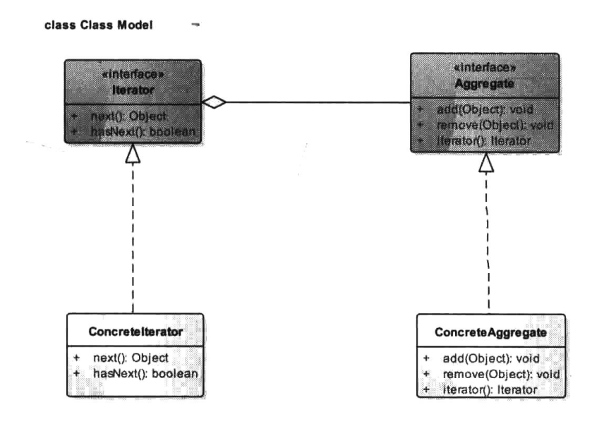

# 迭代器模式


## 一、概念


### 1、介绍

迭代器模式(Iterator Pattern)又称为游标(Cursor)模式，是行为型设计模式之一。迭代器模式算是一个比较古老的设计模式，其源于对容器的访问，比如Java中的List、Map、数组等，我们知道对容器对象的访问必然会涉及遍历算法，我们可以将遍历的方法封装在容器中，或者不提供遍历方法。如果我们将遍历的方法封装到容器中，那么对于容器类来说就承担了过多的功能，容器类不仅要维护自身内部的数据元素而且还要对外提供遍历的接口方法，因为遍历状态的存储问题还不
能对同一个容器同时进行多个遍历操作，如果我们不提供遍历方法而让使用者自己去实现，又会让容器的内部细节暴露无遗，正因于此，迭代模式应运而生，在客户访问类与容器体之间插入了一个第三者一迭代器，很好地解决了上面所述的弊端。


### 2、定义

提供一种方法顺序访问一个聚合对象中的各个元素，而又不需要暴露该对象的内部表示。


### 3、使用场景

遍历一个容器对象时。


### 4、UML类图



- Iterator：迭代器接口。

  迭代器接口负责定义、访问和遍历元素的接口。

- Concrete Iterator：具体迭代器类。

  实现迭代器接口，并记录遍历的当前位置。

- Aggregate：容器接口。

  容器接口负责提供创建具体迭代器角色的接口。

- Concrete Aggregate：具体容器类。

  实现Aggregate接口。


### 5、通用模式代码

从类图可以得出如下一个迭代器模式的通用模式代码。

迭代器接口。

```java
package cn.pangchun.scaffold.design_patterns.iterator;

/**
 * 迭代器接口
 * 
 * @author pangchun
 * @since 2023/10/12
 */
public interface Iterator<T> {

    /**
     * 是否还有下一个元素
     * @return true表示有，false表示没有
     */
    boolean hasNext();

    /**
     * 返回当前位置元素并将位置移至下一位
     * @return 当前位置的元素
     */
    T next();
}
```

具体迭代器实现。

```java
package cn.pangchun.scaffold.design_patterns.iterator;

import java.util.ArrayList;
import java.util.List;

/**
 * 具体的迭代器：要记录当前位置下标
 *
 * @author pangchun
 * @since 2023/10/12
 */
public class ConcreteIterator<T> implements Iterator<T> {

    /**
     * 当前下标位置
     */
    private int cursor = 0;

    /**
     * 元素数组
     */
    private List<T> list = new ArrayList<>();

    /**
     * 构造迭代器的时候传入元素数组
     * @param list 元素数组
     */
    public ConcreteIterator(List<T> list) {
        this.list = list;
    }

    @Override
    public boolean hasNext() {
        return cursor != list.size();
    }

    @Override
    public T next() {
        T obj = null;
        if (this.hasNext()) {
            obj = list.get(cursor++);
        }
        return obj;
    }
}
```

容器接口。

```java
package cn.pangchun.scaffold.design_patterns.iterator;

/**
 * 容器接口
 *
 * @author pangchun
 * @since 2023/10/12
 */
public interface Aggregate<T> {

    /**
     * 添加一个元素
     * @param t 元素对象
     */
    void add(T t);

    /**
     * 移除一个元素
     * @param t 元素对象
     */
    void remove(T t);

    /**
     * 获取迭代器
     * @return 迭代器对象
     */
    Iterator<T> iterator();
}
```

具体的容器实现。

```java
package cn.pangchun.scaffold.design_patterns.iterator;

import java.util.ArrayList;
import java.util.List;

/**
 * 具体的容器
 *
 * @author pangchun
 * @since 2023/10/12
 */
public class ConcreteAggregate<T> implements Aggregate<T> {

    private final List<T> list = new ArrayList<>();

    @Override
    public void add(T t) {
        list.add(t);
    }

    @Override
    public void remove(T t) {
        list.remove(t);
    }

    @Override
    public Iterator<T> iterator() {
        return new ConcreteIterator<>(list);
    }
}
```

客户端。

```java
/**
 * 迭代器模式 - 通用模式代码
 */
@Test
public void testIterator() {
    final ConcreteAggregate<String> list = new ConcreteAggregate<>();
    list.add("张三");
    list.add("李四");
    list.add("王五");

    // 获取迭代器
    final Iterator<String> iterator = list.iterator();
    while (iterator.hasNext()) {
        System.out.println(iterator.next());
    }
}

// 输出
张三
李四
王五
```


## 二、示例

迭代器这个模式对开发者来说几乎不会要求自己去实现一个迭代器，java都提供了很多如List、Map等数据结构，其中就包含了迭代器，因此我们这里也没有去写一个示例。

不过，如果要自己定义一个迭代器也十分简单，我们可以参照List，使用数组作为底层的存储结构，通过指针下标来完成元素的遍历，这里就不再演示。


