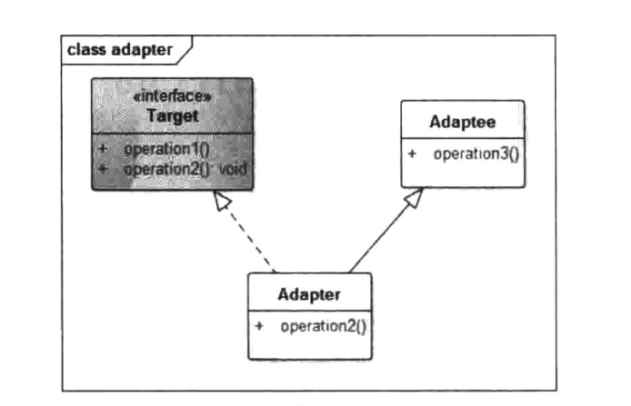
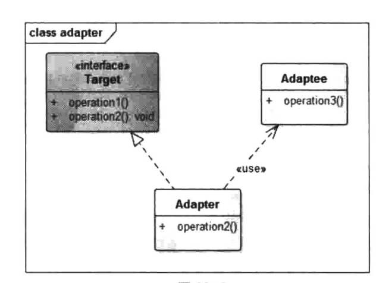

# 适配器模式


## 一、概念


### 1、介绍

适配器模式在我们的开发中使用率极高，从代码中随处可见的Adapter就可以判断出来。从最早的ListView、GridView到现在最新的RecyclerView都需要使Adapter,并且在开发中我们遇到的优化问题、出错概率较大的地方也基本都出自Adapter,这是一个让人又爱又恨的角色。

说到底，适配器是将两个不兼容的类融合在一起，它有点像粘合剂，将不同的东西通过一种转换使得它们能够协作起来。例如，经常碰到要在两个没有关系的类型之间进行交互，第一个解决方案是修改各自类的接口，但是如果没有源代码或者我们不愿意为了一个应用而修改各自的接口，此时怎么办？这种情况我们往往会使用一个Adapter,在这两种接口之间创建一个“混血儿”接口，这个Adapter会将这两个接口进行兼容，在不修改原有代码的情况下满足需求。


### 2、定义

适配器模式把一个类的接口变换成客户端所期待的另一种接口，从而使原本因接口不匹配而无法在一起工作的两个类能够在一起工作。


### 3、使用场景

1. 系统需要使用现有的类，而此类的接口不符合系统的需要，即接口不兼容。
2. 想要建立一个可以重复使用的类，用于与一些彼此之间没有太大关联的一些类，包括一些可能在将来引进的类一起工作。
3. 需要一个统一的输出接口，而输入端的类型不可预知。


### 4、UML类图

适配器模式分为两种：类适配器、对象适配器。

类适配器：



类适配器是通过实现Target接口以及继承Adaptee类来实现接口转换，例如，目标接口需要的是operation2,但是Adaptee对象只有一个operation3,因此就出现了不兼容的情况。此时通过Adapter实现一个operation.2函数将Adaptee的operation3转换为Target需要的operation2,以此实现兼容。

角色介绍：

1. Target：目标角色，也就是所期待得到的接口。注意：由于这里讨论的是类适配器模式，因此目标不可以是类。
2. Adaptee：现在需要适配的接口。
3. Adapter：适配器角色，也是本模式的核心。适配器把源接口转换成目标接口。显然，这一角色不可以是接口，而必须是具体类。


对象适配器：



与类的适配器模式一样，对象的适配器模式把被适配的类的API转换成为目标类的API,与类的适配器模式不同的是，对象的适配器模式不是使用继承关系连接到Adaptee类，而是使用代理关系连接到Adaptee类。


## 二、示例

用电源接口做例子，笔记本电脑的电源一般都是用5V电压，但是我们生活中的电线电压一般都是220V。这个时候就出现了不匹配的状况，在软件开发中我们称之为接口不兼容，此时就需要适配器来进行一个接口转换。在软件开发中有一句话正好体现了这点：任何问题都可以加一个中间层来解决。这个层我们可以理解为这里的Adapter层，通过这层来进行一个接口转换就达到了兼容的目的。

在上述电源接口这个示例中，5V电压就是Target接口，220V电压就是Adaptee类，而将电压从220V转换到5V就是Adapter。


### 1、类适配器

target角色：

```java
package cn.pangchun.scaffold.design_patterns.adapter;

/**
 * target角色：5v输出电压
 * 
 * @author pangchun
 * @since 2023/10/23
 */
public interface FiveVolt {

    int getVolt5();
}
```

adaptee角色：

```java
package cn.pangchun.scaffold.design_patterns.adapter;

/**
 * adaptee角色：220v输入电压
 * 
 * @author pangchun
 * @since 2023/10/23
 */
public class Volt220 {

    public int getVolt220() {
        return 220;
    }
}
```

adapter角色：

```java
package cn.pangchun.scaffold.design_patterns.adapter;

/**
 * adapter角色：将220v输入电压转为5v输出电压
 * 
 * @author pangchun
 * @since 2023/10/23
 */
public class VoltAdapter extends Volt220 implements FiveVolt {
    @Override
    public int getVolt5() {
        return 5;
    }
}
```

测试类：

```java
/**
 * 适配器模式: 类适配器
 */
@Test
public void testAdapter() {
    final VoltAdapter adapter = new VoltAdapter();
    System.out.println("输出电压：" + adapter.getVolt5());

    // 打印结果
    // 输出电压：5
}
```

Target角色给出了需要的目标接口，而Adaptee类则是需要被转换的对象。Adapter则是将Volt220转换成Target的接口。对应的Target的目标是要获取5V的输出电压，而Adaptee正常输出电压是220V,此时就需要电源适配器类将220V的电压转换为5V电压，解决接口不兼容的问题。


### 2、对象适配器

可以看出，Adaptee类(Volt220)并没有get Volt5:0方法，而客户端则期待这个方法。为使客户端能够使用Adaptee类，需要提供一个包装类Adapter。这个包装类包装了一个Adaptee的实例，从而此包装类能够把Adaptee的API与Target类的API衔接起来。Adapter与Adaptee是委派关系，这决定了适配器模式是对象的。示例代码如下。

```java
package cn.pangchun.scaffold.design_patterns.adapter;

/**
 * adapter角色：将220v输入电压转为5v输出电压
 * 
 * @author pangchun
 * @since 2023/10/23
 */
public class VoltAdapter2 implements FiveVolt {

    private Volt220 volt220;

    public VoltAdapter2(Volt220 volt220) {
        this.volt220 = volt220;
    }

    public int getVolt220() {
        return volt220.getVolt220();
    }

    @Override
    public int getVolt5() {
        return 5;
    }
}
```

测试类：

```java
/**
 * 适配器模式: 对象适配器
 */
@Test
public void testAdapter2() {
    final VoltAdapter2 adapter = new VoltAdapter2(new Volt220());
    System.out.println("输出电压：" + adapter.getVolt5());

    // 打印结果
    // 输出电压：5
}
```

这种实现方式直接将要被适配的对象传递到Adapter中，使用组合的形式实现接口兼容的效果。这比类适配器方式更为灵活，它的另一个好处是被适配对象中的方法不会暴露出来，而类适配器由于继承了被适配对象，因此，被适配对象类的函数在Adapter类中也都含有，这使得Adapter类出现一些奇怪的接口，用户使用成本较高。因此，对象适配器模式更加灵活、实用。

在实际开发中Adapter通常应用于进行不兼容的类型转换的场景，还有一种就是输入有无数种情况，但是输出类型是统一的，我们可以通过Adapter返回一个统一的输出，而具体的输入留给用户处理，内部只需知道输出的是符合要求的类型即可。例如ListView的Adapter,用户的Item View各式各样，但最终都是属于View类型，ListView只需要知道getView返回的是一个View即可，具体是什么View类型并不需要ListView关心。**而在使用Adapter模式的过程中建议尽量使用对象适配器的实现方式，多用合成或者聚合，少用继承。**当然，具体问题具体分析，根据需要来选用实现


